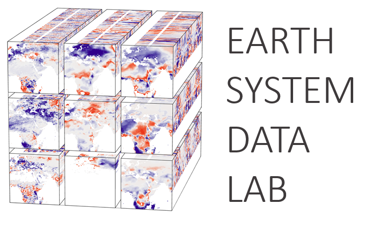
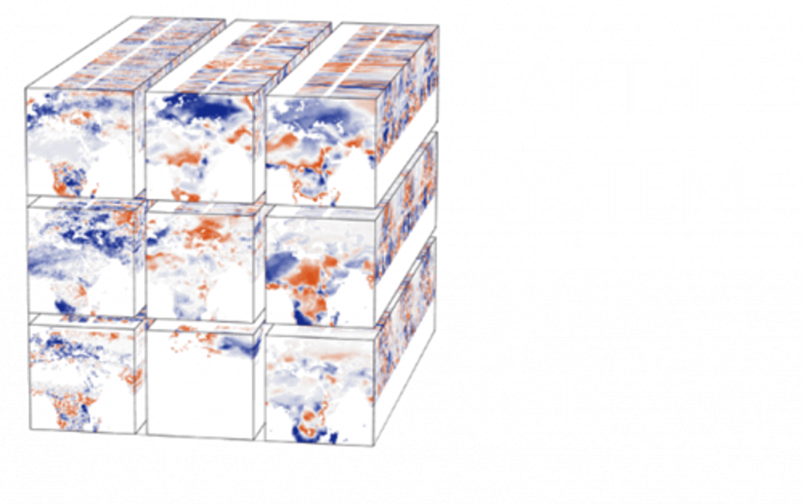

# About DeepESDL

{: .light-image .centered-logo style="max-width: 300px;" }
{: .dark-image .centered-logo style="max-width: 300px;" }

Welcome to the online documentation of DeepESDL – ESA’s Deep Earth System
Data Laboratory, a platform providing analysis-ready data cube in a powerful,
virtual laboratory to the Earth Science research community. DeepESDL offers a
full suite of services to facilitate data exploitation, share data and source
code, and publish results. Special emphasize is put on improving the support
for machine learning and artificial intelligence approaches, which includes
the preparation of AI-ready datasets, providing a programming environment
with relevant libraries and packages, and the resources to execute processing
pipelines. For more information and access to the lab please visit the
[DeepESDL website](https://www.earthsystemdatalab.net/).

The DeepESDL documentation contains:

- The [User Guide](../guide/overview.md) for all DeepESDL services.
  This is the starting point for new users.
- An overview of [public, pre-generated data cubes](../datasets/datasets.md)
  available in DeepESDL with detailed metadata and specifications.
- A [description of DeepESDL’s architecture](design/index.md).
