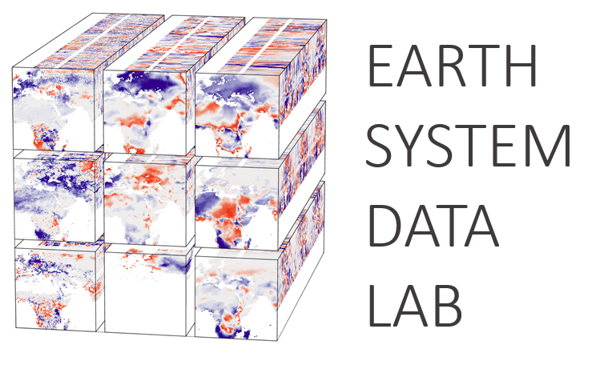
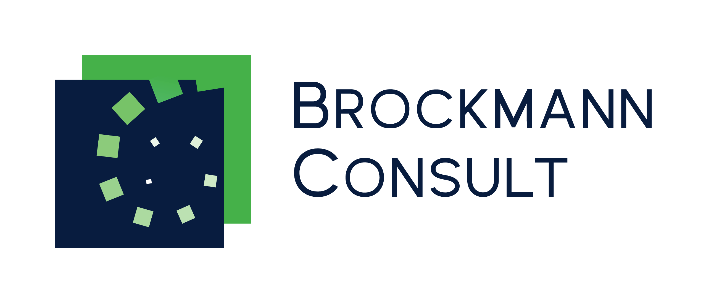

# About

{: .centered-logo style="max-width: 300px;" }

**DeepESDL – the Deep Earth System Data Laboratory** provides access to a wide range of Earth Science data
in analysis-ready data cubes and a virtual lab for analysis and processing. Fully integrated into [EarthCODE](../earthcode/index.md), 
it offers a comprehensive suite of services for sharing and publishing results, workflows, and experiments. 
Particular emphasis is placed on machine learning and artificial intelligence, including AI-ready datasets, 
integrated programming environments, and access to cloud and GPU computing resources.

DeepESDL was originally developed in an [ESA](https://www.esa.int/)-funded project with support from [University of Leipzig](https://rsc4earth.de/),
[Earthwave](https://earthwave.co.uk/) and the [Max Planck Institute for Biochemistry](https://www.bgc-jena.mpg.de/), and is now offered as a service through 
the [Network of Resources](https://nor-discover.org/).

  <!-- Provided By Section -->
  

    <!-- Operated by -->
    

      
Operated by

      
      
    

  

