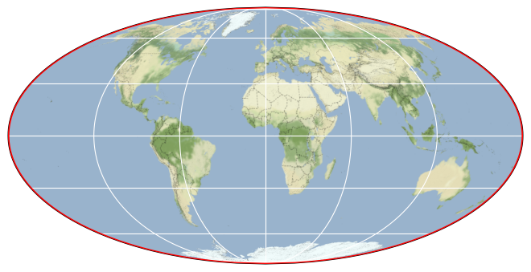

# Earth System Data Cube (ESDC) v3.0.0

## Basic information

 
Map tiles by <a href="http://stamen.com">Stamen Design</a>, under <a href="http://creativecommons.org/licenses/by/3.0">CC BY 3.0</a>. Data by <a href="http://openstreetmap.org">OpenStreetMap</a>, under <a href="http://www.openstreetmap.org/copyright">ODbL</a>.

| Parameter | Minimum | Maximum |
| ---- | ---- | ---- |
| Bounding box latitude | -89.875 | 89.875 |
| Bounding box longitude | -179.875 | 179.875 |
| Time range | 1979-01-05T00:00:00.000000000 | 2021-12-31T00:00:00.000000000 |

Publisher: DeepESDL Team

[Click here for full dataset metadata.](#full-metadata)

## Variable list

| Variable | Identifier | Units |
| ---- | ---- | ---- |
| [Aerosol Optical Thickness at 550 nm](#aerosol\_optical\_thickness\_550) | aerosol\_optical\_thickness\_550 | 1 |
| [Mean Air Temperature at 2 m](#air\_temperature\_2m) | air\_temperature\_2m | °C |
| [Bare soil evaporation](#bare\_soil\_evaporation) | bare\_soil\_evaporation | mm d^-1 |
| [Monthly Burnt Area](#burnt\_area) | burnt\_area | hectares |
| [Cloud Optical Thickness](#cot) | cot | 1 |
| [Cloud Top Height](#cth) | cth | km |
| [Cloud Top Temperature](#ctt) | ctt | K |
| [Actual evaporation](#evaporation) | evaporation | mm d^-1 |
| [Evaporation](#evaporation\_era5) | evaporation\_era5 | mm d^-1 |
| [Evaporative stress](#evaporative\_stress) | evaporative\_stress | 1 |
| [Gross Primary Productivity](#gross\_primary\_productivity) | gross\_primary\_productivity | g C m^-2 d^-1 |
| [Interception loss](#interception\_loss) | interception\_loss | mm d^-1 |
| [Kernel Normalized Difference Vegetation Index](#kndvi) | kndvi | 1 |
| [Latent Energy](#latent\_energy) | latent\_energy | MJ m^-2 d^-1 |
| [Maximum Air Temperature at 2 m](#max\_air\_temperature\_2m) | max\_air\_temperature\_2m | °C |
| [Minimum Air Temperature at 2 m](#min\_air\_temperature\_2m) | min\_air\_temperature\_2m | °C |
| [Nadir Adjusted BRDF Reflectance of Band 3 (blue)](#nbar\_blue) | nbar\_blue | 1 |
| [Nadir Adjusted BRDF Reflectance of Band 4 (green)](#nbar\_green) | nbar\_green | 1 |
| [Nadir BRDF Adjusted Reflectance of Band 2 (NIR)](#nbar\_nir) | nbar\_nir | 1 |
| [Nadir BRDF Adjusted Reflectance of Band 1 (red)](#nbar\_red) | nbar\_red | 1 |
| [Nadir Adjusted BRDF Reflectance of Band 5 (SWIR 1)](#nbar\_swir1) | nbar\_swir1 | 1 |
| [Nadir Adjusted BRDF Reflectance of Band 6 (SWIR 2)](#nbar\_swir2) | nbar\_swir2 | 1 |
| [Nadir Adjusted BRDF Reflectance of Band 7 (SWIR 3)](#nbar\_swir3) | nbar\_swir3 | 1 |
| [Normalized Difference Vegetation Index](#ndvi) | ndvi | 1 |
| [Net Ecosystem Exchange](#net\_ecosystem\_exchange) | net\_ecosystem\_exchange | g C m^-2 d^-1 |
| [Net Radiation](#net\_radiation) | net\_radiation | MJ m^-2 d^-1 |
| [Near Infrared Reflectance of Vegetation](#nirv) | nirv | 1 |
| [Open-water evaporation](#open\_water\_evaporation) | open\_water\_evaporation | mm d^-1 |
| [Potential evaporation](#potential\_evaporation) | potential\_evaporation | mm d^-1 |
| [Total Precipitation](#precipitation\_era5) | precipitation\_era5 | mm d^-1 |
| [Surface Net Solar Radiation](#radiation\_era5) | radiation\_era5 | J m^-2 |
| [Root-zone soil moisture](#root\_moisture) | root\_moisture | mm d^-1 |
| [Sensible Heat](#sensible\_heat) | sensible\_heat | MJ m^-2 d^-1 |
| [Downscaled Daily Corrected Sun-Induced Chlorophyll Fluorescence at 740 nm](#sif\_gome2\_jj) | sif\_gome2\_jj | m W m^-2 sr^-1 nm^-1 |
| [Downscaled Daily Corrected Sun-Induced Chlorophyll Fluorescence at 740 nm](#sif\_gome2\_pk) | sif\_gome2\_pk | m W m^-2 sr^-1 nm^-1 |
| [Solar-Induced Chlorophyll Fluorescence at 757 nm](#sif\_gosif) | sif\_gosif | W m^-2 sr^-1 um^-1 |
| [Solar-Induced Chlorophyll Fluorescence at 740 nm](#sif\_rtsif) | sif\_rtsif | m W m^-2 sr^-1 um^-1 |
| [Volumetric Soil Moisture](#sm) | sm | m^3 m^-3 |
| [Snow sublimation](#snow\_sublimation) | snow\_sublimation | mm d^-1 |
| [Surface soil moisture](#surface\_moisture) | surface\_moisture | mm d^-1 |
| [Terrestrial Ecosystem Respiration](#terrestrial\_ecosystem\_respiration) | terrestrial\_ecosystem\_respiration | g C m^-2 d^-1 |
| [Transpiration](#transpiration) | transpiration | mm d^-1 |

## Full variable metadata

### Aerosol Optical Thickness at 550 nm

| Field | Value |
| ---- | ---- |
| name | aerosol\_optical\_thickness\_550 |
| acknowledgment | ESA Aerosol Climate Change Initiative (Aerosol\_cci) |
| date\_modified | 2022-10-13 03:15:18.312024 |
| description | ESA Aerosol Climate Change Initiative (Aerosol\_cci): Level 3 aerosol products from AATSR (ensemble product), Version 2.6 |
| geospatial\_lat\_max | 89.875 |
| geospatial\_lat\_min | -89.875 |
| geospatial\_lat\_resolution | 0.25 |
| geospatial\_lon\_max | 179.875 |
| geospatial\_lon\_min | -179.875 |
| geospatial\_lon\_resolution | 0.25 |
| license | Terms and conditions of the DeepESDL data distribution |
| long\_name | Aerosol Optical Thickness at 550 nm |
| original\_add\_offset | 0.0 |
| original\_name | AOD550\_mean |
| original\_scale\_factor | 1.0 |
| processing\_steps | Loading data using the cciodp xcube data store, Resampling by 8-day mean, Upsampling to 0.25 degrees using nearest neighbor |
| project | DeepESDL |
| references | [https://doi.org/10.5194/amt-6-1919-2013](https://doi.org/10.5194/amt-6-1919-2013) |
| reported\_day | 5.0 |
| source | [Click here for source.](ESDC-aerosol_optical_thickness_550.md) |
| standard\_name | atmosphere\_optical\_thickness\_due\_to\_ambient\_aerosol |
| temporal\_resolution | 8D |
| time\_coverage\_end | 2012-04-10T00:00:00.000000000 |
| time\_coverage\_start | 2002-05-21T00:00:00.000000000 |
| time\_period | 8D |
| units | 1 |

### Mean Air Temperature at 2 m

| Field | Value |
| ---- | ---- |
| name | air\_temperature\_2m |
| acknowledgment | ERA5 hourly data on single levels from 1959 to present |
| date\_modified | 2022-10-15 15:22:40.252342 |
| description | ERA5 Reanalysis Products |
| geospatial\_lat\_max | 89.875 |
| geospatial\_lat\_min | -89.875 |
| geospatial\_lat\_resolution | 0.25 |
| geospatial\_lon\_max | 179.875 |
| geospatial\_lon\_min | -179.875 |
| geospatial\_lon\_resolution | 0.25 |
| license | Terms and conditions of the DeepESDL data distribution |
| long\_name | Mean Air Temperature at 2 m |
| original\_add\_offset | 0.0 |
| original\_name | t2m |
| original\_scale\_factor | 1.0 |
| processing\_steps | Merging nc files, Resampling by daily mean, Converting to °C from K, Resampling by 8-day mean, Resampling to 0.25 degrees using bilinear interpolation |
| project | DeepESDL |
| references | [https://confluence.ecmwf.int/display/CKB/ERA5%3A+data+documentation](https://confluence.ecmwf.int/display/CKB/ERA5%3A+data+documentation) |
| reported\_day | 5.0 |
| source | [Click here for source.](ESDC-air_temperature_2m.md) |
| standard\_name | mean\_air\_temperature\_2m |
| temporal\_resolution | 8D |
| time\_coverage\_end | 2021-12-27T00:00:00.000000000 |
| time\_coverage\_start | 1979-01-01T00:00:00.000000000 |
| time\_period | 8D |
| units | °C |

### Bare soil evaporation

| Field | Value |
| ---- | ---- |
| name | bare\_soil\_evaporation |
| acknowledgment | [https://www.gleam.eu/](https://www.gleam.eu/) |
| date\_modified | 2022-10-11 16:47:36.234042 |
| description | Global Land Evaporation Amsterdam Model (GLEAM) v3.6a |
| geospatial\_lat\_max | 89.875 |
| geospatial\_lat\_min | -89.875 |
| geospatial\_lat\_resolution | -0.25 |
| geospatial\_lon\_max | 179.875 |
| geospatial\_lon\_min | -179.875 |
| geospatial\_lon\_resolution | 0.25 |
| license | Terms and conditions of the DeepESDL data distribution |
| long\_name | Bare soil evaporation |
| original\_add\_offset | 0.0 |
| original\_name | Eb |
| original\_scale\_factor | 1.0 |
| processing\_steps | Merging nc files, resampling by 8-day mean |
| project | DeepESDL |
| references | [https://doi.org/10.5194/gmd-10-1903-2017](https://doi.org/10.5194/gmd-10-1903-2017), [https://doi.org/10.5194/hess-15-453-2011](https://doi.org/10.5194/hess-15-453-2011) |
| reported\_day | 5.0 |
| source | [Click here for source.](ESDC-bare_soil_evaporation.md) |
| standard\_name | bare\_soil\_evaporation |
| temporal\_resolution | 8D |
| time\_coverage\_end | 2021-12-31T00:00:00.000000000 |
| time\_coverage\_start | 1980-01-05T00:00:00.000000000 |
| time\_period | 8D |
| units | mm d^-1 |

### Monthly Burnt Area

| Field | Value |
| ---- | ---- |
| name | burnt\_area |
| acknowledgment | [https://www.globalfiredata.org/](https://www.globalfiredata.org/) |
| date\_modified | 2022-10-13 14:55:35.002779 |
| description | Global Fire Emissions Database (GFED) 4 Monthly Burnt Area |
| geospatial\_lat\_max | 89.875 |
| geospatial\_lat\_min | -89.875 |
| geospatial\_lat\_resolution | -0.25 |
| geospatial\_lon\_max | 179.875 |
| geospatial\_lon\_min | -179.875 |
| geospatial\_lon\_resolution | 0.25 |
| license | Terms and conditions of the DeepESDL data distribution |
| long\_name | Monthly Burnt Area |
| original\_add\_offset | 0.0 |
| original\_name | burnt\_area |
| original\_scale\_factor | 0.01 |
| processing\_steps | Merging hdf files, Resampling by 8-day nearest neighbor |
| project | DeepESDL |
| references | [https://doi.org/10.1002/jgrg.20042](https://doi.org/10.1002/jgrg.20042) |
| reported\_day | 5.0 |
| source | [Click here for source.](ESDC-burnt_area.md) |
| standard\_name | burnt\_area |
| temporal\_resolution | 8D |
| time\_coverage\_end | 2016-12-30T00:00:00.000000000 |
| time\_coverage\_start | 1995-06-06T00:00:00.000000000 |
| time\_period | 8D |
| units | hectares |

### Cloud Optical Thickness

| Field | Value |
| ---- | ---- |
| name | cot |
| acknowledgment | ESA Cloud Climate Change Initiative (Cloud\_cci) |
| date\_modified | 2022-10-13 03:11:42.331361 |
| description | ESA Cloud Climate Change Initiative (Cloud\_cci): MODIS-TERRA monthly gridded cloud properties, version 2.0 |
| geospatial\_lat\_max | 89.875 |
| geospatial\_lat\_min | -89.875 |
| geospatial\_lat\_resolution | 0.25 |
| geospatial\_lon\_max | 179.875 |
| geospatial\_lon\_min | -179.875 |
| geospatial\_lon\_resolution | 0.25 |
| license | Terms and conditions of the DeepESDL data distribution |
| long\_name | Cloud Optical Thickness |
| original\_add\_offset | 0.0 |
| original\_name | cot |
| original\_scale\_factor | 1.0 |
| processing\_steps | Loading data using the cciodp xcube data store, Resampling by 8-day nearest neighbor, Upsampling to 0.25 degrees using nearest neighbor |
| project | DeepESDL |
| references | [https://public.satproj.klima.dwd.de/data/ESA\_Cloud\_CCI/CLD\_PRODUCTS/v2.0/DOIs/DOI\_ESA\_Cloud\_cci\_MODIS-Terra\_v2.0\_landingpage.html](https://public.satproj.klima.dwd.de/data/ESA_Cloud_CCI/CLD_PRODUCTS/v2.0/DOIs/DOI_ESA_Cloud_cci_MODIS-Terra_v2.0_landingpage.html), [https://dap.ceda.ac.uk/neodc/esacci/cloud/docs/DataSet\_Desc\_ESA\_Cloud\_cci\_CC4CL\_1.5.pdf](https://dap.ceda.ac.uk/neodc/esacci/cloud/docs/DataSet_Desc_ESA_Cloud_cci_CC4CL_1.5.pdf) |
| reported\_day | 5.0 |
| source | [Click here for source.](ESDC-cot.md) |
| standard\_name | atmosphere\_optical\_thickness\_due\_to\_cloud |
| temporal\_resolution | 8D |
| time\_coverage\_end | 2014-12-15T00:00:00.000000000 |
| time\_coverage\_start | 2000-02-22T00:00:00.000000000 |
| time\_period | 8D |
| units | 1 |

### Cloud Top Height

| Field | Value |
| ---- | ---- |
| name | cth |
| acknowledgment | ESA Cloud Climate Change Initiative (Cloud\_cci) |
| date\_modified | 2022-10-13 03:11:42.331361 |
| description | ESA Cloud Climate Change Initiative (Cloud\_cci): MODIS-TERRA monthly gridded cloud properties, version 2.0 |
| geospatial\_lat\_max | 89.875 |
| geospatial\_lat\_min | -89.875 |
| geospatial\_lat\_resolution | 0.25 |
| geospatial\_lon\_max | 179.875 |
| geospatial\_lon\_min | -179.875 |
| geospatial\_lon\_resolution | 0.25 |
| license | Terms and conditions of the DeepESDL data distribution |
| long\_name | Cloud Top Height |
| original\_add\_offset | 0.0 |
| original\_name | cth |
| original\_scale\_factor | 1.0 |
| processing\_steps | Loading data using the cciodp xcube data store, Resampling by 8-day nearest neighbor, Upsampling to 0.25 degrees using nearest neighbor |
| project | DeepESDL |
| references | [https://public.satproj.klima.dwd.de/data/ESA\_Cloud\_CCI/CLD\_PRODUCTS/v2.0/DOIs/DOI\_ESA\_Cloud\_cci\_MODIS-Terra\_v2.0\_landingpage.html](https://public.satproj.klima.dwd.de/data/ESA_Cloud_CCI/CLD_PRODUCTS/v2.0/DOIs/DOI_ESA_Cloud_cci_MODIS-Terra_v2.0_landingpage.html), [https://dap.ceda.ac.uk/neodc/esacci/cloud/docs/DataSet\_Desc\_ESA\_Cloud\_cci\_CC4CL\_1.5.pdf](https://dap.ceda.ac.uk/neodc/esacci/cloud/docs/DataSet_Desc_ESA_Cloud_cci_CC4CL_1.5.pdf) |
| reported\_day | 5.0 |
| source | [Click here for source.](ESDC-cth.md) |
| standard\_name | cloud\_top\_altitude |
| temporal\_resolution | 8D |
| time\_coverage\_end | 2014-12-15T00:00:00.000000000 |
| time\_coverage\_start | 2000-02-22T00:00:00.000000000 |
| time\_period | 8D |
| units | km |

### Cloud Top Temperature

| Field | Value |
| ---- | ---- |
| name | ctt |
| acknowledgment | ESA Cloud Climate Change Initiative (Cloud\_cci) |
| date\_modified | 2022-10-13 03:11:42.331361 |
| description | ESA Cloud Climate Change Initiative (Cloud\_cci): MODIS-TERRA monthly gridded cloud properties, version 2.0 |
| geospatial\_lat\_max | 89.875 |
| geospatial\_lat\_min | -89.875 |
| geospatial\_lat\_resolution | 0.25 |
| geospatial\_lon\_max | 179.875 |
| geospatial\_lon\_min | -179.875 |
| geospatial\_lon\_resolution | 0.25 |
| license | Terms and conditions of the DeepESDL data distribution |
| long\_name | Cloud Top Temperature |
| original\_add\_offset | 0.0 |
| original\_name | ctt |
| original\_scale\_factor | 1.0 |
| processing\_steps | Loading data using the cciodp xcube data store, Resampling by 8-day nearest neighbor, Upsampling to 0.25 degrees using nearest neighbor |
| project | DeepESDL |
| references | [https://public.satproj.klima.dwd.de/data/ESA\_Cloud\_CCI/CLD\_PRODUCTS/v2.0/DOIs/DOI\_ESA\_Cloud\_cci\_MODIS-Terra\_v2.0\_landingpage.html](https://public.satproj.klima.dwd.de/data/ESA_Cloud_CCI/CLD_PRODUCTS/v2.0/DOIs/DOI_ESA_Cloud_cci_MODIS-Terra_v2.0_landingpage.html), [https://dap.ceda.ac.uk/neodc/esacci/cloud/docs/DataSet\_Desc\_ESA\_Cloud\_cci\_CC4CL\_1.5.pdf](https://dap.ceda.ac.uk/neodc/esacci/cloud/docs/DataSet_Desc_ESA_Cloud_cci_CC4CL_1.5.pdf) |
| reported\_day | 5.0 |
| source | [Click here for source.](ESDC-ctt.md) |
| standard\_name | air\_temperature\_at\_cloud\_top |
| temporal\_resolution | 8D |
| time\_coverage\_end | 2014-12-15T00:00:00.000000000 |
| time\_coverage\_start | 2000-02-22T00:00:00.000000000 |
| time\_period | 8D |
| units | K |

### Actual evaporation

| Field | Value |
| ---- | ---- |
| name | evaporation |
| acknowledgment | [https://www.gleam.eu/](https://www.gleam.eu/) |
| date\_modified | 2022-10-11 16:47:36.234042 |
| description | Global Land Evaporation Amsterdam Model (GLEAM) v3.6a |
| geospatial\_lat\_max | 89.875 |
| geospatial\_lat\_min | -89.875 |
| geospatial\_lat\_resolution | -0.25 |
| geospatial\_lon\_max | 179.875 |
| geospatial\_lon\_min | -179.875 |
| geospatial\_lon\_resolution | 0.25 |
| license | Terms and conditions of the DeepESDL data distribution |
| long\_name | Actual evaporation |
| original\_add\_offset | 0.0 |
| original\_name | E |
| original\_scale\_factor | 1.0 |
| processing\_steps | Merging nc files, resampling by 8-day mean |
| project | DeepESDL |
| references | [https://doi.org/10.5194/gmd-10-1903-2017](https://doi.org/10.5194/gmd-10-1903-2017), [https://doi.org/10.5194/hess-15-453-2011](https://doi.org/10.5194/hess-15-453-2011) |
| reported\_day | 5.0 |
| source | [Click here for source.](ESDC-evaporation.md) |
| standard\_name | actual\_evaporation |
| temporal\_resolution | 8D |
| time\_coverage\_end | 2021-12-31T00:00:00.000000000 |
| time\_coverage\_start | 1980-01-05T00:00:00.000000000 |
| time\_period | 8D |
| units | mm d^-1 |

### Evaporation

| Field | Value |
| ---- | ---- |
| name | evaporation\_era5 |
| acknowledgment | ERA5 hourly data on single levels from 1959 to present |
| date\_modified | 2022-10-15 15:22:40.252342 |
| description | ERA5 Reanalysis Products |
| geospatial\_lat\_max | 89.875 |
| geospatial\_lat\_min | -89.875 |
| geospatial\_lat\_resolution | 0.25 |
| geospatial\_lon\_max | 179.875 |
| geospatial\_lon\_min | -179.875 |
| geospatial\_lon\_resolution | 0.25 |
| license | Terms and conditions of the DeepESDL data distribution |
| long\_name | Evaporation |
| original\_add\_offset | 0.0 |
| original\_name | e |
| original\_scale\_factor | 1.0 |
| processing\_steps | Merging nc files, Resampling by daily sum, Converting to mm from m, Resampling by 8-day mean, Resampling to 0.25 degrees using bilinear interpolation |
| project | DeepESDL |
| references | [https://confluence.ecmwf.int/display/CKB/ERA5%3A+data+documentation](https://confluence.ecmwf.int/display/CKB/ERA5%3A+data+documentation) |
| reported\_day | 5.0 |
| source | [Click here for source.](ESDC-evaporation_era5.md) |
| standard\_name | lwe\_thickness\_of\_water\_evaporation\_amount |
| temporal\_resolution | 8D |
| time\_coverage\_end | 2021-12-27T00:00:00.000000000 |
| time\_coverage\_start | 1979-01-01T00:00:00.000000000 |
| time\_period | 8D |
| units | mm d^-1 |

### Evaporative stress

| Field | Value |
| ---- | ---- |
| name | evaporative\_stress |
| acknowledgment | [https://www.gleam.eu/](https://www.gleam.eu/) |
| date\_modified | 2022-10-11 16:47:36.234042 |
| description | Global Land Evaporation Amsterdam Model (GLEAM) v3.6a |
| geospatial\_lat\_max | 89.875 |
| geospatial\_lat\_min | -89.875 |
| geospatial\_lat\_resolution | -0.25 |
| geospatial\_lon\_max | 179.875 |
| geospatial\_lon\_min | -179.875 |
| geospatial\_lon\_resolution | 0.25 |
| license | Terms and conditions of the DeepESDL data distribution |
| long\_name | Evaporative stress |
| original\_add\_offset | 0.0 |
| original\_name | S |
| original\_scale\_factor | 1.0 |
| processing\_steps | Merging nc files, resampling by 8-day mean |
| project | DeepESDL |
| references | [https://doi.org/10.5194/gmd-10-1903-2017](https://doi.org/10.5194/gmd-10-1903-2017), [https://doi.org/10.5194/hess-15-453-2011](https://doi.org/10.5194/hess-15-453-2011) |
| reported\_day | 5.0 |
| source | [Click here for source.](ESDC-evaporative_stress.md) |
| standard\_name | evaporative\_stress |
| temporal\_resolution | 8D |
| time\_coverage\_end | 2021-12-31T00:00:00.000000000 |
| time\_coverage\_start | 1980-01-05T00:00:00.000000000 |
| time\_period | 8D |
| units | 1 |

### Gross Primary Productivity

| Field | Value |
| ---- | ---- |
| name | gross\_primary\_productivity |
| acknowledgment | FLUXCOM |
| date\_modified | 2022-10-17 22:14:30.401506 |
| description | FLUXCOM |
| geospatial\_lat\_max | 89.87499928049999 |
| geospatial\_lat\_min | -89.8750000005 |
| geospatial\_lat\_resolution | 0.25 |
| geospatial\_lon\_max | 179.87499856049996 |
| geospatial\_lon\_min | -179.8750000005 |
| geospatial\_lon\_resolution | 0.25 |
| license | Terms and conditions of the DeepESDL data distribution |
| long\_name | Gross Primary Productivity |
| original\_add\_offset | 0.0 |
| original\_name | GPP |
| original\_scale\_factor | 1.0 |
| processing\_steps | Merging nc files, Downsampling to 0.25 deg with mean |
| project | DeepESDL |
| references | [https://doi.org/10.5194/bg-13-4291-2016](https://doi.org/10.5194/bg-13-4291-2016), [https://doi.org/10.1038/s41597-019-0076-8](https://doi.org/10.1038/s41597-019-0076-8) |
| reported\_day | 5.0 |
| source | [Click here for source.](ESDC-gross_primary_productivity.md) |
| standard\_name | gross\_primary\_productivity\_of\_carbon |
| temporal\_resolution | 8D |
| time\_coverage\_end | 2020-12-30T00:00:00.000000000 |
| time\_coverage\_start | 2001-01-05T00:00:00.000000000 |
| time\_period | 8D |
| units | g C m^-2 d^-1 |

### Interception loss

| Field | Value |
| ---- | ---- |
| name | interception\_loss |
| acknowledgment | [https://www.gleam.eu/](https://www.gleam.eu/) |
| date\_modified | 2022-10-11 16:47:36.234042 |
| description | Global Land Evaporation Amsterdam Model (GLEAM) v3.6a |
| geospatial\_lat\_max | 89.875 |
| geospatial\_lat\_min | -89.875 |
| geospatial\_lat\_resolution | -0.25 |
| geospatial\_lon\_max | 179.875 |
| geospatial\_lon\_min | -179.875 |
| geospatial\_lon\_resolution | 0.25 |
| license | Terms and conditions of the DeepESDL data distribution |
| long\_name | Interception loss |
| original\_add\_offset | 0.0 |
| original\_name | Ei |
| original\_scale\_factor | 1.0 |
| processing\_steps | Merging nc files, resampling by 8-day mean |
| project | DeepESDL |
| references | [https://doi.org/10.5194/gmd-10-1903-2017](https://doi.org/10.5194/gmd-10-1903-2017), [https://doi.org/10.5194/hess-15-453-2011](https://doi.org/10.5194/hess-15-453-2011) |
| reported\_day | 5.0 |
| source | [Click here for source.](ESDC-interception_loss.md) |
| standard\_name | interception\_loss |
| temporal\_resolution | 8D |
| time\_coverage\_end | 2021-12-31T00:00:00.000000000 |
| time\_coverage\_start | 1980-01-05T00:00:00.000000000 |
| time\_period | 8D |
| units | mm d^-1 |

### Kernel Normalized Difference Vegetation Index

| Field | Value |
| ---- | ---- |
| name | kndvi |
| acknowledgment | [https://lpdaac.usgs.gov/products/mcd43c4v061/](https://lpdaac.usgs.gov/products/mcd43c4v061/) |
| date\_modified | 2022-10-11 23:51:00.603768 |
| description | MODIS/Terra+Aqua BRDF/Albedo Nadir BRDF-Adjusted Reflectance Daily L3 Global 0.05 Deg CMG and Vegetation Indices |
| geospatial\_lat\_max | 89.875 |
| geospatial\_lat\_min | -89.87499999998977 |
| geospatial\_lat\_resolution | 0.25 |
| geospatial\_lon\_max | 179.87500000008183 |
| geospatial\_lon\_min | -179.87499999999997 |
| geospatial\_lon\_resolution | 0.25 |
| license | Terms and conditions of the DeepESDL data distribution |
| long\_name | Kernel Normalized Difference Vegetation Index |
| original\_add\_offset | 0.0 |
| original\_name | kNDVI |
| original\_scale\_factor | 1.0 |
| processing\_steps | Merging hdf files, Computing NDVI, NIRv, and kNDVI, resampling by 8-day mean, Downsampling to 0.25 deg with mean, Interpolating NA with linear interpolation, Masking water using GLEAM as reference |
| project | DeepESDL |
| references | [https://doi.org/10.1126/sciadv.abc7447](https://doi.org/10.1126/sciadv.abc7447), [https://github.com/awesome-spectral-indices/awesome-spectral-indices](https://github.com/awesome-spectral-indices/awesome-spectral-indices), [https://doi.org/10.5067/MODIS/MCD43C4.061](https://doi.org/10.5067/MODIS/MCD43C4.061), [https://www.umb.edu/spectralmass/terra\_aqua\_modis/v006](https://www.umb.edu/spectralmass/terra_aqua_modis/v006) |
| reported\_day | 5.0 |
| source | [Click here for source.](ESDC-kndvi.md) |
| standard\_name | kNDVI |
| temporal\_resolution | 8D |
| time\_coverage\_end | 2021-12-31T00:00:00.000000000 |
| time\_coverage\_start | 2000-03-01T00:00:00.000000000 |
| time\_period | 8D |
| units | 1 |

### Latent Energy

| Field | Value |
| ---- | ---- |
| name | latent\_energy |
| acknowledgment | FLUXCOM |
| date\_modified | 2022-10-17 22:14:30.401506 |
| description | FLUXCOM |
| geospatial\_lat\_max | 89.87499928049999 |
| geospatial\_lat\_min | -89.8750000005 |
| geospatial\_lat\_resolution | 0.25 |
| geospatial\_lon\_max | 179.87499856049996 |
| geospatial\_lon\_min | -179.8750000005 |
| geospatial\_lon\_resolution | 0.25 |
| license | Terms and conditions of the DeepESDL data distribution |
| long\_name | Latent Energy |
| original\_add\_offset | 0.0 |
| original\_name | LE |
| original\_scale\_factor | 1.0 |
| processing\_steps | Merging nc files, Downsampling to 0.25 deg with mean |
| project | DeepESDL |
| references | [https://doi.org/10.5194/bg-13-4291-2016](https://doi.org/10.5194/bg-13-4291-2016), [https://doi.org/10.1038/s41597-019-0076-8](https://doi.org/10.1038/s41597-019-0076-8) |
| reported\_day | 5.0 |
| source | [Click here for source.](ESDC-latent_energy.md) |
| standard\_name | surface\_upward\_latent\_heat\_flux |
| temporal\_resolution | 8D |
| time\_coverage\_end | 2020-12-30T00:00:00.000000000 |
| time\_coverage\_start | 2001-01-05T00:00:00.000000000 |
| time\_period | 8D |
| units | MJ m^-2 d^-1 |

### Maximum Air Temperature at 2 m

| Field | Value |
| ---- | ---- |
| name | max\_air\_temperature\_2m |
| acknowledgment | ERA5 hourly data on single levels from 1959 to present |
| date\_modified | 2022-10-15 15:22:40.252342 |
| description | ERA5 Reanalysis Products |
| geospatial\_lat\_max | 89.875 |
| geospatial\_lat\_min | -89.875 |
| geospatial\_lat\_resolution | 0.25 |
| geospatial\_lon\_max | 179.875 |
| geospatial\_lon\_min | -179.875 |
| geospatial\_lon\_resolution | 0.25 |
| license | Terms and conditions of the DeepESDL data distribution |
| long\_name | Maximum Air Temperature at 2 m |
| original\_add\_offset | 0.0 |
| original\_name | t2m\_max |
| original\_scale\_factor | 1.0 |
| processing\_steps | Merging nc files, Resampling by daily max, Converting to °C from K, Resampling by 8-day max, Resampling to 0.25 degrees using bilinear interpolation |
| project | DeepESDL |
| references | [https://confluence.ecmwf.int/display/CKB/ERA5%3A+data+documentation](https://confluence.ecmwf.int/display/CKB/ERA5%3A+data+documentation) |
| reported\_day | 5.0 |
| source | [Click here for source.](ESDC-max_air_temperature_2m.md) |
| standard\_name | max\_air\_temperature\_2m |
| temporal\_resolution | 8D |
| time\_coverage\_end | 2021-12-27T00:00:00.000000000 |
| time\_coverage\_start | 1979-01-01T00:00:00.000000000 |
| time\_period | 8D |
| units | °C |

### Minimum Air Temperature at 2 m

| Field | Value |
| ---- | ---- |
| name | min\_air\_temperature\_2m |
| acknowledgment | ERA5 hourly data on single levels from 1959 to present |
| date\_modified | 2022-10-15 15:22:40.252342 |
| description | ERA5 Reanalysis Products |
| geospatial\_lat\_max | 89.875 |
| geospatial\_lat\_min | -89.875 |
| geospatial\_lat\_resolution | 0.25 |
| geospatial\_lon\_max | 179.875 |
| geospatial\_lon\_min | -179.875 |
| geospatial\_lon\_resolution | 0.25 |
| license | Terms and conditions of the DeepESDL data distribution |
| long\_name | Minimum Air Temperature at 2 m |
| original\_add\_offset | 0.0 |
| original\_name | t2m\_min |
| original\_scale\_factor | 1.0 |
| processing\_steps | Merging nc files, Resampling by daily min, Converting to °C from K, Resampling by 8-day min, Resampling to 0.25 degrees using bilinear interpolation |
| project | DeepESDL |
| references | [https://confluence.ecmwf.int/display/CKB/ERA5%3A+data+documentation](https://confluence.ecmwf.int/display/CKB/ERA5%3A+data+documentation) |
| reported\_day | 5.0 |
| source | [Click here for source.](ESDC-min_air_temperature_2m.md) |
| standard\_name | min\_air\_temperature\_2m |
| temporal\_resolution | 8D |
| time\_coverage\_end | 2021-12-27T00:00:00.000000000 |
| time\_coverage\_start | 1979-01-01T00:00:00.000000000 |
| time\_period | 8D |
| units | °C |

### Nadir Adjusted BRDF Reflectance of Band 3 (blue)

| Field | Value |
| ---- | ---- |
| name | nbar\_blue |
| acknowledgment | [https://lpdaac.usgs.gov/products/mcd43c4v061/](https://lpdaac.usgs.gov/products/mcd43c4v061/) |
| bandwidth | 20.0 |
| bandwidth\_units | nm |
| date\_modified | 2022-10-11 23:51:00.603768 |
| description | MODIS/Terra+Aqua BRDF/Albedo Nadir BRDF-Adjusted Reflectance Daily L3 Global 0.05 Deg CMG and Vegetation Indices |
| geospatial\_lat\_max | 89.875 |
| geospatial\_lat\_min | -89.87499999998977 |
| geospatial\_lat\_resolution | 0.25 |
| geospatial\_lon\_max | 179.87500000008183 |
| geospatial\_lon\_min | -179.87499999999997 |
| geospatial\_lon\_resolution | 0.25 |
| license | Terms and conditions of the DeepESDL data distribution |
| long\_name | Nadir Adjusted BRDF Reflectance of Band 3 (blue) |
| original\_add\_offset | 0.0 |
| original\_name | Nadir\_Reflectance\_Band3 |
| original\_scale\_factor | 1.0 |
| processing\_steps | Merging hdf files, Computing NDVI, NIRv, and kNDVI, resampling by 8-day mean, Downsampling to 0.25 deg with mean, Interpolating NA with linear interpolation, Masking water using GLEAM as reference |
| project | DeepESDL |
| references | [https://doi.org/10.5067/MODIS/MCD43C4.061](https://doi.org/10.5067/MODIS/MCD43C4.061), [https://www.umb.edu/spectralmass/terra\_aqua\_modis/v006](https://www.umb.edu/spectralmass/terra_aqua_modis/v006) |
| reported\_day | 5.0 |
| source | [Click here for source.](ESDC-nbar_blue.md) |
| standard\_name | nadir\_reflectance\_band3 |
| temporal\_resolution | 8D |
| time\_coverage\_end | 2021-12-31T00:00:00.000000000 |
| time\_coverage\_start | 2000-03-01T00:00:00.000000000 |
| time\_period | 8D |
| units | 1 |
| wavelength | 469.0 |
| wavelength\_units | nm |

### Nadir Adjusted BRDF Reflectance of Band 4 (green)

| Field | Value |
| ---- | ---- |
| name | nbar\_green |
| acknowledgment | [https://lpdaac.usgs.gov/products/mcd43c4v061/](https://lpdaac.usgs.gov/products/mcd43c4v061/) |
| bandwidth | 20.0 |
| bandwidth\_units | nm |
| date\_modified | 2022-10-11 23:51:00.603768 |
| description | MODIS/Terra+Aqua BRDF/Albedo Nadir BRDF-Adjusted Reflectance Daily L3 Global 0.05 Deg CMG and Vegetation Indices |
| geospatial\_lat\_max | 89.875 |
| geospatial\_lat\_min | -89.87499999998977 |
| geospatial\_lat\_resolution | 0.25 |
| geospatial\_lon\_max | 179.87500000008183 |
| geospatial\_lon\_min | -179.87499999999997 |
| geospatial\_lon\_resolution | 0.25 |
| license | Terms and conditions of the DeepESDL data distribution |
| long\_name | Nadir Adjusted BRDF Reflectance of Band 4 (green) |
| original\_add\_offset | 0.0 |
| original\_name | Nadir\_Reflectance\_Band4 |
| original\_scale\_factor | 1.0 |
| processing\_steps | Merging hdf files, Computing NDVI, NIRv, and kNDVI, resampling by 8-day mean, Downsampling to 0.25 deg with mean, Interpolating NA with linear interpolation, Masking water using GLEAM as reference |
| project | DeepESDL |
| references | [https://doi.org/10.5067/MODIS/MCD43C4.061](https://doi.org/10.5067/MODIS/MCD43C4.061), [https://www.umb.edu/spectralmass/terra\_aqua\_modis/v006](https://www.umb.edu/spectralmass/terra_aqua_modis/v006) |
| reported\_day | 5.0 |
| source | [Click here for source.](ESDC-nbar_green.md) |
| standard\_name | nadir\_reflectance\_band4 |
| temporal\_resolution | 8D |
| time\_coverage\_end | 2021-12-31T00:00:00.000000000 |
| time\_coverage\_start | 2000-03-01T00:00:00.000000000 |
| time\_period | 8D |
| units | 1 |
| wavelength | 555.0 |
| wavelength\_units | nm |

### Nadir BRDF Adjusted Reflectance of Band 2 (NIR)

| Field | Value |
| ---- | ---- |
| name | nbar\_nir |
| acknowledgment | [https://lpdaac.usgs.gov/products/mcd43c4v061/](https://lpdaac.usgs.gov/products/mcd43c4v061/) |
| bandwidth | 35.0 |
| bandwidth\_units | nm |
| date\_modified | 2022-10-11 23:51:00.603768 |
| description | MODIS/Terra+Aqua BRDF/Albedo Nadir BRDF-Adjusted Reflectance Daily L3 Global 0.05 Deg CMG and Vegetation Indices |
| geospatial\_lat\_max | 89.875 |
| geospatial\_lat\_min | -89.87499999998977 |
| geospatial\_lat\_resolution | 0.25 |
| geospatial\_lon\_max | 179.87500000008183 |
| geospatial\_lon\_min | -179.87499999999997 |
| geospatial\_lon\_resolution | 0.25 |
| license | Terms and conditions of the DeepESDL data distribution |
| long\_name | Nadir BRDF Adjusted Reflectance of Band 2 (NIR) |
| original\_add\_offset | 0.0 |
| original\_name | Nadir\_Reflectance\_Band2 |
| original\_scale\_factor | 1.0 |
| processing\_steps | Merging hdf files, Computing NDVI, NIRv, and kNDVI, resampling by 8-day mean, Downsampling to 0.25 deg with mean, Interpolating NA with linear interpolation, Masking water using GLEAM as reference |
| project | DeepESDL |
| references | [https://doi.org/10.5067/MODIS/MCD43C4.061](https://doi.org/10.5067/MODIS/MCD43C4.061), [https://www.umb.edu/spectralmass/terra\_aqua\_modis/v006](https://www.umb.edu/spectralmass/terra_aqua_modis/v006) |
| reported\_day | 5.0 |
| source | [Click here for source.](ESDC-nbar_nir.md) |
| standard\_name | nadir\_reflectance\_band2 |
| temporal\_resolution | 8D |
| time\_coverage\_end | 2021-12-31T00:00:00.000000000 |
| time\_coverage\_start | 2000-03-01T00:00:00.000000000 |
| time\_period | 8D |
| units | 1 |
| wavelength | 858.5 |
| wavelength\_units | nm |

### Nadir BRDF Adjusted Reflectance of Band 1 (red)

| Field | Value |
| ---- | ---- |
| name | nbar\_red |
| acknowledgment | [https://lpdaac.usgs.gov/products/mcd43c4v061/](https://lpdaac.usgs.gov/products/mcd43c4v061/) |
| bandwidth | 50.0 |
| bandwidth\_units | nm |
| date\_modified | 2022-10-11 23:51:00.603768 |
| description | MODIS/Terra+Aqua BRDF/Albedo Nadir BRDF-Adjusted Reflectance Daily L3 Global 0.05 Deg CMG and Vegetation Indices |
| geospatial\_lat\_max | 89.875 |
| geospatial\_lat\_min | -89.87499999998977 |
| geospatial\_lat\_resolution | 0.25 |
| geospatial\_lon\_max | 179.87500000008183 |
| geospatial\_lon\_min | -179.87499999999997 |
| geospatial\_lon\_resolution | 0.25 |
| license | Terms and conditions of the DeepESDL data distribution |
| long\_name | Nadir BRDF Adjusted Reflectance of Band 1 (red) |
| original\_add\_offset | 0.0 |
| original\_name | Nadir\_Reflectance\_Band1 |
| original\_scale\_factor | 1.0 |
| processing\_steps | Merging hdf files, Computing NDVI, NIRv, and kNDVI, resampling by 8-day mean, Downsampling to 0.25 deg with mean, Interpolating NA with linear interpolation, Masking water using GLEAM as reference |
| project | DeepESDL |
| references | [https://doi.org/10.5067/MODIS/MCD43C4.061](https://doi.org/10.5067/MODIS/MCD43C4.061), [https://www.umb.edu/spectralmass/terra\_aqua\_modis/v006](https://www.umb.edu/spectralmass/terra_aqua_modis/v006) |
| reported\_day | 5.0 |
| source | [Click here for source.](ESDC-nbar_red.md) |
| standard\_name | nadir\_reflectance\_band1 |
| temporal\_resolution | 8D |
| time\_coverage\_end | 2021-12-31T00:00:00.000000000 |
| time\_coverage\_start | 2000-03-01T00:00:00.000000000 |
| time\_period | 8D |
| units | 1 |
| wavelength | 645.0 |
| wavelength\_units | nm |

### Nadir Adjusted BRDF Reflectance of Band 5 (SWIR 1)

| Field | Value |
| ---- | ---- |
| name | nbar\_swir1 |
| acknowledgment | [https://lpdaac.usgs.gov/products/mcd43c4v061/](https://lpdaac.usgs.gov/products/mcd43c4v061/) |
| bandwidth | 20.0 |
| bandwidth\_units | nm |
| date\_modified | 2022-10-11 23:51:00.603768 |
| description | MODIS/Terra+Aqua BRDF/Albedo Nadir BRDF-Adjusted Reflectance Daily L3 Global 0.05 Deg CMG and Vegetation Indices |
| geospatial\_lat\_max | 89.875 |
| geospatial\_lat\_min | -89.87499999998977 |
| geospatial\_lat\_resolution | 0.25 |
| geospatial\_lon\_max | 179.87500000008183 |
| geospatial\_lon\_min | -179.87499999999997 |
| geospatial\_lon\_resolution | 0.25 |
| license | Terms and conditions of the DeepESDL data distribution |
| long\_name | Nadir Adjusted BRDF Reflectance of Band 5 (SWIR 1) |
| original\_add\_offset | 0.0 |
| original\_name | Nadir\_Reflectance\_Band5 |
| original\_scale\_factor | 1.0 |
| processing\_steps | Merging hdf files, Computing NDVI, NIRv, and kNDVI, resampling by 8-day mean, Downsampling to 0.25 deg with mean, Interpolating NA with linear interpolation, Masking water using GLEAM as reference |
| project | DeepESDL |
| references | [https://doi.org/10.5067/MODIS/MCD43C4.061](https://doi.org/10.5067/MODIS/MCD43C4.061), [https://www.umb.edu/spectralmass/terra\_aqua\_modis/v006](https://www.umb.edu/spectralmass/terra_aqua_modis/v006) |
| reported\_day | 5.0 |
| source | [Click here for source.](ESDC-nbar_swir1.md) |
| standard\_name | nadir\_reflectance\_band5 |
| temporal\_resolution | 8D |
| time\_coverage\_end | 2021-12-31T00:00:00.000000000 |
| time\_coverage\_start | 2000-03-01T00:00:00.000000000 |
| time\_period | 8D |
| units | 1 |
| wavelength | 1240.0 |
| wavelength\_units | nm |

### Nadir Adjusted BRDF Reflectance of Band 6 (SWIR 2)

| Field | Value |
| ---- | ---- |
| name | nbar\_swir2 |
| acknowledgment | [https://lpdaac.usgs.gov/products/mcd43c4v061/](https://lpdaac.usgs.gov/products/mcd43c4v061/) |
| bandwidth | 24.0 |
| bandwidth\_units | nm |
| date\_modified | 2022-10-11 23:51:00.603768 |
| description | MODIS/Terra+Aqua BRDF/Albedo Nadir BRDF-Adjusted Reflectance Daily L3 Global 0.05 Deg CMG and Vegetation Indices |
| geospatial\_lat\_max | 89.875 |
| geospatial\_lat\_min | -89.87499999998977 |
| geospatial\_lat\_resolution | 0.25 |
| geospatial\_lon\_max | 179.87500000008183 |
| geospatial\_lon\_min | -179.87499999999997 |
| geospatial\_lon\_resolution | 0.25 |
| license | Terms and conditions of the DeepESDL data distribution |
| long\_name | Nadir Adjusted BRDF Reflectance of Band 6 (SWIR 2) |
| original\_add\_offset | 0.0 |
| original\_name | Nadir\_Reflectance\_Band6 |
| original\_scale\_factor | 1.0 |
| processing\_steps | Merging hdf files, Computing NDVI, NIRv, and kNDVI, resampling by 8-day mean, Downsampling to 0.25 deg with mean, Interpolating NA with linear interpolation, Masking water using GLEAM as reference |
| project | DeepESDL |
| references | [https://doi.org/10.5067/MODIS/MCD43C4.061](https://doi.org/10.5067/MODIS/MCD43C4.061), [https://www.umb.edu/spectralmass/terra\_aqua\_modis/v006](https://www.umb.edu/spectralmass/terra_aqua_modis/v006) |
| reported\_day | 5.0 |
| source | [Click here for source.](ESDC-nbar_swir2.md) |
| standard\_name | nadir\_reflectance\_band6 |
| temporal\_resolution | 8D |
| time\_coverage\_end | 2021-12-31T00:00:00.000000000 |
| time\_coverage\_start | 2000-03-01T00:00:00.000000000 |
| time\_period | 8D |
| units | 1 |
| wavelength | 1640.0 |
| wavelength\_units | nm |

### Nadir Adjusted BRDF Reflectance of Band 7 (SWIR 3)

| Field | Value |
| ---- | ---- |
| name | nbar\_swir3 |
| acknowledgment | [https://lpdaac.usgs.gov/products/mcd43c4v061/](https://lpdaac.usgs.gov/products/mcd43c4v061/) |
| bandwidth | 50.0 |
| bandwidth\_units | nm |
| date\_modified | 2022-10-11 23:51:00.603768 |
| description | MODIS/Terra+Aqua BRDF/Albedo Nadir BRDF-Adjusted Reflectance Daily L3 Global 0.05 Deg CMG and Vegetation Indices |
| geospatial\_lat\_max | 89.875 |
| geospatial\_lat\_min | -89.87499999998977 |
| geospatial\_lat\_resolution | 0.25 |
| geospatial\_lon\_max | 179.87500000008183 |
| geospatial\_lon\_min | -179.87499999999997 |
| geospatial\_lon\_resolution | 0.25 |
| license | Terms and conditions of the DeepESDL data distribution |
| long\_name | Nadir Adjusted BRDF Reflectance of Band 7 (SWIR 3) |
| original\_add\_offset | 0.0 |
| original\_name | Nadir\_Reflectance\_Band7 |
| original\_scale\_factor | 1.0 |
| processing\_steps | Merging hdf files, Computing NDVI, NIRv, and kNDVI, resampling by 8-day mean, Downsampling to 0.25 deg with mean, Interpolating NA with linear interpolation, Masking water using GLEAM as reference |
| project | DeepESDL |
| references | [https://doi.org/10.5067/MODIS/MCD43C4.061](https://doi.org/10.5067/MODIS/MCD43C4.061), [https://www.umb.edu/spectralmass/terra\_aqua\_modis/v006](https://www.umb.edu/spectralmass/terra_aqua_modis/v006) |
| reported\_day | 5.0 |
| source | [Click here for source.](ESDC-nbar_swir3.md) |
| standard\_name | nadir\_reflectance\_band7 |
| temporal\_resolution | 8D |
| time\_coverage\_end | 2021-12-31T00:00:00.000000000 |
| time\_coverage\_start | 2000-03-01T00:00:00.000000000 |
| time\_period | 8D |
| units | 1 |
| wavelength | 2130.0 |
| wavelength\_units | nm |

### Normalized Difference Vegetation Index

| Field | Value |
| ---- | ---- |
| name | ndvi |
| acknowledgment | [https://lpdaac.usgs.gov/products/mcd43c4v061/](https://lpdaac.usgs.gov/products/mcd43c4v061/) |
| date\_modified | 2022-10-11 23:51:00.603768 |
| description | MODIS/Terra+Aqua BRDF/Albedo Nadir BRDF-Adjusted Reflectance Daily L3 Global 0.05 Deg CMG and Vegetation Indices |
| geospatial\_lat\_max | 89.875 |
| geospatial\_lat\_min | -89.87499999998977 |
| geospatial\_lat\_resolution | 0.25 |
| geospatial\_lon\_max | 179.87500000008183 |
| geospatial\_lon\_min | -179.87499999999997 |
| geospatial\_lon\_resolution | 0.25 |
| license | Terms and conditions of the DeepESDL data distribution |
| long\_name | Normalized Difference Vegetation Index |
| original\_add\_offset | 0.0 |
| original\_name | NDVI |
| original\_scale\_factor | 1.0 |
| processing\_steps | Merging hdf files, Computing NDVI, NIRv, and kNDVI, resampling by 8-day mean, Downsampling to 0.25 deg with mean, Interpolating NA with linear interpolation, Masking water using GLEAM as reference |
| project | DeepESDL |
| references | [https://ntrs.nasa.gov/citations/19740022614](https://ntrs.nasa.gov/citations/19740022614), [https://github.com/awesome-spectral-indices/awesome-spectral-indices](https://github.com/awesome-spectral-indices/awesome-spectral-indices), [https://doi.org/10.5067/MODIS/MCD43C4.061](https://doi.org/10.5067/MODIS/MCD43C4.061), [https://www.umb.edu/spectralmass/terra\_aqua\_modis/v006](https://www.umb.edu/spectralmass/terra_aqua_modis/v006) |
| reported\_day | 5.0 |
| source | [Click here for source.](ESDC-ndvi.md) |
| standard\_name | NDVI |
| temporal\_resolution | 8D |
| time\_coverage\_end | 2021-12-31T00:00:00.000000000 |
| time\_coverage\_start | 2000-03-01T00:00:00.000000000 |
| time\_period | 8D |
| units | 1 |

### Net Ecosystem Exchange

| Field | Value |
| ---- | ---- |
| name | net\_ecosystem\_exchange |
| acknowledgment | FLUXCOM |
| date\_modified | 2022-10-17 22:14:30.401506 |
| description | FLUXCOM |
| geospatial\_lat\_max | 89.87499928049999 |
| geospatial\_lat\_min | -89.8750000005 |
| geospatial\_lat\_resolution | 0.25 |
| geospatial\_lon\_max | 179.87499856049996 |
| geospatial\_lon\_min | -179.8750000005 |
| geospatial\_lon\_resolution | 0.25 |
| license | Terms and conditions of the DeepESDL data distribution |
| long\_name | Net Ecosystem Exchange |
| original\_add\_offset | 0.0 |
| original\_name | NEE |
| original\_scale\_factor | 1.0 |
| processing\_steps | Merging nc files, Downsampling to 0.25 deg with mean |
| project | DeepESDL |
| references | [https://doi.org/10.5194/bg-13-4291-2016](https://doi.org/10.5194/bg-13-4291-2016), [https://doi.org/10.1038/s41597-019-0076-8](https://doi.org/10.1038/s41597-019-0076-8) |
| reported\_day | 5.0 |
| source | [Click here for source.](ESDC-net_ecosystem_exchange.md) |
| standard\_name | net\_primary\_productivity\_of\_carbon |
| temporal\_resolution | 8D |
| time\_coverage\_end | 2020-12-30T00:00:00.000000000 |
| time\_coverage\_start | 2001-01-05T00:00:00.000000000 |
| time\_period | 8D |
| units | g C m^-2 d^-1 |

### Net Radiation

| Field | Value |
| ---- | ---- |
| name | net\_radiation |
| acknowledgment | FLUXCOM |
| date\_modified | 2022-10-17 22:14:30.401506 |
| description | FLUXCOM |
| geospatial\_lat\_max | 89.87499928049999 |
| geospatial\_lat\_min | -89.8750000005 |
| geospatial\_lat\_resolution | 0.25 |
| geospatial\_lon\_max | 179.87499856049996 |
| geospatial\_lon\_min | -179.8750000005 |
| geospatial\_lon\_resolution | 0.25 |
| license | Terms and conditions of the DeepESDL data distribution |
| long\_name | Net Radiation |
| original\_add\_offset | 0.0 |
| original\_name | Rn |
| original\_scale\_factor | 1.0 |
| processing\_steps | Merging nc files, Downsampling to 0.25 deg with mean |
| project | DeepESDL |
| references | [https://doi.org/10.5194/bg-13-4291-2016](https://doi.org/10.5194/bg-13-4291-2016), [https://doi.org/10.1038/s41597-019-0076-8](https://doi.org/10.1038/s41597-019-0076-8) |
| reported\_day | 5.0 |
| source | [Click here for source.](ESDC-net_radiation.md) |
| standard\_name | surface\_net\_radiation\_flux |
| temporal\_resolution | 8D |
| time\_coverage\_end | 2020-12-30T00:00:00.000000000 |
| time\_coverage\_start | 2001-01-05T00:00:00.000000000 |
| time\_period | 8D |
| units | MJ m^-2 d^-1 |

### Near Infrared Reflectance of Vegetation

| Field | Value |
| ---- | ---- |
| name | nirv |
| acknowledgment | [https://lpdaac.usgs.gov/products/mcd43c4v061/](https://lpdaac.usgs.gov/products/mcd43c4v061/) |
| date\_modified | 2022-10-11 23:51:00.603768 |
| description | MODIS/Terra+Aqua BRDF/Albedo Nadir BRDF-Adjusted Reflectance Daily L3 Global 0.05 Deg CMG and Vegetation Indices |
| geospatial\_lat\_max | 89.875 |
| geospatial\_lat\_min | -89.87499999998977 |
| geospatial\_lat\_resolution | 0.25 |
| geospatial\_lon\_max | 179.87500000008183 |
| geospatial\_lon\_min | -179.87499999999997 |
| geospatial\_lon\_resolution | 0.25 |
| license | Terms and conditions of the DeepESDL data distribution |
| long\_name | Near Infrared Reflectance of Vegetation |
| original\_add\_offset | 0.0 |
| original\_name | NIRv |
| original\_scale\_factor | 1.0 |
| processing\_steps | Merging hdf files, Computing NDVI, NIRv, and kNDVI, resampling by 8-day mean, Downsampling to 0.25 deg with mean, Interpolating NA with linear interpolation, Masking water using GLEAM as reference |
| project | DeepESDL |
| references | [https://doi.org/10.1126/sciadv.1602244](https://doi.org/10.1126/sciadv.1602244), [https://github.com/awesome-spectral-indices/awesome-spectral-indices](https://github.com/awesome-spectral-indices/awesome-spectral-indices), [https://doi.org/10.5067/MODIS/MCD43C4.061](https://doi.org/10.5067/MODIS/MCD43C4.061), [https://www.umb.edu/spectralmass/terra\_aqua\_modis/v006](https://www.umb.edu/spectralmass/terra_aqua_modis/v006) |
| reported\_day | 5.0 |
| source | [Click here for source.](ESDC-nirv.md) |
| standard\_name | NIRv |
| temporal\_resolution | 8D |
| time\_coverage\_end | 2021-12-31T00:00:00.000000000 |
| time\_coverage\_start | 2000-03-01T00:00:00.000000000 |
| time\_period | 8D |
| units | 1 |

### Open-water evaporation

| Field | Value |
| ---- | ---- |
| name | open\_water\_evaporation |
| acknowledgment | [https://www.gleam.eu/](https://www.gleam.eu/) |
| date\_modified | 2022-10-11 16:47:36.234042 |
| description | Global Land Evaporation Amsterdam Model (GLEAM) v3.6a |
| geospatial\_lat\_max | 89.875 |
| geospatial\_lat\_min | -89.875 |
| geospatial\_lat\_resolution | -0.25 |
| geospatial\_lon\_max | 179.875 |
| geospatial\_lon\_min | -179.875 |
| geospatial\_lon\_resolution | 0.25 |
| license | Terms and conditions of the DeepESDL data distribution |
| long\_name | Open-water evaporation |
| original\_add\_offset | 0.0 |
| original\_name | Ew |
| original\_scale\_factor | 1.0 |
| processing\_steps | Merging nc files, resampling by 8-day mean |
| project | DeepESDL |
| references | [https://doi.org/10.5194/gmd-10-1903-2017](https://doi.org/10.5194/gmd-10-1903-2017), [https://doi.org/10.5194/hess-15-453-2011](https://doi.org/10.5194/hess-15-453-2011) |
| reported\_day | 5.0 |
| source | [Click here for source.](ESDC-open_water_evaporation.md) |
| standard\_name | open\_water\_evaporation |
| temporal\_resolution | 8D |
| time\_coverage\_end | 2021-12-31T00:00:00.000000000 |
| time\_coverage\_start | 1980-01-05T00:00:00.000000000 |
| time\_period | 8D |
| units | mm d^-1 |

### Potential evaporation

| Field | Value |
| ---- | ---- |
| name | potential\_evaporation |
| acknowledgment | [https://www.gleam.eu/](https://www.gleam.eu/) |
| date\_modified | 2022-10-11 16:47:36.234042 |
| description | Global Land Evaporation Amsterdam Model (GLEAM) v3.6a |
| geospatial\_lat\_max | 89.875 |
| geospatial\_lat\_min | -89.875 |
| geospatial\_lat\_resolution | -0.25 |
| geospatial\_lon\_max | 179.875 |
| geospatial\_lon\_min | -179.875 |
| geospatial\_lon\_resolution | 0.25 |
| license | Terms and conditions of the DeepESDL data distribution |
| long\_name | Potential evaporation |
| original\_add\_offset | 0.0 |
| original\_name | Ep |
| original\_scale\_factor | 1.0 |
| processing\_steps | Merging nc files, resampling by 8-day mean |
| project | DeepESDL |
| references | [https://doi.org/10.5194/gmd-10-1903-2017](https://doi.org/10.5194/gmd-10-1903-2017), [https://doi.org/10.5194/hess-15-453-2011](https://doi.org/10.5194/hess-15-453-2011) |
| reported\_day | 5.0 |
| source | [Click here for source.](ESDC-potential_evaporation.md) |
| standard\_name | potential\_evaporation |
| temporal\_resolution | 8D |
| time\_coverage\_end | 2021-12-31T00:00:00.000000000 |
| time\_coverage\_start | 1980-01-05T00:00:00.000000000 |
| time\_period | 8D |
| units | mm d^-1 |

### Total Precipitation

| Field | Value |
| ---- | ---- |
| name | precipitation\_era5 |
| acknowledgment | ERA5 hourly data on single levels from 1959 to present |
| date\_modified | 2022-10-15 15:22:40.252342 |
| description | ERA5 Reanalysis Products |
| geospatial\_lat\_max | 89.875 |
| geospatial\_lat\_min | -89.875 |
| geospatial\_lat\_resolution | 0.25 |
| geospatial\_lon\_max | 179.875 |
| geospatial\_lon\_min | -179.875 |
| geospatial\_lon\_resolution | 0.25 |
| license | Terms and conditions of the DeepESDL data distribution |
| long\_name | Total Precipitation |
| original\_add\_offset | 0.0 |
| original\_name | tp |
| original\_scale\_factor | 1.0 |
| processing\_steps | Merging nc files, Resampling by daily sum, Converting to mm from m, Resampling by 8-day mean, Resampling to 0.25 degrees using bilinear interpolation |
| project | DeepESDL |
| references | [https://confluence.ecmwf.int/display/CKB/ERA5%3A+data+documentation](https://confluence.ecmwf.int/display/CKB/ERA5%3A+data+documentation) |
| reported\_day | 5.0 |
| source | [Click here for source.](ESDC-precipitation_era5.md) |
| standard\_name | total\_precipitation |
| temporal\_resolution | 8D |
| time\_coverage\_end | 2021-12-27T00:00:00.000000000 |
| time\_coverage\_start | 1979-01-01T00:00:00.000000000 |
| time\_period | 8D |
| units | mm d^-1 |

### Surface Net Solar Radiation

| Field | Value |
| ---- | ---- |
| name | radiation\_era5 |
| acknowledgment | ERA5 hourly data on single levels from 1959 to present |
| date\_modified | 2022-10-15 15:22:40.252342 |
| description | ERA5 Reanalysis Products |
| geospatial\_lat\_max | 89.875 |
| geospatial\_lat\_min | -89.875 |
| geospatial\_lat\_resolution | 0.25 |
| geospatial\_lon\_max | 179.875 |
| geospatial\_lon\_min | -179.875 |
| geospatial\_lon\_resolution | 0.25 |
| license | Terms and conditions of the DeepESDL data distribution |
| long\_name | Surface Net Solar Radiation |
| original\_add\_offset | 0.0 |
| original\_name | ssr |
| original\_scale\_factor | 1.0 |
| processing\_steps | Merging nc files, Resampling by daily mean, Resampling by 8-day mean, Resampling to 0.25 degrees using bilinear interpolation |
| project | DeepESDL |
| references | [https://confluence.ecmwf.int/display/CKB/ERA5%3A+data+documentation](https://confluence.ecmwf.int/display/CKB/ERA5%3A+data+documentation) |
| reported\_day | 5.0 |
| source | [Click here for source.](ESDC-radiation_era5.md) |
| standard\_name | surface\_net\_downward\_shortwave\_flux |
| temporal\_resolution | 8D |
| time\_coverage\_end | 2021-12-27T00:00:00.000000000 |
| time\_coverage\_start | 1979-01-01T00:00:00.000000000 |
| time\_period | 8D |
| units | J m^-2 |

### Root-zone soil moisture

| Field | Value |
| ---- | ---- |
| name | root\_moisture |
| acknowledgment | [https://www.gleam.eu/](https://www.gleam.eu/) |
| date\_modified | 2022-10-11 16:47:36.234042 |
| description | Global Land Evaporation Amsterdam Model (GLEAM) v3.6a |
| geospatial\_lat\_max | 89.875 |
| geospatial\_lat\_min | -89.875 |
| geospatial\_lat\_resolution | -0.25 |
| geospatial\_lon\_max | 179.875 |
| geospatial\_lon\_min | -179.875 |
| geospatial\_lon\_resolution | 0.25 |
| license | Terms and conditions of the DeepESDL data distribution |
| long\_name | Root-zone soil moisture |
| original\_add\_offset | 0.0 |
| original\_name | SMroot |
| original\_scale\_factor | 1.0 |
| processing\_steps | Merging nc files, resampling by 8-day mean |
| project | DeepESDL |
| references | [https://doi.org/10.5194/gmd-10-1903-2017](https://doi.org/10.5194/gmd-10-1903-2017), [https://doi.org/10.5194/hess-15-453-2011](https://doi.org/10.5194/hess-15-453-2011) |
| reported\_day | 5.0 |
| source | [Click here for source.](ESDC-root_moisture.md) |
| standard\_name | root\_zone\_soil\_moisture |
| temporal\_resolution | 8D |
| time\_coverage\_end | 2021-12-31T00:00:00.000000000 |
| time\_coverage\_start | 1980-01-05T00:00:00.000000000 |
| time\_period | 8D |
| units | mm d^-1 |

### Sensible Heat

| Field | Value |
| ---- | ---- |
| name | sensible\_heat |
| acknowledgment | FLUXCOM |
| date\_modified | 2022-10-17 22:14:30.401506 |
| description | FLUXCOM |
| geospatial\_lat\_max | 89.87499928049999 |
| geospatial\_lat\_min | -89.8750000005 |
| geospatial\_lat\_resolution | 0.25 |
| geospatial\_lon\_max | 179.87499856049996 |
| geospatial\_lon\_min | -179.8750000005 |
| geospatial\_lon\_resolution | 0.25 |
| license | Terms and conditions of the DeepESDL data distribution |
| long\_name | Sensible Heat |
| original\_add\_offset | 0.0 |
| original\_name | H |
| original\_scale\_factor | 1.0 |
| processing\_steps | Merging nc files, Downsampling to 0.25 deg with mean |
| project | DeepESDL |
| references | [https://doi.org/10.5194/bg-13-4291-2016](https://doi.org/10.5194/bg-13-4291-2016), [https://doi.org/10.1038/s41597-019-0076-8](https://doi.org/10.1038/s41597-019-0076-8) |
| reported\_day | 5.0 |
| source | [Click here for source.](ESDC-sensible_heat.md) |
| standard\_name | surface\_upward\_sensible\_heat\_flux |
| temporal\_resolution | 8D |
| time\_coverage\_end | 2020-12-30T00:00:00.000000000 |
| time\_coverage\_start | 2001-01-05T00:00:00.000000000 |
| time\_period | 8D |
| units | MJ m^-2 d^-1 |

### Downscaled Daily Corrected Sun-Induced Chlorophyll Fluorescence at 740 nm

| Field | Value |
| ---- | ---- |
| name | sif\_gome2\_jj |
| acknowledgment | [https://doi.org/10.5194/essd-12-1101-2020](https://doi.org/10.5194/essd-12-1101-2020) |
| date\_modified | 2022-10-11 22:36:53.583022 |
| description | Spatially Downscaled Sun-Induced Fluorescence (JJ Method) |
| geospatial\_lat\_max | 89.875 |
| geospatial\_lat\_min | -89.875 |
| geospatial\_lat\_resolution | 0.25 |
| geospatial\_lon\_max | 179.87500000000003 |
| geospatial\_lon\_min | -179.87499999999997 |
| geospatial\_lon\_resolution | 0.25 |
| license | Terms and conditions of the DeepESDL data distribution |
| long\_name | Downscaled Daily Corrected Sun-Induced Chlorophyll Fluorescence at 740 nm |
| original\_add\_offset | 0.0 |
| original\_name | SIF |
| original\_scale\_factor | 1.0 |
| processing\_steps | Merging nc files, Downsampling to 0.25 deg with mean, Interpolating NA with linear interpolation |
| project | DeepESDL |
| references | [https://doi.org/10.5194/essd-12-1101-2020](https://doi.org/10.5194/essd-12-1101-2020) |
| reported\_day | 9.0 |
| source | [Click here for source.](ESDC-sif_gome2_jj.md) |
| standard\_name | sif |
| temporal\_resolution | 16D |
| time\_coverage\_end | 2018-10-04T00:00:00.000000000 |
| time\_coverage\_start | 2007-01-21T00:00:00.000000000 |
| time\_period | 8D |
| units | m W m^-2 sr^-1 nm^-1 |

### Downscaled Daily Corrected Sun-Induced Chlorophyll Fluorescence at 740 nm

| Field | Value |
| ---- | ---- |
| name | sif\_gome2\_pk |
| acknowledgment | [https://doi.org/10.5194/essd-12-1101-2020](https://doi.org/10.5194/essd-12-1101-2020) |
| date\_modified | 2022-10-11 22:43:08.258033 |
| description | Spatially Downscaled Sun-Induced Fluorescence (PK Method) |
| geospatial\_lat\_max | 89.875 |
| geospatial\_lat\_min | -89.875 |
| geospatial\_lat\_resolution | 0.25 |
| geospatial\_lon\_max | 179.87500000000003 |
| geospatial\_lon\_min | -179.87499999999997 |
| geospatial\_lon\_resolution | 0.25 |
| license | Terms and conditions of the DeepESDL data distribution |
| long\_name | Downscaled Daily Corrected Sun-Induced Chlorophyll Fluorescence at 740 nm |
| original\_add\_offset | 0.0 |
| original\_name | SIF |
| original\_scale\_factor | 1.0 |
| processing\_steps | Merging nc files, Downsampling to 0.25 deg with mean, Interpolating NA with linear interpolation |
| project | DeepESDL |
| references | [https://doi.org/10.5194/essd-12-1101-2020](https://doi.org/10.5194/essd-12-1101-2020) |
| reported\_day | 9.0 |
| source | [Click here for source.](ESDC-sif_gome2_pk.md) |
| standard\_name | sif |
| temporal\_resolution | 16D |
| time\_coverage\_end | 2018-12-31T00:00:00.000000000 |
| time\_coverage\_start | 2007-01-21T00:00:00.000000000 |
| time\_period | 8D |
| units | m W m^-2 sr^-1 nm^-1 |

### Solar-Induced Chlorophyll Fluorescence at 757 nm

| Field | Value |
| ---- | ---- |
| name | sif\_gosif |
| acknowledgment | [https://doi.org/10.3390/rs11050517](https://doi.org/10.3390/rs11050517) |
| date\_modified | 2022-10-11 22:20:05.841847 |
| description | GOSIF Solar-Induced Chlorophyll Fluorescence Derived from OCO-2, MODIS, and Reanalysis Data |
| geospatial\_lat\_max | 89.87499999999999 |
| geospatial\_lat\_min | -89.87500000000001 |
| geospatial\_lat\_resolution | 0.25 |
| geospatial\_lon\_max | 179.87500000000003 |
| geospatial\_lon\_min | -179.87499999999997 |
| geospatial\_lon\_resolution | 0.25 |
| license | Terms and conditions of the DeepESDL data distribution |
| long\_name | Solar-Induced Chlorophyll Fluorescence at 757 nm |
| original\_add\_offset | 0.0 |
| original\_name | sif |
| original\_scale\_factor | 0.0001 |
| processing\_steps | Merging tif files, Converting water bodies and snow covered areas to NaN, Applying original scale factor, Downsampling to 0.25 deg with mean |
| project | DeepESDL |
| references | [https://doi.org/10.3390/rs11050517](https://doi.org/10.3390/rs11050517) |
| reported\_day | 5.0 |
| source | [Click here for source.](ESDC-sif_gosif.md) |
| standard\_name | sif |
| temporal\_resolution | 8D |
| time\_coverage\_end | 2021-12-31T00:00:00.000000000 |
| time\_coverage\_start | 2000-03-01T00:00:00.000000000 |
| time\_period | 8D |
| units | W m^-2 sr^-1 um^-1 |

### Solar-Induced Chlorophyll Fluorescence at 740 nm

| Field | Value |
| ---- | ---- |
| name | sif\_rtsif |
| acknowledgment | [https://doi.org/10.1038/s41597-022-01520-1](https://doi.org/10.1038/s41597-022-01520-1) |
| date\_modified | 2022-10-12 14:26:02.972963 |
| description | Long-term Reconstructed TROPOMI Solar-Induced Fluorescence (RTSIF) |
| geospatial\_lat\_max | 89.87499999999999 |
| geospatial\_lat\_min | -89.87500000000001 |
| geospatial\_lat\_resolution | 0.25 |
| geospatial\_lon\_max | 179.87500000000003 |
| geospatial\_lon\_min | -179.87499999999997 |
| geospatial\_lon\_resolution | 0.25 |
| license | Terms and conditions of the DeepESDL data distribution |
| long\_name | Solar-Induced Chlorophyll Fluorescence at 740 nm |
| original\_add\_offset | 0.0 |
| original\_name | sif |
| original\_scale\_factor | 1.0 |
| processing\_steps | Merging tif files, Downsampling to 0.25 deg with mean |
| project | DeepESDL |
| references | [https://doi.org/10.1038/s41597-022-01520-1](https://doi.org/10.1038/s41597-022-01520-1) |
| reported\_day | 5.0 |
| source | [Click here for source.](ESDC-sif_rtsif.md) |
| standard\_name | sif |
| temporal\_resolution | 8D |
| time\_coverage\_end | 2020-12-30T00:00:00.000000000 |
| time\_coverage\_start | 2001-01-05T00:00:00.000000000 |
| time\_period | 8D |
| units | m W m^-2 sr^-1 um^-1 |

### Volumetric Soil Moisture

| Field | Value |
| ---- | ---- |
| name | sm |
| acknowledgment | ESA Soil Moisture Climate Change Initiative (Soil\_Moisture\_cci) |
| date\_modified | 2022-10-13 20:42:41.277132 |
| description | ESA Soil Moisture Climate Change Initiative (Soil\_Moisture\_cci): COMBINED product, Version 06.1 |
| geospatial\_lat\_max | 89.875 |
| geospatial\_lat\_min | -89.875 |
| geospatial\_lat\_resolution | -0.25 |
| geospatial\_lon\_max | 179.875 |
| geospatial\_lon\_min | -179.875 |
| geospatial\_lon\_resolution | 0.25 |
| license | Terms and conditions of the DeepESDL data distribution |
| long\_name | Volumetric Soil Moisture |
| original\_add\_offset | 0.0 |
| original\_name | sm |
| original\_scale\_factor | 1.0 |
| processing\_steps | Merging nc files, Resampling by 8-day mean |
| project | DeepESDL |
| references | [https://data.cci.ceda.ac.uk/thredds/fileServer/esacci/soil\_moisture/docs/v06.1/ESA\_CCI\_SM\_RD\_D2.1\_v2\_ATBD\_v06.1\_issue\_1.1.pdf](https://data.cci.ceda.ac.uk/thredds/fileServer/esacci/soil_moisture/docs/v06.1/ESA_CCI_SM_RD_D2.1_v2_ATBD_v06.1_issue_1.1.pdf), [https://doi.org/10.5194/essd-11-717-2019](https://doi.org/10.5194/essd-11-717-2019), [https://doi.org/10.1016/j.rse.2017.07.001](https://doi.org/10.1016/j.rse.2017.07.001) |
| reported\_day | 5.0 |
| source | [Click here for source.](ESDC-sm.md) |
| standard\_name | volumetric\_soil\_moisture |
| temporal\_resolution | 8D |
| time\_coverage\_end | 2020-12-30T00:00:00.000000000 |
| time\_coverage\_start | 1979-01-05T00:00:00.000000000 |
| time\_period | 8D |
| units | m^3 m^-3 |

### Snow sublimation

| Field | Value |
| ---- | ---- |
| name | snow\_sublimation |
| acknowledgment | [https://www.gleam.eu/](https://www.gleam.eu/) |
| date\_modified | 2022-10-11 16:47:36.234042 |
| description | Global Land Evaporation Amsterdam Model (GLEAM) v3.6a |
| geospatial\_lat\_max | 89.875 |
| geospatial\_lat\_min | -89.875 |
| geospatial\_lat\_resolution | -0.25 |
| geospatial\_lon\_max | 179.875 |
| geospatial\_lon\_min | -179.875 |
| geospatial\_lon\_resolution | 0.25 |
| license | Terms and conditions of the DeepESDL data distribution |
| long\_name | Snow sublimation |
| original\_add\_offset | 0.0 |
| original\_name | Es |
| original\_scale\_factor | 1.0 |
| processing\_steps | Merging nc files, resampling by 8-day mean |
| project | DeepESDL |
| references | [https://doi.org/10.5194/gmd-10-1903-2017](https://doi.org/10.5194/gmd-10-1903-2017), [https://doi.org/10.5194/hess-15-453-2011](https://doi.org/10.5194/hess-15-453-2011) |
| reported\_day | 5.0 |
| source | [Click here for source.](ESDC-snow_sublimation.md) |
| standard\_name | snow\_sublimation |
| temporal\_resolution | 8D |
| time\_coverage\_end | 2021-12-31T00:00:00.000000000 |
| time\_coverage\_start | 1980-01-05T00:00:00.000000000 |
| time\_period | 8D |
| units | mm d^-1 |

### Surface soil moisture

| Field | Value |
| ---- | ---- |
| name | surface\_moisture |
| acknowledgment | [https://www.gleam.eu/](https://www.gleam.eu/) |
| date\_modified | 2022-10-11 16:47:36.234042 |
| description | Global Land Evaporation Amsterdam Model (GLEAM) v3.6a |
| geospatial\_lat\_max | 89.875 |
| geospatial\_lat\_min | -89.875 |
| geospatial\_lat\_resolution | -0.25 |
| geospatial\_lon\_max | 179.875 |
| geospatial\_lon\_min | -179.875 |
| geospatial\_lon\_resolution | 0.25 |
| license | Terms and conditions of the DeepESDL data distribution |
| long\_name | Surface soil moisture |
| original\_add\_offset | 0.0 |
| original\_name | SMsurf |
| original\_scale\_factor | 1.0 |
| processing\_steps | Merging nc files, resampling by 8-day mean |
| project | DeepESDL |
| references | [https://doi.org/10.5194/gmd-10-1903-2017](https://doi.org/10.5194/gmd-10-1903-2017), [https://doi.org/10.5194/hess-15-453-2011](https://doi.org/10.5194/hess-15-453-2011) |
| reported\_day | 5.0 |
| source | [Click here for source.](ESDC-surface_moisture.md) |
| standard\_name | surface\_soil\_moisture |
| temporal\_resolution | 8D |
| time\_coverage\_end | 2021-12-31T00:00:00.000000000 |
| time\_coverage\_start | 1980-01-05T00:00:00.000000000 |
| time\_period | 8D |
| units | mm d^-1 |

### Terrestrial Ecosystem Respiration

| Field | Value |
| ---- | ---- |
| name | terrestrial\_ecosystem\_respiration |
| acknowledgment | FLUXCOM |
| date\_modified | 2022-10-17 22:14:30.401506 |
| description | FLUXCOM |
| geospatial\_lat\_max | 89.87499928049999 |
| geospatial\_lat\_min | -89.8750000005 |
| geospatial\_lat\_resolution | 0.25 |
| geospatial\_lon\_max | 179.87499856049996 |
| geospatial\_lon\_min | -179.8750000005 |
| geospatial\_lon\_resolution | 0.25 |
| license | Terms and conditions of the DeepESDL data distribution |
| long\_name | Terrestrial Ecosystem Respiration |
| original\_add\_offset | 0.0 |
| original\_name | TER |
| original\_scale\_factor | 1.0 |
| processing\_steps | Merging nc files, Downsampling to 0.25 deg with mean |
| project | DeepESDL |
| references | [https://doi.org/10.5194/bg-13-4291-2016](https://doi.org/10.5194/bg-13-4291-2016), [https://doi.org/10.1038/s41597-019-0076-8](https://doi.org/10.1038/s41597-019-0076-8) |
| reported\_day | 5.0 |
| source | [Click here for source.](ESDC-terrestrial_ecosystem_respiration.md) |
| standard\_name | ecosystem\_respiration\_carbon\_flux |
| temporal\_resolution | 8D |
| time\_coverage\_end | 2020-12-30T00:00:00.000000000 |
| time\_coverage\_start | 2001-01-05T00:00:00.000000000 |
| time\_period | 8D |
| units | g C m^-2 d^-1 |

### Transpiration

| Field | Value |
| ---- | ---- |
| name | transpiration |
| acknowledgment | [https://www.gleam.eu/](https://www.gleam.eu/) |
| date\_modified | 2022-10-11 16:47:36.234042 |
| description | Global Land Evaporation Amsterdam Model (GLEAM) v3.6a |
| geospatial\_lat\_max | 89.875 |
| geospatial\_lat\_min | -89.875 |
| geospatial\_lat\_resolution | -0.25 |
| geospatial\_lon\_max | 179.875 |
| geospatial\_lon\_min | -179.875 |
| geospatial\_lon\_resolution | 0.25 |
| license | Terms and conditions of the DeepESDL data distribution |
| long\_name | Transpiration |
| original\_add\_offset | 0.0 |
| original\_name | Et |
| original\_scale\_factor | 1.0 |
| processing\_steps | Merging nc files, resampling by 8-day mean |
| project | DeepESDL |
| references | [https://doi.org/10.5194/gmd-10-1903-2017](https://doi.org/10.5194/gmd-10-1903-2017), [https://doi.org/10.5194/hess-15-453-2011](https://doi.org/10.5194/hess-15-453-2011) |
| reported\_day | 5.0 |
| source | [Click here for source.](ESDC-transpiration.md) |
| standard\_name | transpiration |
| temporal\_resolution | 8D |
| time\_coverage\_end | 2021-12-31T00:00:00.000000000 |
| time\_coverage\_start | 1980-01-05T00:00:00.000000000 |
| time\_period | 8D |
| units | mm d^-1 |

## Full dataset metadata

| Field | Value |
| ---- | ---- |
| Conventions | CF-1.9 |
| acknowledgment | All ESDC data providers are acknowledged inside each variable |
| contributor\_name | University of Leipzig, Max Planck Institute, Brockmann Consult GmbH |
| contributor\_url | [https://www.uni-leipzig.de/](https://www.uni-leipzig.de/), [https://www.mpg.de/en](https://www.mpg.de/en), [https://www.brockmann-consult.de/](https://www.brockmann-consult.de/) |
| creator\_name | University of Leipzig, Brockmann Consult GmbH |
| creator\_url | [https://www.uni-leipzig.de/](https://www.uni-leipzig.de/), [https://www.brockmann-consult.de/](https://www.brockmann-consult.de/) |
| date\_modified | 2022-10-18 10:12:59.595300 |
| geospatial\_lat\_max | 89.875 |
| geospatial\_lat\_min | -89.875 |
| geospatial\_lat\_resolution | 0.25 |
| geospatial\_lon\_max | 179.875 |
| geospatial\_lon\_min | -179.875 |
| geospatial\_lon\_resolution | 0.25 |
| id | esdc-8d-0.25deg-256x128x128-3.0.0 |
| license | Terms and conditions of the DeepESDL data distribution |
| project | DeepESDL |
| publisher\_name | DeepESDL Team |
| publisher\_url | [https://www.earthsystemdatalab.net/](https://www.earthsystemdatalab.net/) |
| time\_coverage\_end | 2021-12-31T00:00:00.000000000 |
| time\_coverage\_start | 1979-01-05T00:00:00.000000000 |
| time\_period | 8D |
| time\_period\_reported\_day | 5.0 |
| title | Earth System Data Cube (ESDC) v3.0.0 |

