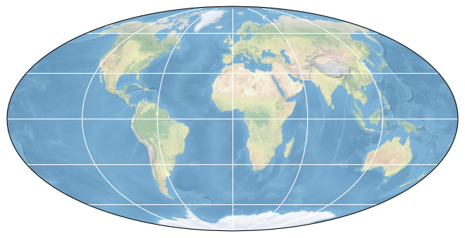

# SMOS Soil Moisture Data Cube

## How to open this dataset in DeepESDL JupyterLab
```python
from xcube.core.store import new_data_store
store = new_data_store("s3", root="deep-esdl-public", storage_options=dict(anon=True))
ds = store.open_data('SMOS-L2C-SM-20230101-20231231-1W-res0-1x1000x1000.levels')
```

## Bounding box map

<br>
<span style="font-size: x-small">Map tiles and data from <a href="http://openstreetmap.org">OpenStreetMap</a>, under <a href="http://www.openstreetmap.org/copyright">the ODbL</a>.</span>

## Basic information

| Parameter | Value                    |
| ---- |--------------------------|
| Bounding box longitude (°) | -180 to 180              |
| Bounding box latitude (°) | -89 to 89                |
| Time range | 2023-01-01 to 2024-01-06 |
| Time period | 7D                       |
| Publisher | Brockmann Consult GmbH   |

[Click here for full dataset metadata.](#full-metadata)

## Variable list

Click on a variable name to jump to the variable’s full metadata.

| Variable | Long name | Units |
| ---- | ---- | ---- |
| [Chi\_2](#Chi\_2) | \[none\] | \[none\] |
| [Chi\_2\_P](#Chi\_2\_P) | \[none\] | \[none\] |
| [N\_RFI\_X](#N\_RFI\_X) | \[none\] | \[none\] |
| [N\_RFI\_Y](#N\_RFI\_Y) | \[none\] | \[none\] |
| [RFI\_Prob](#RFI\_Prob) | \[none\] | \[none\] |
| [Soil\_Moisture](#Soil\_Moisture) | \[none\] | m3 m\-3 |
| [Soil\_Moisture\_DQX](#Soil\_Moisture\_DQX) | \[none\] | m3 m\-3 |

## Full variable metadata

### <a name="Chi_2"></a>Chi_2

| Field | Value |
| ---- | ---- |
| scale\_offset | 0\.0 |

### <a name="Chi_2_P"></a>Chi_2_P

| Field | Value |
| ---- | ---- |
| scale\_offset | 0\.0 |

### <a name="N_RFI_X"></a>N_RFI_X

### <a name="N_RFI_Y"></a>N_RFI_Y

### <a name="RFI_Prob"></a>RFI_Prob

| Field | Value |
| ---- | ---- |
| scale\_offset | 0\.0 |

### <a name="Soil_Moisture"></a>Soil_Moisture

| Field | Value |
| ---- | ---- |
| color\_bar\_name | YlGnBu |
| color\_value\_max | 1 |
| color\_value\_min | 0 |
| units | m3 m\-3 |

### <a name="Soil_Moisture_DQX"></a>Soil_Moisture_DQX

| Field | Value |
| ---- | ---- |
| units | m3 m\-3 |

## <a name="full-metadata"></a>Full dataset metadata

| Field | Value |
| ---- | ---- |
| Conventions | CF\-1\.9 |
| FH\-File\_Class | OPER |
| FH\-File\_Description | L2 Soil Moisture Output User Data Product |
| FH\-File\_Type | MIR\_SMUDP2 |
| FH\-File\_Version | 0001 |
| FH\-Mission | SMOS |
| FH\-Source\-Creator | L2OP |
| FH\-Source\-Creator\_Version | 700 |
| FH\-Source\-System | DPGS |
| VH\-MPH\-Acquisition\_Station | SVLD |
| VH\-MPH\-Logical\_Proc\_Centre | FPC |
| VH\-MPH\-Processing\_Centre | ESAC |
| VH\-MPH\-Product\_Confidence | NOMINAL |
| VH\-MPH\-Ref\_Doc | SO\-TN\-IDR\-GS\-0006 |
| acknowledgment | ESA SMOS, DeepESDL project |
| creator\_email | info@brockmann\-consult\.de |
| creator\_name | Brockmann Consult GmbH |
| creator\_url | [www\.brockmann\-consult\.de](http://www.brockmann-consult.de) |
| data\_id | SMOS\-L2C\-SM\-20230101\-20231231\-1W\-res0 |
| date\_modified | 2024\-08\-19 16:19:15\.359970 |
| description | Weekly means SMOS Soil Moisture 2023 |
| geospatial\_lat\_max | 89\.0 |
| geospatial\_lat\_min | \-89\.0 |
| geospatial\_lon\_max | 180 |
| geospatial\_lon\_min | \-180 |
| institution | Brockmann Consult GmbH |
| license | Creative Commons Attribution 4\.0 International \(CC BY 4\.0\) |
| license\_url | [https://creativecommons\.org/licenses/by/4\.0/](https://creativecommons.org/licenses/by/4.0/) |
| project | DeepESDL |
| publisher\_email | info@brockmann\-consult\.de |
| publisher\_name | Brockmann Consult GmbH |
| source | ESA SMOS Soil Moisture |
| temporal\_coverage\_end | 2023\-12\-31 23:59:59 |
| temporal\_coverage\_start | 2023\-01\-01 00:00:00 |
| temporal\_resolution | 1W |
| title | SMOS Soil Moisture Data Cube |
| version | 1\.0\.0 |

