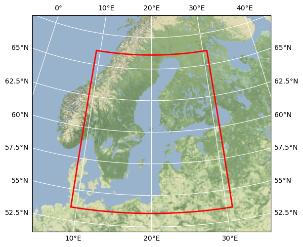

# Baltic Sea Data Cube

## Basic information

 
Map tiles by <a href="http://stamen.com">Stamen Design</a>, under <a href="http://creativecommons.org/licenses/by/3.0">CC BY 3.0</a>. Data by <a href="http://openstreetmap.org">OpenStreetMap</a>, under <a href="http://www.openstreetmap.org/copyright">ODbL</a>.

| Parameter | Value |
| ---- | ---- |
| Bounding box latitude | 53.5709 to 66.112 |
| Bounding box longitude | 9.2331 to 30.7932 |
| Time range | 2016-01-01T00:00:00.000000000 to 2017-12-31T00:00:00.000000000 |
| Publisher | DeepESDL Team |

[Click here for full dataset metadata.](#full-metadata)

## Variable list

| Variable | Identifier | Units |
| ---- | ---- | ---- |
| [sea surface wave significant height \(SWH\)](#SWH) | SWH | m |
| [Sea Surface Temperature](#sst) | sst | K |
| [Chlorophyll\-a concentration](#chl\-a) | chl\-a | mg/m3 |
| [east component of the surface current velocity](#eastward velocity) | eastward velocity | m/s |
| [north component of the surface current velocity](#northward velocity) | northward velocity | m/s |
| [Sea Surface Salinity](#sss) | sss | psu |
| [Marine Protected Areas](#MPA) | MPA | N/A |

## Full variable metadata

### sea surface wave significant height (SWH)

| Field | Value |
| ---- | ---- |
| name | SWH |
| grid\_mapping | crs |
| long\_name | sea surface wave significant height \(SWH\) |
| processing\_level | L4 |
| references | [https://resources\.marine\.copernicus\.eu/product\-detail/BALTICSEA\_REANALYSIS\_WAV\_003\_015/DOCUMENTATION](https://resources.marine.copernicus.eu/product-detail/BALTICSEA_REANALYSIS_WAV_003_015/DOCUMENTATION) |
| source | [Click here for source.](baltic-sea-SWH.md) |
| standard\_name | sea\_surface\_wave\_significant\_height |
| units | m |
| original\_lon\_spatial\_res | 0.037 |
| original\_lat\_spatial\_res | 0.028 |
| original\_name | SWH |
| original\_scale\_factor | 1.0 |
| original\_add\_offset | 0.0 |
| original\_time\_period | 1H |
| processing\_steps | Temporal daily mean aggregation, Spatial nearest neighbor interpolation |

### Sea Surface Temperature

| Field | Value |
| ---- | ---- |
| name | sst |
| grid\_mapping | crs |
| long\_name | Sea Surface Temperature |
| processing\_level | L3 |
| references | [https://resources\.marine\.copernicus\.eu/product\-detail/SST\_BAL\_SST\_L3S\_NRT\_OBSERVATIONS\_010\_032/INFORMATION](https://resources.marine.copernicus.eu/product-detail/SST_BAL_SST_L3S_NRT_OBSERVATIONS_010_032/INFORMATION) |
| source | [Click here for source.](baltic-sea-sst.md) |
| standard\_name | sea\_surface\_temperature |
| units | K |
| original\_lon\_spatial\_res | 0.00833 |
| original\_lat\_spatial\_res | 0.00833 |
| original\_name | sea\_surface\_temperature |
| original\_scale\_factor | 1.0 |
| original\_add\_offset | 0.0 |
| original\_time\_period | 1D |
| processing\_steps | Spatial nearest neighbor interpolation |

### Chlorophyll-a concentration

| Field | Value |
| ---- | ---- |
| name | chl\-a |
| grid\_mapping | crs |
| long\_name | Chlorophyll\-a concentration |
| processing\_level | L3 |
| references | [https://resources\.marine\.copernicus\.eu/product\-detail/OCEANCOLOUR\_BAL\_BGC\_L3\_MY\_009\_133/INFORMATION](https://resources.marine.copernicus.eu/product-detail/OCEANCOLOUR_BAL_BGC_L3_MY_009_133/INFORMATION) |
| source | [Click here for source.](baltic-sea-chl-a.md) |
| standard\_name | mass\_concentration\_of\_chlorophyll\_a\_in\_sea\_water \(CHL\) |
| units | mg/m3 |
| original\_lon\_spatial\_res | 0.00833 |
| original\_lat\_spatial\_res | 0.00833 |
| original\_name | mass\_concentration\_of\_chlorophyll\_a\_in\_sea\_water \(CHL\) |
| original\_scale\_factor | 1.0 |
| original\_add\_offset | 0.0 |
| original\_time\_period | 1D |
| processing\_steps | Spatial nearest neighbor interpolation |

### east component of the surface current velocity

| Field | Value |
| ---- | ---- |
| name | eastward velocity |
| grid\_mapping | crs |
| long\_name | east component of the surface current velocity |
| processing\_level | L4 |
| references | [https://resources\.marine\.copernicus\.eu/product\-detail/BALTICSEA\_REANALYSIS\_PHY\_003\_011/INFORMATION](https://resources.marine.copernicus.eu/product-detail/BALTICSEA_REANALYSIS_PHY_003_011/INFORMATION) |
| source | [Click here for source.](baltic-sea-eastward velocity.md) |
| standard\_name | eastward\_sea\_water\_velocity |
| units | m/s |
| original\_lon\_spatial\_res | 0.00833 |
| original\_lat\_spatial\_res | 0.00833 |
| original\_name | eastward\_sea\_water\_velocity |
| original\_scale\_factor | 1.0 |
| original\_add\_offset | 0.0 |
| original\_time\_period | 1D |
| processing\_steps | Spatial nearest neighbor interpolation |

### north component of the surface current velocity

| Field | Value |
| ---- | ---- |
| name | northward velocity |
| grid\_mapping | crs |
| long\_name | north component of the surface current velocity |
| processing\_level | L4 |
| references | [https://resources\.marine\.copernicus\.eu/product\-detail/BALTICSEA\_REANALYSIS\_PHY\_003\_011/INFORMATION](https://resources.marine.copernicus.eu/product-detail/BALTICSEA_REANALYSIS_PHY_003_011/INFORMATION) |
| source | [Click here for source.](baltic-sea-northward velocity.md) |
| standard\_name | northward\_sea\_water\_velocity |
| units | m/s |
| original\_lon\_spatial\_res | 0.00833 |
| original\_lat\_spatial\_res | 0.00833 |
| original\_name | northward\_sea\_water\_velocity |
| original\_scale\_factor | 1.0 |
| original\_add\_offset | 0.0 |
| original\_time\_period | 1D |
| processing\_steps | Spatial nearest neighbor interpolation |

### Sea Surface Salinity

| Field | Value |
| ---- | ---- |
| name | sss |
| grid\_mapping | crs |
| long\_name | Sea Surface Salinity |
| processing\_level | L4 |
| references | [https://resources\.marine\.copernicus\.eu/product\-detail/BALTICSEA\_REANALYSIS\_PHY\_003\_011/INFORMATION](https://resources.marine.copernicus.eu/product-detail/BALTICSEA_REANALYSIS_PHY_003_011/INFORMATION) |
| source | [Click here for source.](baltic-sea-sss.md) |
| standard\_name | sea water salinity |
| units | psu |
| original\_lon\_spatial\_res | 0.00833 |
| original\_lat\_spatial\_res | 0.00833 |
| original\_name | sea\_water\_salinity |
| original\_scale\_factor | 1.0 |
| original\_add\_offset | 0.0 |
| original\_time\_period | 1D |
| processing\_steps | Spatial nearest neighbor interpolation |

### Marine Protected Areas

| Field | Value |
| ---- | ---- |
| name | MPA |
| grid\_mapping | crs |
| long\_name | Marine Protected Areas |
| processing\_level | N/A |
| references | [https://metadata\.helcom\.fi/geonetwork/srv/eng/catalog\.search\#/metadata/d27df8c0\-de86\-4d13\-a06d\-35a8f50b16fa](https://metadata.helcom.fi/geonetwork/srv/eng/catalog.search#/metadata/d27df8c0-de86-4d13-a06d-35a8f50b16fa) |
| source | [Click here for source.](baltic-sea-MPA.md) |
| standard\_name | Marine Protected Areas |
| units | N/A |
| original\_lon\_spatial\_res | 0.00833 |
| original\_lat\_spatial\_res | 0.00833 |
| original\_name | mass\_concentration\_of\_chlorophyll\_a\_in\_sea\_water \(CHL\) |
| original\_scale\_factor | 1.0 |
| original\_add\_offset | 0.0 |
| original\_time\_period | 1D |
| processing\_steps | Spatial nearest neighbor interpolation |

## Full dataset metadata

| Field | Value |
| ---- | ---- |
| Conventions | CF\-1\.9 |
| acknowledgment | ESA BalticAIMS project, CMEMS, HELCOM, DeepESDL project |
| contributor\_name | University of Leipzig, Brockmann Consult GmbH |
| contributor\_url | [https://www\.uni\-leipzig\.de/](https://www.uni-leipzig.de/), [https://www\.brockmann\-consult\.de/](https://www.brockmann-consult.de/) |
| creator\_name | University of Leipzig, Brockmann Consult GmbH |
| creator\_url | [https://www\.uni\-leipzig\.de/](https://www.uni-leipzig.de/), [https://www\.brockmann\-consult\.de/](https://www.brockmann-consult.de/) |
| date\_modified | 2022\-08\-19 16:19:15\.359970 |
| geospatial\_lat\_max | 66.112 |
| geospatial\_lat\_min | 53.5709 |
| geospatial\_lat\_resolution | 0.0030000000000001137 |
| geospatial\_lon\_max | 30.7932 |
| geospatial\_lon\_min | 9.2331 |
| geospatial\_lon\_resolution | 0.0030000000000001137 |
| id | baltic\-sea\-256x256x256 |
| institution | Brockmann Consult GmbH |
| license | Terms and conditions of the DeepESDL data distribution |
| project | DeepESDL |
| publisher\_name | DeepESDL Team |
| publisher\_url | [https://www\.earthsystemdatalab\.net/](https://www.earthsystemdatalab.net/) |
| source | ESA BalticAIMS project, CMEMS, HELCOM, DeepESDL project |
| time\_coverage\_end | 2017\-12\-31T00:00:00\.000000000 |
| time\_coverage\_start | 2016\-01\-01T00:00:00\.000000000 |
| title | Baltic Sea Data Cube |

