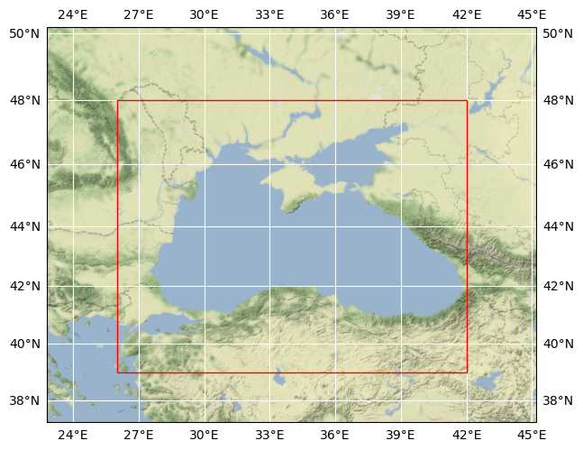

# Black Sea Data Cube

## Basic information

 
Map tiles by <a href="http://stamen.com">Stamen Design</a>, under <a href="http://creativecommons.org/licenses/by/3.0">CC BY 3.0</a>. Data by <a href="http://openstreetmap.org">OpenStreetMap</a>, under <a href="http://www.openstreetmap.org/copyright">ODbL</a>.

| Parameter | Minimum | Maximum |
| ---- | ---- | ---- |
| Bounding box latitude | 39.001500000000156 | 47.9985 |
| Bounding box longitude | 26.0015 | 41.997499999999725 |
| Time range | 2016-01-01T00:00:00.000000000 | 2017-12-31T00:00:00.000000000 |

Publisher: Brockmann Consult GmbH

[Click here for full dataset metadata.](#full-metadata)

## Variable list

| Variable | Identifier | Units |
| ---- | ---- | ---- |
| [Spectral Significant Wave Height (Hm0)](#VHM0) | VHM0 | m |
| [Chlorophyll Concentration](#chl) | chl | mg m^-3 |
| [Sea Level Anomaly](#sla) | sla | m |
| [Sea Surface Salinity](#sss) | sss | psu |
| [Sea Surface Temperature](#sst) | sst | K |
| [Absolute Geostrophic Velocity: Zonal Component](#ugos) | ugos | m s^-1 |
| [Geostrophic Velocity Anomalies: Zonal Component](#ugosa) | ugosa | m s^-1 |
| [Absolute Geostrophic Velocity: Meridian Component](#vgos) | vgos | m s^-1 |
| [Geostrophic Velocity Anomalies: Meridian Component](#vgosa) | vgosa | m s^-1 |

## Full variable metadata

### Spectral Significant Wave Height (Hm0)

| Field | Value |
| ---- | ---- |
| name | VHM0 |
| grid\_mapping | crs |
| long\_name | Spectral Significant Wave Height (Hm0) |
| processing\_level | L4 |
| references | [https://resources.marine.copernicus.eu/product-detail/BLKSEA\_MULTIYEAR\_WAV\_007\_006/DOCUMENTATION](https://resources.marine.copernicus.eu/product-detail/BLKSEA_MULTIYEAR_WAV_007_006/DOCUMENTATION) |
| source | [Click here for source.](black-sea-VHM0.md) |
| standard\_name | sea\_surface\_wave\_significant\_height |
| units | m |
| original\_lon\_spatial\_res | 0.037 |
| original\_lat\_spatial\_res | 0.028 |
| original\_name | VHM0 |
| original\_scale\_factor | 1.0 |
| original\_add\_offset | 0.0 |
| original\_time\_period | 1H |
| processing\_steps | ['Temporal daily mean aggregation', 'Spatial nearest neighbor interpolation'] |

### Chlorophyll Concentration

| Field | Value |
| ---- | ---- |
| name | chl |
| grid\_mapping | crs |
| long\_name | Chlorophyll Concentration |
| processing\_level | L3 |
| references | [http://www.eo4sibs.uliege.be/doc/EO4SIBS\_DUM\_ATBD\_OceanColour.pdf](http://www.eo4sibs.uliege.be/doc/EO4SIBS_DUM_ATBD_OceanColour.pdf) |
| source | [Click here for source.](black-sea-chl.md) |
| standard\_name | chlorophyll\_concentration |
| units | mg m^-3 |
| original\_lon\_spatial\_res | 0.003 |
| original\_lat\_spatial\_res | 0.003 |
| original\_name | Chlorophyll |
| original\_scale\_factor | 0.01 |
| original\_add\_offset | 0.0 |
| original\_time\_period | 1D |
| processing\_steps | ['Multiplying original scale factor'] |

### Sea Level Anomaly

| Field | Value |
| ---- | ---- |
| name | sla |
| grid\_mapping | crs |
| long\_name | Sea Level Anomaly |
| processing\_level | L4 |
| references | [http://www.eo4sibs.uliege.be/doc/EO4SIBS\_D4.4\_AltimetryL4\_DUM\_v1.1.pdf](http://www.eo4sibs.uliege.be/doc/EO4SIBS_D4.4_AltimetryL4_DUM_v1.1.pdf) |
| source | [Click here for source.](black-sea-sla.md) |
| standard\_name | sea\_surface\_height\_above\_sea\_level |
| units | m |
| original\_lon\_spatial\_res | 0.0625 |
| original\_lat\_spatial\_res | 0.0625 |
| original\_name | sla |
| original\_scale\_factor | 1.0 |
| original\_add\_offset | 0.0 |
| original\_time\_period | 1D |
| processing\_steps | ['Spatial nearest neighbor interpolation'] |

### Sea Surface Salinity

| Field | Value |
| ---- | ---- |
| name | sss |
| grid\_mapping | crs |
| long\_name | Sea Surface Salinity |
| processing\_level | L3 |
| references | [http://www.eo4sibs.uliege.be/doc/EO4SIBS\_DUM\_ATBD\_Salinity.pdf](http://www.eo4sibs.uliege.be/doc/EO4SIBS_DUM_ATBD_Salinity.pdf) |
| source | [Click here for source.](black-sea-sss.md) |
| standard\_name | sea\_surface\_salinity |
| units | psu |
| original\_lon\_spatial\_res | 0.25 |
| original\_lat\_spatial\_res | 0.25 |
| original\_name | sss |
| original\_scale\_factor | 1.0 |
| original\_add\_offset | 0.0 |
| original\_time\_period | 1D |
| processing\_steps | ['Spatial nearest neighbor interpolation'] |

### Sea Surface Temperature

| Field | Value |
| ---- | ---- |
| name | sst |
| grid\_mapping | crs |
| long\_name | Sea Surface Temperature |
| processing\_level | L3 |
| references | [https://resources.marine.copernicus.eu/product-detail/SST\_BS\_SST\_L3S\_NRT\_OBSERVATIONS\_010\_013/DOCUMENTATION](https://resources.marine.copernicus.eu/product-detail/SST_BS_SST_L3S_NRT_OBSERVATIONS_010_013/DOCUMENTATION) |
| source | [Click here for source.](black-sea-sst.md) |
| standard\_name | sea\_surface\_temperature |
| units | K |
| original\_lon\_spatial\_res | 0.00833 |
| original\_lat\_spatial\_res | 0.00833 |
| original\_name | sea\_surface\_temperature |
| original\_scale\_factor | 1.0 |
| original\_add\_offset | 0.0 |
| original\_time\_period | 1D |
| processing\_steps | ['Spatial nearest neighbor interpolation'] |

### Absolute Geostrophic Velocity: Zonal Component

| Field | Value |
| ---- | ---- |
| name | ugos |
| grid\_mapping | crs |
| long\_name | Absolute Geostrophic Velocity: Zonal Component |
| processing\_level | L4 |
| references | [http://www.eo4sibs.uliege.be/doc/EO4SIBS\_D4.4\_AltimetryL4\_DUM\_v1.1.pdf](http://www.eo4sibs.uliege.be/doc/EO4SIBS_D4.4_AltimetryL4_DUM_v1.1.pdf) |
| source | [Click here for source.](black-sea-ugos.md) |
| standard\_name | surface\_geostrophic\_eastward\_sea\_water\_velocity |
| units | m s^-1 |
| original\_lon\_spatial\_res | 0.0625 |
| original\_lat\_spatial\_res | 0.0625 |
| original\_name | ugos |
| original\_scale\_factor | 1.0 |
| original\_add\_offset | 0.0 |
| original\_time\_period | 1D |
| processing\_steps | ['Spatial nearest neighbor interpolation'] |

### Geostrophic Velocity Anomalies: Zonal Component

| Field | Value |
| ---- | ---- |
| name | ugosa |
| grid\_mapping | crs |
| long\_name | Geostrophic Velocity Anomalies: Zonal Component |
| processing\_level | L4 |
| references | [http://www.eo4sibs.uliege.be/doc/EO4SIBS\_D4.4\_AltimetryL4\_DUM\_v1.1.pdf](http://www.eo4sibs.uliege.be/doc/EO4SIBS_D4.4_AltimetryL4_DUM_v1.1.pdf) |
| source | [Click here for source.](black-sea-ugosa.md) |
| standard\_name | surface\_geostrophic\_eastward\_sea\_water\_velocity\_assuming\_sea\_level\_for\_geoid |
| units | m s^-1 |
| original\_lon\_spatial\_res | 0.0625 |
| original\_lat\_spatial\_res | 0.0625 |
| original\_name | ugosa |
| original\_scale\_factor | 1.0 |
| original\_add\_offset | 0.0 |
| original\_time\_period | 1D |
| processing\_steps | ['Spatial nearest neighbor interpolation'] |

### Absolute Geostrophic Velocity: Meridian Component

| Field | Value |
| ---- | ---- |
| name | vgos |
| grid\_mapping | crs |
| long\_name | Absolute Geostrophic Velocity: Meridian Component |
| processing\_level | L4 |
| references | [http://www.eo4sibs.uliege.be/doc/EO4SIBS\_D4.4\_AltimetryL4\_DUM\_v1.1.pdf](http://www.eo4sibs.uliege.be/doc/EO4SIBS_D4.4_AltimetryL4_DUM_v1.1.pdf) |
| source | [Click here for source.](black-sea-vgos.md) |
| standard\_name | surface\_geostrophic\_northward\_sea\_water\_velocity |
| units | m s^-1 |
| original\_lon\_spatial\_res | 0.0625 |
| original\_lat\_spatial\_res | 0.0625 |
| original\_name | vgos |
| original\_scale\_factor | 1.0 |
| original\_add\_offset | 0.0 |
| original\_time\_period | 1D |
| processing\_steps | ['Spatial nearest neighbor interpolation'] |

### Geostrophic Velocity Anomalies: Meridian Component

| Field | Value |
| ---- | ---- |
| name | vgosa |
| grid\_mapping | crs |
| long\_name | Geostrophic Velocity Anomalies: Meridian Component |
| processing\_level | L4 |
| references | [http://www.eo4sibs.uliege.be/doc/EO4SIBS\_D4.4\_AltimetryL4\_DUM\_v1.1.pdf](http://www.eo4sibs.uliege.be/doc/EO4SIBS_D4.4_AltimetryL4_DUM_v1.1.pdf) |
| source | [Click here for source.](black-sea-vgosa.md) |
| standard\_name | surface\_geostrophic\_northward\_sea\_water\_velocity\_assuming\_sea\_level\_for\_geoid |
| units | m s^-1 |
| original\_lon\_spatial\_res | 0.0625 |
| original\_lat\_spatial\_res | 0.0625 |
| original\_name | vgosa |
| original\_scale\_factor | 1.0 |
| original\_add\_offset | 0.0 |
| original\_time\_period | 1D |
| processing\_steps | ['Spatial nearest neighbor interpolation'] |

## Full dataset metadata

| Field | Value |
| ---- | ---- |
| Conventions | CF-1.9 |
| acknowledgment | EO4SIBS, CMEMS, DeepESDL project |
| contributor\_name | Brockmann Geomatics Sweden AB |
| contributor\_url | [www.brockmann-geomatics.se](http://www.brockmann-geomatics.se) |
| creator\_email | info@brockmann-consult.de |
| creator\_name | Brockmann Consult GmbH |
| creator\_url | [www.brockmann-consult.de](http://www.brockmann-consult.de) |
| date\_modified | 2022-08-19 16:19:15.359970 |
| geospatial\_lat\_max | 47.9985 |
| geospatial\_lat\_min | 39.001500000000156 |
| geospatial\_lat\_resolution | 0.0030000000000001137 |
| geospatial\_lon\_max | 41.997499999999725 |
| geospatial\_lon\_min | 26.0015 |
| geospatial\_lon\_resolution | 0.0030000000000001137 |
| id | black-sea-256x256x256 |
| institution | Brockmann Consult GmbH |
| license | Terms and conditions of the DeepESDL data distribution |
| project | DeepESDL |
| publisher\_email | info@brockmann-consult.de |
| publisher\_name | Brockmann Consult GmbH |
| publisher\_url | [www.brockmann-consult.de](http://www.brockmann-consult.de) |
| source | EO4SIBS, CMEMS |
| time\_coverage\_end | 2017-12-31T00:00:00.000000000 |
| time\_coverage\_start | 2016-01-01T00:00:00.000000000 |
| title | Black Sea Data Cube |

