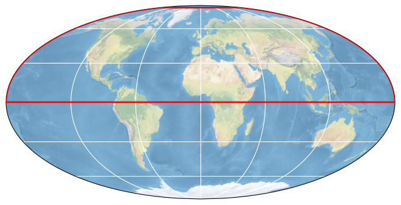

# SMOS Freeze and Thaw Processing and Dissemination Service

## How to open this dataset in DeepESDL JupyterLab
```python
from xcube.core.store import new_data_store
store = new_data_store("s3", root="deep-esdl-public", storage_options=dict(anon=True))
ds = store.open_data('SMOS-snow-1x720x720-1.0.1.zarr')
```

## Bounding box map

<br>
<span style="font-size: x-small">Map tiles and data from <a href="http://openstreetmap.org">OpenStreetMap</a>, under <a href="http://www.openstreetmap.org/copyright">the ODbL</a>.</span>

## Basic information

| Parameter | Value |
| ---- | ---- |
| Bounding box longitude (°) | -180 to 180 |
| Bounding box latitude (°) | 0 to 85 |
| Time range | 2010-07-01 to 2023-03-09 |

[Click here for full dataset metadata.](#full-metadata)

## Variable list

Click on a variable name to jump to the variable’s full metadata.

| Variable | Long name | Units |
| ---- | ---- | ---- |
| [L3FT](#L3FT) | SMOS Level 3 Freeze Thaw Estimates | \[none\] |
| [PM](#PM) | Processing Mask | \[none\] |
| [quality\_flag](#quality\_flag) | Quality Flag | \[none\] |
| [uncertainty](#uncertainty) | Uncertainty | \[none\] |

## Full variable metadata

### <a name="L3FT"></a>L3FT

| Field | Value |
| ---- | ---- |
| flag\_meanings | Thaw Partial Frozen |
| flag\_values | 1, 2, 3 |
| grid\_mapping | crs |
| long\_name | SMOS Level 3 Freeze Thaw Estimates |
| valid\_range | 1, 3 |

### <a name="PM"></a>PM

| Field | Value |
| ---- | ---- |
| grid\_mapping | crs |
| long\_name | Processing Mask |
| valid\_range | 0, 8 |

### <a name="crs"></a>crs

| Field | Value |
| ---- | ---- |
| GeoTransform | \-9000000 25000 0 9000000 0 \-25000  |
| false\_easting | 0 |
| false\_northing | 0 |
| grid\_mapping\_name | lambert\_azimuthal\_equal\_area |
| inverse\_flattening | 298 |
| latitude\_of\_projection\_origin | 90 |
| longitude\_of\_prime\_meridian | 0 |
| longitude\_of\_projection\_origin | 0 |
| semi\_major\_axis | 6380000\.0 |
| spatial\_ref | PROJCS\["unnamed",GEOGCS\["WGS 84",DATUM\["unknown",SPHEROID\["WGS84",6378137,298\.257223563\]\],PRIMEM\["Greenwich",0\],UNIT\["degree",0\.0174532925199433\]\],PROJECTION\["Lambert\_Azimuthal\_Equal\_Area"\],PARAMETER\["latitude\_of\_center",90\],PARAMETER\["longitude\_of\_center",0\],PARAMETER\["false\_easting",0\],PARAMETER\["false\_northing",0\],UNIT\["metre",1,AUTHORITY\["EPSG","9001"\]\]\] |

### <a name="quality_flag"></a>quality_flag

| Field | Value |
| ---- | ---- |
| grid\_mapping | crs |
| long\_name | Quality Flag |
| valid\_range | 0, 255 |

### <a name="uncertainty"></a>uncertainty

| Field | Value |
| ---- | ---- |
| grid\_mapping | crs |
| long\_name | Uncertainty |
| valid\_range | 0, 100 |

## <a name="full-metadata"></a>Full dataset metadata

| Field | Value |
| ---- | ---- |
| ancillarydata\_2mair | Ancillary data for 2m airtemperature: ECMWF ERA Interim reanalysis \(1\-Jul\-2010 \- 31\-Jul\-2018\) and ECMWF NRT data \(1\-Aug\-2018 onwards\) |
| ancillarydata\_snowcover | Ancillary data for snow cover: IMS DAILY NORTHERN HEMISPHERE SNOW AND ICE ANALYSIS AT 4 KM |
| contact | Kimmo Rautiainen &lt;kimmo\.rautiainen@fmi\.fi&gt; |
| coordinate\_system | Equal\-Area Scalable Earth Grid 2\.0 \(EASE\-Grid 2\.0\) \- Northern Hemisphere |
| data\_date | 20100701 |
| incidence\_angle\_range | 50\-55 degrees |
| latitude\_range | 0N \- 85N |
| longitude\_range | 180W \- 180E |
| moving\_average | 20 days |
| orbits\_included | Currently only descending orbits used |
| processing\_date | 2019\-05\-22 |
| processing\_organisation | Finnish Meteorological Institute |
| processing\_software\_name | FMI SMOS F/T processing sowtware \(Rautiainen, Cohen, Hiltunen, Ikonen, Parkkinen, Moisander, Takala 2016\-2019\) |
| processing\_software\_version | v\_2\.00 |
| project\_id | SMOS Freeze and Thaw Processing and Dissemination Service |
| sensor | SMOS |
| smosinputdataversion | SMOS input data: CATDS v620 |
| spatial\_resolution | 25 X 25 sq\.km |
| title | SMOS Freeze and Thaw Processing and Dissemination Service |

