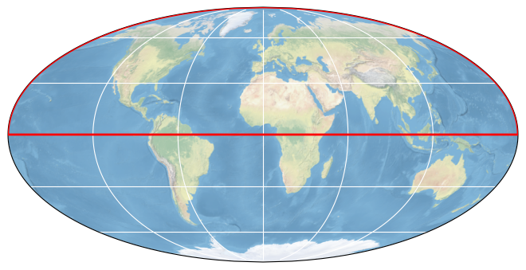

# ESA CCI PERMAFROST

## How to open this dataset in DeepESDL JupyterLab
```python
from xcube.core.store import new_data_store
store = new_data_store("s3", root="deep-esdl-public", storage_options=dict(anon=True))
# The cube is saved as a multilevel cube, the level 0 is the base layer with 
# the highest resolution
ml_dataset = store.open_data('esa-cci-permafrost-1x1151x1641-0.0.2.levels')
# Chek how many levels are present
ml_dataset.num_levels
# Open dataset at a certain level, here level 0
ds = ml_dataset.get_dataset(0)
```

## Bounding box map

<br>
<span style="font-size: x-small">Map tiles and data from <a href="http://openstreetmap.org">OpenStreetMap</a>, under <a href="http://www.openstreetmap.org/copyright">the ODbL</a>.</span>

## Basic information

| Parameter | Value |
| ---- | ---- |
| Bounding box longitude (°) | -180 to 180 |
| Bounding box latitude (°) | 0 to 90 |
| Time range | 2000-01-01 to 2020-01-01 |

[Click here for full dataset metadata.](#full-metadata)

## Variable list

Click on a variable name to jump to the variable’s full metadata.

| Variable | Long name | Units |
| ---- | ---- | ---- |
| [GST](#GST) | GST surface temperature  | degrees celsius |
| [T10m](#T10m) | T10m solid earth subsurface temperature  | degrees celsius |
| [T1m](#T1m) | T1m solid earth subsurface temperature  | degrees celsius |
| [T2m](#T2m) | T2m solid earth subsurface temperature  | degrees celsius |
| [T5m](#T5m) | T5m solid earth subsurface temperature  | degrees celsius |
| [polar\_stereographic](#polar\_stereographic) | \[none\] | \[none\] |

## Full variable metadata

### <a name="GST"></a>GST

| Field | Value |
| ---- | ---- |
| color\_bar\_name | coolwarm |
| color\_value\_max | 30 |
| color\_value\_min | \-30 |
| grid\_mapping | polar\_stereographic |
| long\_name | GST surface temperature  |
| orig\_data\_type | uint16 |
| standard\_name | surface\_temperature |
| units | degrees celsius |
| valid\_max | 100 |
| valid\_min | \-100 |

### <a name="T10m"></a>T10m

| Field | Value |
| ---- | ---- |
| color\_bar\_name | coolwarm |
| color\_value\_max | 30 |
| color\_value\_min | \-30 |
| grid\_mapping | polar\_stereographic |
| long\_name | T10m solid earth subsurface temperature  |
| orig\_data\_type | uint16 |
| standard\_name | solid\_earth\_subsurface\_temperature |
| units | degrees celsius |
| valid\_max | 100 |
| valid\_min | \-100 |

### <a name="T1m"></a>T1m

| Field | Value |
| ---- | ---- |
| color\_bar\_name | coolwarm |
| color\_value\_max | 30 |
| color\_value\_min | \-30 |
| grid\_mapping | polar\_stereographic |
| long\_name | T1m solid earth subsurface temperature  |
| orig\_data\_type | uint16 |
| standard\_name | solid\_earth\_subsurface\_temperature |
| units | degrees celsius |
| valid\_max | 100 |
| valid\_min | \-100 |

### <a name="T2m"></a>T2m

| Field | Value |
| ---- | ---- |
| color\_bar\_name | coolwarm |
| color\_value\_max | 30 |
| color\_value\_min | \-30 |
| grid\_mapping | polar\_stereographic |
| long\_name | T2m solid earth subsurface temperature  |
| orig\_data\_type | uint16 |
| standard\_name | solid\_earth\_subsurface\_temperature |
| units | degrees celsius |
| valid\_max | 100 |
| valid\_min | \-100 |

### <a name="T5m"></a>T5m

| Field | Value |
| ---- | ---- |
| color\_bar\_name | coolwarm |
| color\_value\_max | 30 |
| color\_value\_min | \-30 |
| grid\_mapping | polar\_stereographic |
| long\_name | T5m solid earth subsurface temperature  |
| orig\_data\_type | uint16 |
| standard\_name | solid\_earth\_subsurface\_temperature |
| units | degrees celsius |
| valid\_max | 100 |
| valid\_min | \-100 |

### <a name="polar_stereographic"></a>polar_stereographic

| Field | Value |
| ---- | ---- |
| GeoTransform | \-8679599\.425969256 926\.6254331383326 0 4120958\.560533902 0 \-926\.6254331383326  |
| chunk\_sizes |  |
| crs\_wkt | PROJCRS\["WGS 84 / Arctic Polar Stereographic",BASEGEOGCRS\["WGS 84",ENSEMBLE\["World Geodetic System 1984 ensemble",MEMBER\["World Geodetic System 1984 \(Transit\)"\],MEMBER\["World Geodetic System 1984 \(G730\)"\],MEMBER\["World Geodetic System 1984 \(G873\)"\],MEMBER\["World Geodetic System 1984 \(G1150\)"\],MEMBER\["World Geodetic System 1984 \(G1674\)"\],MEMBER\["World Geodetic System 1984 \(G1762\)"\],MEMBER\["World Geodetic System 1984 \(G2139\)"\],ELLIPSOID\["WGS 84",6378137,298\.257223563,LENGTHUNIT\["metre",1\]\],ENSEMBLEACCURACY\[2\.0\]\],PRIMEM\["Greenwich",0,ANGLEUNIT\["degree",0\.0174532925199433\]\],ID\["EPSG",4326\]\],CONVERSION\["Arctic Polar Stereographic",METHOD\["Polar Stereographic \(variant B\)",ID\["EPSG",9829\]\],PARAMETER\["Latitude of standard parallel",71,ANGLEUNIT\["degree",0\.0174532925199433\],ID\["EPSG",8832\]\],PARAMETER\["Longitude of origin",0,ANGLEUNIT\["degree",0\.0174532925199433\],ID\["EPSG",8833\]\],PARAMETER\["False easting",0,LENGTHUNIT\["metre",1\],ID\["EPSG",8806\]\],PARAMETER\["False northing",0,LENGTHUNIT\["metre",1\],ID\["EPSG",8807\]\]\],CS\[Cartesian,2\],AXIS\["easting \(X\)",south,MERIDIAN\[90,ANGLEUNIT\["degree",0\.0174532925199433\]\],ORDER\[1\],LENGTHUNIT\["metre",1\]\],AXIS\["northing \(Y\)",south,MERIDIAN\[180,ANGLEUNIT\["degree",0\.0174532925199433\]\],ORDER\[2\],LENGTHUNIT\["metre",1\]\],USAGE\[SCOPE\["Polar research\."\],AREA\["Northern hemisphere \- north of 60°N onshore and offshore, including Arctic\."\],BBOX\[60,\-180,90,180\]\],ID\["EPSG",3995\]\] |
| data\_type | int64 |
| dimensions |  |
| esri\_wkt | PROJCS\[\\"WGS\_84\_Arctic\_Polar\_Stereographic\\",GEOGCS\[\\"GCS\_WGS\_1984\\",DATUM\[\\"D\_WGS\_1984\\",SPHEROID\[\\"WGS\_1984\\",6378137,298\.257223563\]\],PRIMEM\[\\"Greenwich\\",0\],UNIT\[\\"Degree\\",0\.017453292519943295\]\],PROJECTION\[\\"Stereographic\_North\_Pole\\"\],PARAMETER\[\\"standard\_parallel\_1\\",71\],PARAMETER\[\\"central\_meridian\\",0\],PARAMETER\[\\"false\_easting\\",0\],PARAMETER\[\\"false\_northing\\",0\],UNIT\[\\"Meter\\",1\]\] |
| false\_easting | 0\.0 |
| false\_northing | 0\.0 |
| file\_chunk\_sizes | 1 |
| file\_dimensions |  |
| fill\_value | 9223372036854775807 |
| geographic\_crs\_name | WGS 84 |
| grid\_mapping\_name | polar\_stereographic |
| horizontal\_datum\_name | World Geodetic System 1984 ensemble |
| inverse\_flattening | 298\.257223563 |
| latitude\_of\_projection\_origin | 90\.0 |
| longitude\_of\_prime\_meridian | 0\.0 |
| orig\_data\_type | int32 |
| prime\_meridian\_name | Greenwich |
| projected\_crs\_name | WGS 84 / Arctic Polar Stereographic |
| reference\_ellipsoid\_name | WGS 84 |
| semi\_major\_axis | 6378137\.0 |
| semi\_minor\_axis | 6356752\.314245179 |
| shape |  |
| size | 1 |
| spatial\_ref | GEOGCS\[\\"WGS 84\\",DATUM\[\\"WGS\_1984\\",SPHEROID\[\\"WGS 84\\",6378137,298\.257223563,AUTHORITY\[\\"EPSG\\",\\"7030\\"\]\],AUTHORITY\[\\"EPSG\\",\\"6326\\"\]\],PRIMEM\[\\"Greenwich\\",0\],UNIT\[\\"degree\\",0\.0174532925199433\],AUTHORITY\[\\"EPSG\\",\\"4326\\"\]\],PROJECTION\[\\"Polar\_Stereographic\\"\],PARAMETER\[\\"latitude\_of\_origin\\",45\],PARAMETER\[\\"central\_meridian\\",\-170\],PARAMETER\[\\"scale\_factor\\",1\],PARAMETER\[\\"false\_easting\\",0\],PARAMETER\[\\"false\_northing\\",0\],UNIT\[\\"metre\\",1,AUTHORITY\[\\"EPSG\\",\\"9001\\"\]\] |
| standard\_parallel | 71\.0 |
| straight\_vertical\_longitude\_from\_pole | 0\.0 |

## <a name="full-metadata"></a>Full dataset metadata

| Field | Value |
| ---- | ---- |
| Conventions | CF\-1\.7 |
| date\_created | 2023\-05\-08 |
| history | cube\_params: time\_range: 2019\-01\-01T00:00:00, 2019\-12\-31T00:00:00, variable\_names: polar\_stereographic, GST, T1m, T2m, T5m, T10m, program: xcube\_cci\.chunkstore\.CciChunkStore |
| id | esa\-cci\-permafrost\-1x1151x1641\-0\.0\.2 |
| processing\_level | L4 |
| project | DeepESDL |
| source | esacci\.PERMAFROST\.yr\.L4\.GTD\.multi\-sensor\.multi\-platform\.ERA5\_MODISLST\_BIASCORRECTED\.03\-0\.r1, esacci\.PERMAFROST\.yr\.L4\.GTD\.multi\-sensor\.multi\-platform\.MODISLST\_CRYOGRID\.03\-0\.r1 |
| time\_coverage\_duration | P365DT0H0M0S |
| time\_coverage\_end | 2019\-07\-02T12:00:00 |
| time\_coverage\_start | 2000\-07\-02T12:00:00 |
| title | ESA CCI PERMAFROST |

