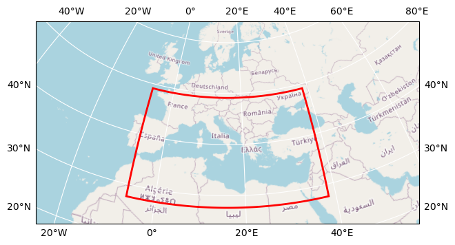

# Merged extrAIM dataset

## How to open this dataset in DeepESDL JupyterLab
```python
from xcube.core.store import new_data_store
store = new_data_store("s3", root="deep-esdl-public", storage_options=dict(anon=True))
ds = store.open_data('extrAIM-merged-cube-1x86x179.zarr')
```

## Bounding box map

<br>
<span style="font-size: x-small">Map tiles and data from <a href="http://openstreetmap.org">OpenStreetMap</a>, under <a href="http://www.openstreetmap.org/copyright">the ODbL</a>.</span>

## Basic information

| Parameter | Value |
| ---- | ---- |
| Bounding box longitude (°) | -6.375 to 38.375 |
| Bounding box latitude (°) | 27.625 to 49.125 |
| Time range | 2007-01-01 to 2021-10-01 |
| Time period | 1D |

[Click here for full dataset metadata.](#full-metadata)

## Variable list

Click on a variable name to jump to the variable’s full metadata.

| Variable | Long name | Units |
| ---- | ---- | ---- |
| [precip](#precip) | \[none\] | mm |

## Full variable metadata

### <a name="precip"></a>precip

| Field | Value |
| ---- | ---- |
| color\_bar\_name | coolwarm |
| color\_value\_max | 40 |
| color\_value\_min | 0 |
| units | mm |

## <a name="full-metadata"></a>Full dataset metadata

| Field | Value |
| ---- | ---- |
| history | The extrAIM consortium, Sat Feb 24 12:41:25 2024 |
| institution | extrAIM |
| title | Merged extrAIM dataset |

