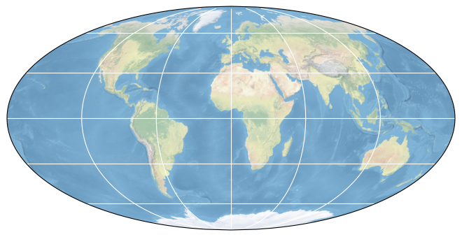

# SeasFire Cube: A Global Dataset for Seasonal Fire Modeling in the Earth System

## How to open this dataset in DeepESDL JupyterLab
```python
from xcube.core.store import new_data_store
store = new_data_store("s3", root="deep-esdl-public", storage_options=dict(anon=True))
ds = store.open_data('SeasFireCube_v3.zarr')
```

## Bounding box map

<br>
<span style="font-size: x-small">Map tiles and data from <a href="http://openstreetmap.org">OpenStreetMap</a>, under <a href="http://www.openstreetmap.org/copyright">the ODbL</a>.</span>

## Basic information

| Parameter | Value |
| ---- | ---- |
| Bounding box longitude (°) | -180.0 to 180.0 |
| Bounding box latitude (°) | -90.0 to 90.0 |
| Time range | 2001-01-01 to 2021-12-27 |

[Click here for full dataset metadata.](#full-metadata)

## Variable list

Click on a variable name to jump to the variable’s full metadata.

| Variable | Long name | Units |
| ---- | ---- | ---- |
| [area](#area) | \[none\] | m2 |
| [biomes](#biomes) | \[none\] | \[none\] |
| [cams\_co2fire](#cams\_co2fire) | Wildfire flux of carbon dioxide | kg m\-2 |
| [cams\_frpfire](#cams\_frpfire) | Wildfire radiative power | W m\-2 |
| [drought\_code\_max](#drought\_code\_max) | Drought Code, Maximum | Dimensionless |
| [drought\_code\_mean](#drought\_code\_mean) | Drought Code, Average | Dimensionless |
| [fcci\_ba](#fcci\_ba) | Burned Areas from Fire Climate Change Initiative \(FCCI\) | hectares \(ha\) |
| [fcci\_ba\_valid\_mask](#fcci\_ba\_valid\_mask) | \[none\] | \[none\] |
| [fcci\_fraction\_of\_burnable\_area](#fcci\_fraction\_of\_burnable\_area) | fraction of burnable area | 0 to 1 |
| [fcci\_fraction\_of\_observed\_area](#fcci\_fraction\_of\_observed\_area) | fraction of observed area | 0 to 1 |
| [fcci\_number\_of\_patches](#fcci\_number\_of\_patches) | number of burn patches | 0 to N |
| [fwi\_max](#fwi\_max) | Fire Weather Index, Maximum | Dimensionless |
| [fwi\_mean](#fwi\_mean) | Fire Weather Index, Average | Dimensionless |
| [gfed\_ba](#gfed\_ba) | Burned Areas from GFED | hectares \(ha\) |
| [gfed\_ba\_valid\_mask](#gfed\_ba\_valid\_mask) | \[none\] | \[none\] |
| [gfed\_region](#gfed\_region) | GFED basis regions | \[none\] |
| [gwis\_ba](#gwis\_ba) | Burned Areas from GWIS | hectares \(ha\) |
| [gwis\_ba\_valid\_mask](#gwis\_ba\_valid\_mask) | \[none\] | \[none\] |
| [lai](#lai) | Leaf Area Index  | m²/m² |
| [lccs\_class\_0](#lccs\_class\_0) | Land Cover Class 0 \- No data | % |
| [lccs\_class\_1](#lccs\_class\_1) | Land Cover Class 1 \- Agriculture | % |
| [lccs\_class\_2](#lccs\_class\_2) | Land Cover Class 2 \- Forest | % |
| [lccs\_class\_3](#lccs\_class\_3) | Land Cover Class 3 \- Grassland | % |
| [lccs\_class\_4](#lccs\_class\_4) | Land Cover Class 4 \- Wetland | % |
| [lccs\_class\_5](#lccs\_class\_5) | Land Cover Class 5 \- Settlement | % |
| [lccs\_class\_6](#lccs\_class\_6) | Land Cover Class 6 \- Shrubland | % |
| [lccs\_class\_7](#lccs\_class\_7) | Land Cover Class 4 \- Sparse vegetation, bare areas, permanent snow and ice | % |
| [lccs\_class\_8](#lccs\_class\_8) | Land Cover Class 4 \- Sparse vegetation, bare areas, permanent snow and ice | % |
| [lsm](#lsm) | Land\-sea mask | \(0 \- 1\) |
| [lst\_day](#lst\_day) | Day Land Surface Temperature for Climate Modeling Grid \(CMG\)  | Kelvin \(K\) |
| [mslp](#mslp) | Mean sea level pressure | Pa |
| [ndvi](#ndvi) | CMG 0\.05 Deg 16 days NDVI  | \-1 to 1 |
| [oci\_ao](#oci\_ao) | Arctic Oscillation | Dimensionless |
| [oci\_censo](#oci\_censo) | Bivariate ENSO Timeseries | Dimensionless |
| [oci\_ea](#oci\_ea) | Eastern Asia/Western Russia | Dimensionless |
| [oci\_epo](#oci\_epo) | East Pacific/North Pacific Oscillation | Dimensionless |
| [oci\_gmsst](#oci\_gmsst) | Global Mean Land/Ocean Temperature | Dimensionless |
| [oci\_nao](#oci\_nao) | North Atlantic Oscillation | Dimensionless |
| [oci\_nina34\_anom](#oci\_nina34\_anom) | Niño 3\.4 region | Dimensionless |
| [oci\_pdo](#oci\_pdo) | Pacific Decadal Oscillation | Dimensionless |
| [oci\_pna](#oci\_pna) | Pacific North American Index | Dimensionless |
| [oci\_soi](#oci\_soi) | Southern Oscillation Index | Dimensionless |
| [oci\_wp](#oci\_wp) | Western Pacific Index | Dimensionless |
| [pop\_dens](#pop\_dens) | UN WPP\-Adjusted Population Density | Persons per square kilometer |
| [rel\_hum](#rel\_hum) | Relative humidity | % |
| [skt](#skt) | Skin Temperature | Kelvin \(K\) |
| [ssr](#ssr) | Surface net solar radiation | MJ m\-2 |
| [ssrd](#ssrd) | Surface net solar radiation downwards | MJ m\-2 |
| [sst](#sst) | Sea surface temperature | K |
| [swvl1](#swvl1) | Volumetric soil water layer 1 | m3 m\-3 |
| [swvl2](#swvl2) | Volumetric soil water layer 2 | m3 m\-3 |
| [swvl3](#swvl3) | Volumetric soil water layer 3 | m3 m\-3 |
| [swvl4](#swvl4) | Volumetric soil water layer 4 | m3 m\-3 |
| [t2m\_max](#t2m\_max) | 2 meters temperature \- Maximum value | Kelvin \(K\) |
| [t2m\_mean](#t2m\_mean) | 2 meters temperature \- Mean value | Kelvin \(K\) |
| [t2m\_min](#t2m\_min) | 2 meters temperature \- Minimum Value | Kelvin \(K\) |
| [tp](#tp) | Total precipitation | mm |
| [vpd](#vpd) | Vapour Pressure Deficit | hPa |
| [ws10](#ws10) | Windspeed of the 10m wind \[sqrt\(u10^2\+v10^2\)\] | m\*s\-2 |

## Full variable metadata

### <a name="area"></a>area

| Field | Value |
| ---- | ---- |
| description | Square meters of each grid cell, calculated in crs 8857, WGS 84 / Equal Earth Greenwich |
| units | m2 |

### <a name="biomes"></a>biomes

| Field | Value |
| ---- | ---- |
| 1 | Flooded Grasslands & Savannas |
| 10 | Tundra |
| 11 | Tropical & Subtropical Coniferous Forests |
| 12 | Tropical & Subtropical Dry Broadleaf Forests |
| 13 | Tropical & Subtropical Moist Broadleaf Forests |
| 14 | Montane Grasslands & Shrublandss |
| 15 | Temperate Broadleaf & Mixed Forests |
| 2 | Tropical & Subtropical Grasslands, Savannas & Shrublands |
| 3 | Mediterranean Forests, Woodlands & Scrub |
| 4 | Rock & Ice |
| 5 | Mangroves |
| 6 | Temperate Grasslands, Savannas & Shrublands |
| 7 | Temperate Conifer Forests |
| 8 | Deserts & Xeric Shrublandss |
| 9 | Boreal Forests/Taiga |
| biome\_number | biome\_name |
| description | The RESOLVE Ecoregions dataset, updated in 2017, offers a depiction of the 846 terrestrial ecoregions that represent our living planet\.Ecoregions, in the simplest definition, are ecosystems of regional extent\. Specifically, ecoregions represent distinct assemblages of biodiversity\-all taxa, not just vegetation\-whose boundaries include the space required to sustain ecological processes\. Ecoregions provide a useful basemap for conservation planning in particular because they draw on natural, rather than political, boundaries, define distinct biogeographic assemblages and ecological habitats within biomes, and assist in representation of Earth's biodiversity\.This dataset is based on recent advances in biogeography \- the science concerning the distribution of plants and animals\. The original ecoregions dataset has been widely used since its introduction in 2001, underpinning the most recent analyses of the effects of global climate change on nature by ecologists to the distribution of the world's beetles to modern conservation planning\.The 846 terrestrial ecoregions are grouped into 14 biomes  |
| provider | RESOLVE Biodiversity and Wildlife Solutions |

### <a name="cams_co2fire"></a>cams_co2fire

| Field | Value |
| ---- | ---- |
| creator\_notes | Missing years filled with Nan\. To convert to kg multiply by the variable square\_meters\. |
| description | The Global Fire Assimilation System \(GFAS\) assimilates fire radiative power \(FRP\) observations from satellite\-based sensors to produce daily estimates of biomass burning emissions |
| downloaded from | [https://confluence\.ecmwf\.int/display/CKB/CAMS%3A\+Global\+Fire\+Assimilation\+System\+%28GFAS%29\+data\+documentation](https://confluence.ecmwf.int/display/CKB/CAMS%3A+Global+Fire+Assimilation+System+%28GFAS%29+data+documentation) |
| long\_name | Wildfire flux of carbon dioxide |
| missing\_years | 2001 & 2002, see Creators Notes |
| provider | ECMWF CAMS Global Fire Assimilation System \(GFAS\) |
| units | kg m\-2 |

### <a name="cams_frpfire"></a>cams_frpfire

| Field | Value |
| ---- | ---- |
| creator\_notes | Missing years filled with Nan\. To convert to W multiply by the variable square\_meters\.  |
| description | FRP observations currently assimilated in GFAS are the NASA Terra MODIS and Aqua MODIS active fire products \(http://modis\-fire\.umd\.edu/\) |
| downloaded\_from | [https://confluence\.ecmwf\.int/display/CKB/CAMS%3A\+Global\+Fire\+Assimilation\+System\+%28GFAS%29\+data\+documentation](https://confluence.ecmwf.int/display/CKB/CAMS%3A+Global+Fire+Assimilation+System+%28GFAS%29+data+documentation) |
| long\_name | Wildfire radiative power |
| missing\_years | 2001 & 2002, see creators notes |
| provider | ECMWF CAMS Global Fire Assimilation System \(GFAS\) |
| units | W m\-2 |

### <a name="drought_code_max"></a>drought_code_max

| Field | Value |
| ---- | ---- |
| description | The Drought code is an indicator of the moisture content in deep compact organic layers\. This code represents a fuel layer at approximately 10\-20 cm deep\. The Drought code fuels have a very slow drying rate, with a time lag of 52 days\. The Drought code scale is open\-ended, although the maximum value is about 800 |
| downloaded\_from | [https://cds\.climate\.copernicus\.eu/cdsapp\#\!/dataset/cems\-fire\-historical?tab=overview](https://cds.climate.copernicus.eu/cdsapp#!/dataset/cems-fire-historical?tab=overview) |
| long\_name | Drought Code, Maximum |
| provider | Copernicus\-CEMS |
| units | Dimensionless |

### <a name="drought_code_mean"></a>drought_code_mean

| Field | Value |
| ---- | ---- |
| description | The Drought code is an indicator of the moisture content in deep compact organic layers\. This code represents a fuel layer at approximately 10\-20 cm deep\. The Drought code fuels have a very slow drying rate, with a time lag of 52 days\. The Drought code scale is open\-ended, although the maximum value is about 800 |
| downloaded\_from | [https://cds\.climate\.copernicus\.eu/cdsapp\#\!/dataset/cems\-fire\-historical?tab=overview](https://cds.climate.copernicus.eu/cdsapp#!/dataset/cems-fire-historical?tab=overview) |
| long\_name | Drought Code, Average |
| provider | Copernicus CEMS |
| units | Dimensionless |

### <a name="fcci_ba"></a>fcci_ba

| Field | Value |
| ---- | ---- |
| creator\_notes | Masked ocean with lsm variable\. Missing years filled with Nan\. USE ONLY for monthly modeling\! FireCCI is a monthly product that could not be fairly distributed to weekly time range\. Each week of the same month is filled with the same monthly value\. To acquire the monthly value take the average of each month |
| description | The ESA Fire Disturbance Climate Change Initiative \(CCI\) project has produced maps of global burned area derived from satellite observations\. The MODIS Fire\_cci v5\.1 grid product described here contains gridded data on global burned area derived from the MODIS instrument onboard the TERRA satellite at 250m resolution for the period 2001 to 2019\. This product supercedes the previously available MODIS v5\.0 product\. The v5\.1 dataset was initially published for 2001\-2017, and has been periodically extended to include 2018 to 2020\. |
| downloaded\_from | https://catalogue\.ceda\.ac\.uk/uuid/3628cb2fdba443588155e15dee8e5352  |
| long\_name | Burned Areas from Fire Climate Change Initiative \(FCCI\) |
| missing\_years | 2021 |
| provider | ESA CCI |
| units | hectares \(ha\) |

### <a name="fcci_ba_valid_mask"></a>fcci_ba_valid_mask

| Field | Value |
| ---- | ---- |
| description | fcci\_ba\_valid\_mask signifies the time period for which variable fcci\_ba is valid\. 1 valid, 0 invalid\.  |

### <a name="fcci_fraction_of_burnable_area"></a>fcci_fraction_of_burnable_area

| Field | Value |
| ---- | ---- |
| description | The fraction of burnable area is the fraction of the cell that corresponds to vegetated land covers that could burn\. The land cover classes are those from CCI Land Cover, http://www\.esa\-landcover\-cci\.org/ |
| long\_name | fraction of burnable area |
| units | 0 to 1 |

### <a name="fcci_fraction_of_observed_area"></a>fcci_fraction_of_observed_area

| Field | Value |
| ---- | ---- |
| description | The fraction of the total burnable area in the cell \(fraction\_of\_burnable\_area variable of this file\) that was observed during the time interval, and was not marked as unsuitable/not observable\. The latter refers to the area where it was not possible to obtain observational burned area information for the whole time interval because of lack of input data \(non\-existing data for that location and period\)\. |
| long\_name | fraction of observed area |
| units | 0 to 1 |

### <a name="fcci_number_of_patches"></a>fcci_number_of_patches

| Field | Value |
| ---- | ---- |
| description | Number of contiguous groups of burned pixels\. |
| long\_name | number of burn patches |
| units | 0 to N |

### <a name="fwi_max"></a>fwi_max

| Field | Value |
| ---- | ---- |
| description | The Fire weather index \(max and mean\) is a combination of Initial spread index and Build\-up index, and is a numerical rating of the potential frontal fire intensity\. In effect, it indicates fire intensity by combining the rate of fire spread with the amount of fuel being consumed\. Fire weather index values are not upper bounded however a value of 50 is considered as extreme in many places\. The Fire weather index is used for general public information about fire danger conditions |
| downloaded\_from | https://cds\.climate\.copernicus\.eu/cdsapp\#\!/dataset/cems\-fire\-historical?tab=overview  |
| long\_name | Fire Weather Index, Maximum |
| provider | Copernicus\-CEMS |
| units | Dimensionless |

### <a name="fwi_mean"></a>fwi_mean

| Field | Value |
| ---- | ---- |
| description | The Fire weather index \(max and mean\) is a combination of Initial spread index and Build\-up index, and is a numerical rating of the potential frontal fire intensity\. In effect, it indicates fire intensity by combining the rate of fire spread with the amount of fuel being consumed\. Fire weather index values are not upper bounded however a value of 50 is considered as extreme in many places\. The Fire weather index is used for general public information about fire danger conditions |
| downloaded\_from | https://cds\.climate\.copernicus\.eu/cdsapp\#\!/dataset/cems\-fire\-historical?tab=overview  |
| long\_name | Fire Weather Index, Average |
| provider | Copernicus\-CEMS |
| units | Dimensionless |

### <a name="gfed_ba"></a>gfed_ba

| Field | Value |
| ---- | ---- |
| aggregation | Temporal | sum |
| creator\_notes | Masked ocean with lsm variable\. Missing years filled with Nan |
| description | GFED4 dataset contains information about large fires only |
| downloaded\_from | [http://www\.globalfiredata\.org/data\.html](http://www.globalfiredata.org/data.html) |
| long\_name | Burned Areas from GFED |
| missing years | 2016\-2021 |
| provider | Global Fire Emissions Database \(GFED\) |
| units | hectares \(ha\) |

### <a name="gfed_ba_valid_mask"></a>gfed_ba_valid_mask

| Field | Value |
| ---- | ---- |
| description | gfed\_ba\_valid\_mask signifies the time period for which variable gfed\_ba is valid\. 1 valid, 0 invalid\. |

### <a name="gfed_region"></a>gfed_region

| Field | Value |
| ---- | ---- |
| description | 0\-OCEAN, 1\-BONA, 2\-TENA, 3\-CEAM, 4\-NHSA, 5\-SHSA, 6\-EURO, 7\-MIDE, 8\-NHAF, 9\-SHAF, 10\-BOAS, 11\-CEAS, 12\-SEAS, 13\-EQAS, 14\-AUST\. For more information visit http://globalfiredata\.org/pages/data/  |
| long\_name | GFED basis regions |

### <a name="gwis_ba"></a>gwis_ba

| Field | Value |
| ---- | ---- |
| aggregation | Spatio\-Temporal | sum |
| creator\_notes | Masked ocean with lsm variable\. Missing years filled with Nan\. Dataset created by using the ignition date of final burned areas |
| description | Global dataset of individual fire perimeters for 2001\-2020\.The dataset is in ESRI shapefile format and is derived from the MCD64A1 burned area product\. Each fire shapefile has a unique fire identification code, the initial date, the final date, the geometry and a field specifying if it is a daily burned area or a final burned area\. |
| downloaded\_from: | https://gwis\.jrc\.ec\.europa\.eu/apps/country\.profile/downloads  |
| long\_name | Burned Areas from GWIS |
| missing\_years | 2021 |
| provider | Global Wildfire Information System \(GWIS\) |
| units | hectares \(ha\) |

### <a name="gwis_ba_valid_mask"></a>gwis_ba_valid_mask

| Field | Value |
| ---- | ---- |
| description | gwis\_ba\_valid\_mask signifies the time period for which variable gwis\_ba is valid\. 1 valid, 0 invalid\.  |

### <a name="lai"></a>lai

| Field | Value |
| ---- | ---- |
| aggregation | Temporal | mean |
| creator\_notes | Seasonality in Nan values for high latitudes, due to seasonality in the data availability |
| description | The MCD15A2H Version 6 Moderate Resolution Imaging Spectroradiometer \(MODIS\) Level 4, Combined Fraction of Photosynthetically Active Radiation \(FPAR\), and Leaf Area Index \(LAI\) product is an 8\-day composite dataset with 500 meter pixel size\. The algorithm chooses the best pixel available from all the acquisitions of both MODIS sensors located on NASA’s Terra and Aqua satellites from within the 8\-day period\.LAI is defined as the one\-sided green leaf area per unit ground area in broadleaf canopies and as one\-half the total needle surface area per unit ground area in coniferous canopies\. FPAR is defined as the fraction of incident photosynthetically active radiation \(400\-700 nm\) absorbed by the green elements of a vegetation canopy\. |
| downloaded\_from | [https://lpdaac\.usgs\.gov/products/mcd15a2hv006/](https://lpdaac.usgs.gov/products/mcd15a2hv006/) |
| long\_name | Leaf Area Index  |
| provider | NASA |
| units | m²/m² |

### <a name="lccs_class_0"></a>lccs_class_0

| Field | Value |
| ---- | ---- |
| aggregation | Spatial | sum |
| description |  Class 0, contains the percentage of LCCS code \[0\] |
| downloaded\_from | [https://cds\.climate\.copernicus\.eu/cdsapp\#\!/dataset/satellite\-land\-cover?tab=form](https://cds.climate.copernicus.eu/cdsapp#!/dataset/satellite-land-cover?tab=form) |
| long\_name | Land Cover Class 0 \- No data |
| provider | Copernicus |
| units | % |

### <a name="lccs_class_1"></a>lccs_class_1

| Field | Value |
| ---- | ---- |
| aggregation | Spatial | sum |
| description | Class 1, contains only the percentage of LCCS codes \[10,11,12,20,30,40\] |
| downloaded\_from | [https://cds\.climate\.copernicus\.eu/cdsapp\#\!/dataset/satellite\-land\-cover?tab=form](https://cds.climate.copernicus.eu/cdsapp#!/dataset/satellite-land-cover?tab=form) |
| long\_name | Land Cover Class 1 \- Agriculture |
| provider | Copernicus |
| units | % |

### <a name="lccs_class_2"></a>lccs_class_2

| Field | Value |
| ---- | ---- |
| aggregation | Spatial | sum |
| description |  Class 2, contains only the percentage of LCCS codes  \[50,60,61,62,70,71,72,80,81,82,90,100\] |
| downloaded\_from | [https://cds\.climate\.copernicus\.eu/cdsapp\#\!/dataset/satellite\-land\-cover?tab=form](https://cds.climate.copernicus.eu/cdsapp#!/dataset/satellite-land-cover?tab=form) |
| long\_name | Land Cover Class 2 \- Forest |
| provider | Copernicus |
| units | % |

### <a name="lccs_class_3"></a>lccs_class_3

| Field | Value |
| ---- | ---- |
| aggregation | Spatial | sum |
| description |  Class 3, contains only the percentage of LCCS codes \[110,130\] |
| downloaded\_from | [https://cds\.climate\.copernicus\.eu/cdsapp\#\!/dataset/satellite\-land\-cover?tab=form](https://cds.climate.copernicus.eu/cdsapp#!/dataset/satellite-land-cover?tab=form) |
| long\_name | Land Cover Class 3 \- Grassland |
| provider | Copernicus |
| units | % |

### <a name="lccs_class_4"></a>lccs_class_4

| Field | Value |
| ---- | ---- |
| aggregation | Spatial | sum |
| description |  Class 4, contains only the percentage of LCCS codes \[160,170,180\] |
| downloaded\_from | [https://cds\.climate\.copernicus\.eu/cdsapp\#\!/dataset/satellite\-land\-cover?tab=form](https://cds.climate.copernicus.eu/cdsapp#!/dataset/satellite-land-cover?tab=form) |
| long\_name | Land Cover Class 4 \- Wetland |
| provider | Copernicus |
| units | % |

### <a name="lccs_class_5"></a>lccs_class_5

| Field | Value |
| ---- | ---- |
| aggregation | Spatial | sum |
| description | Class 5, contains only the percentage with LCCS codes \[190\] |
| downloaded\_from | [https://cds\.climate\.copernicus\.eu/cdsapp\#\!/dataset/satellite\-land\-cover?tab=form](https://cds.climate.copernicus.eu/cdsapp#!/dataset/satellite-land-cover?tab=form) |
| long\_name | Land Cover Class 5 \- Settlement |
| provider | Copernicus |
| units | % |

### <a name="lccs_class_6"></a>lccs_class_6

| Field | Value |
| ---- | ---- |
| aggregation | Spatial | sum |
| description |   Class 6, contains only the percentage of Water Bodies with LCCS codes \[120,121,122\] |
| downloaded\_from | [https://cds\.climate\.copernicus\.eu/cdsapp\#\!/dataset/satellite\-land\-cover?tab=form](https://cds.climate.copernicus.eu/cdsapp#!/dataset/satellite-land-cover?tab=form) |
| long\_name | Land Cover Class 6 \- Shrubland |
| provider | Copernicus |
| units | % |

### <a name="lccs_class_7"></a>lccs_class_7

| Field | Value |
| ---- | ---- |
| aggregation | Spatial | sum |
| description |  Class 7, contains only the percentage with LCCS codes \[140,150,151,152,153,200,201,202,220\] |
| downloaded\_from | [https://cds\.climate\.copernicus\.eu/cdsapp\#\!/dataset/satellite\-land\-cover?tab=form](https://cds.climate.copernicus.eu/cdsapp#!/dataset/satellite-land-cover?tab=form) |
| long\_name | Land Cover Class 4 \- Sparse vegetation, bare areas, permanent snow and ice |
| provider | Copernicus |
| units | % |

### <a name="lccs_class_8"></a>lccs_class_8

| Field | Value |
| ---- | ---- |
| aggregation | Spatial | sum |
| description |  Class 8, contains only the percentage with LCCS codes \[210\] |
| downloaded\_from | [https://cds\.climate\.copernicus\.eu/cdsapp\#\!/dataset/satellite\-land\-cover?tab=form](https://cds.climate.copernicus.eu/cdsapp#!/dataset/satellite-land-cover?tab=form) |
| long\_name | Land Cover Class 4 \- Sparse vegetation, bare areas, permanent snow and ice |
| provider | Copernicus |
| units | % |

### <a name="lsm"></a>lsm

| Field | Value |
| ---- | ---- |
| long\_name | Land\-sea mask |
| provider | ERA5 |
| units | \(0 \- 1\) |

### <a name="lst_day"></a>lst_day

| Field | Value |
| ---- | ---- |
| aggregation | Temporal | mean |
| creator\_notes | Seasonality in Nan values for high latitudes, due to seasonality in the data availability |
| description | The MOD11C1 Version 6 product provides daily Land Surface Temperature and Emissivity \(LST&E\) values in a 0\.05 degree \(5,600 meters at the equator\) latitude/longitude Climate Modeling Grid \(CMG\)\. The MOD11C1 product is directly derived from the MOD11B1 product\. A CMG granule follows a Geographic grid, having 7,200 columns and 3,600 rows, which represent the entire globe\. Each MOD11C1 product consists of the following layers for daytime and nighttime observations: LSTs, quality control assessments, observation times, view zenith angles, number of clear\-sky observations, and emissivities from bands 20, 22, 23, 29, 31, and 32 \(bands 31 and 32 are daytime only\) along with the percentage of land in the grid |
| downloaded\_from | [https://lpdaac\.usgs\.gov/products/mod11c1v006/](https://lpdaac.usgs.gov/products/mod11c1v006/) |
| long\_name | Day Land Surface Temperature for Climate Modeling Grid \(CMG\)  |
| provider | NASA |
| units | Kelvin \(K\) |

### <a name="mslp"></a>mslp

| Field | Value |
| ---- | ---- |
| description | This parameter is the pressure \(force per unit area\) of the atmosphere at the surface of the Earth, adjusted to the height of mean sea level\. It is a measure of the weight that all the air in a column vertically above a point on the Earth's surface would have, if the point were located at mean sea level\. It is calculated over all surfaces \- land, sea and inland water\. Maps of mean sea level pressure are used to identify the locations of low and high pressure weather systems, often referred to as cyclones and anticyclones\. Contours of mean sea level pressure also indicate the strength of the wind\. Tightly packed contours show stronger winds\. The units of this parameter are pascals \(Pa\)\. Mean sea level pressure is often measured in hPa and sometimes is presented in the old units of millibars, mb \(1 hPa = 1 mb = 100 Pa\)\. |
| downloaded\_from | https://cds\.climate\.copernicus\.eu/cdsapp\#\!/dataset/reanalysis\-era5\-pressure\-levels?tab=overview  |
| long\_name | Mean sea level pressure |
| provider | ERA5 |
| units | Pa |

### <a name="ndvi"></a>ndvi

| Field | Value |
| ---- | ---- |
| aggregation | Temporal | mean |
| creator\_notes | Seasonality in Nan values for high latitudes, due to seasonality in the data availability |
| description | The MOD13C1 Version 6 product provides a Vegetation Index \(VI\) value at a per pixel basis\. There are two primary vegetation layers\. The first is the Normalized Difference Vegetation Index \(NDVI\) which is referred to as the continuity index to the existing National Oceanic and Atmospheric Administration\-Advanced Very High Resolution Radiometer \(NOAA\-AVHRR\) derived NDVI\. The second vegetation layer is the Enhanced Vegetation Index \(EVI\), which has improved sensitivity over high biomass regions\.The Climate Modeling Grid \(CMG\) consists 3,600 rows and 7,200 columns of 5,600 meter \(m\) pixels\. Global MOD13C1 data are cloud\-free spatial composites of the gridded 16\-day 1 kilometer MOD13A2 data, and are provided as a Level 3 product projected on a 0\.05 degree \(5,600 m\) geographic CMG\. The MOD13C1 has data fields for NDVI, EVI, VI QA, reflectance data, angular information, and spatial statistics such as mean, standard deviation, and number of used input pixels at the 0\.05 degree CMG resolution\. |
| downloaded\_from | [https://lpdaac\.usgs\.gov/products/mod13c1v006/](https://lpdaac.usgs.gov/products/mod13c1v006/) |
| long\_name | CMG 0\.05 Deg 16 days NDVI  |
| provider | NASA |
| units | \-1 to 1 |

### <a name="oci_ao"></a>oci_ao

| Field | Value |
| ---- | ---- |
| creators Notes | Added as a static variable\. Only changing through time\. No latitude and longitude dimensions |
| description | The Arctic Oscillation \(AO\) is a large scale mode of climate variability, also referred to as the Northern Hemisphere annular mode\. The AO is a climate pattern characterized by winds circulating counterclockwise around the Arctic at around 55°N latitude\. When the AO is in its positive phase, a ring of strong winds circulating around the North Pole acts to confine colder air across polar regions\. This belt of winds becomes weaker and more distorted in the negative phase of the AO, which allows an easier southward penetration of colder, arctic airmasses and increased storminess into the mid\-latitudes\.AO index is obtained by projecting the AO loading pattern to the daily anomaly 1000 millibar height field over 20°N\-90°N latitude\. The AO loading pattern has been chosen as the first mode of EOF analysis using monthly mean 1000 millibar height anomaly data from 1979 to 2000 over 20°N\-90°N\.  |
| downloaded\_from | [https://psl\.noaa\.gov/data/climateindices/list/](https://psl.noaa.gov/data/climateindices/list/) |
| long\_name | Arctic Oscillation |
| provider | National Oceanic and Atmospheric Administration \(NOAA\) |
| units | Dimensionless |

### <a name="oci_censo"></a>oci_censo

| Field | Value |
| ---- | ---- |
| creators\_notes | Added as a static variable\. Only changing through time\. No latitude and longitude dimensions |
| description | The index was designed to be simple to calculate and to provide a long time period ENSO index for research purposes\. Based on 1871\-2001 SST and SOI indices |
| downloaded\_from | [https://psl\.noaa\.gov/data/climateindices/list/](https://psl.noaa.gov/data/climateindices/list/) |
| long\_name | Bivariate ENSO Timeseries |
| provider | National Oceanic and Atmospheric Administration \(NOAA\) |
| units | Dimensionless |

### <a name="oci_ea"></a>oci_ea

| Field | Value |
| ---- | ---- |
| creators\_notes | Added as a static variable\. Only changing through time\. No latitude and longitude dimensions |
| description | The East Atlantic/ West Russia \(EATL/WRUS\) pattern is one of three prominent teleconnection patterns that affects Eurasia throughout the year\. This pattern has been referred to as the Eurasia\-2 pattern by Barnston and Livezey \[18\]\. The East Atlantic/ West Russia pattern consists of four main anomaly centres\. The positive phase is associated with positive height anomalies located over Europe and northern China, and negative height anomalies located over the central North Atlantic and north of the Caspian Sea |
| downloaded\_from | [https://psl\.noaa\.gov/data/climateindices/list/](https://psl.noaa.gov/data/climateindices/list/) |
| long\_name | Eastern Asia/Western Russia |
| provider | National Oceanic and Atmospheric Administration \(NOAA\) |
| units | Dimensionless |

### <a name="oci_epo"></a>oci_epo

| Field | Value |
| ---- | ---- |
| creators\_notes | Added as a static variable\. Only changing through time\. No latitude and longitude dimensions |
| description | The East Pacific \- North Pacific \(EP\- NP\) pattern is a Spring\-Summer\-Fall pattern with three main anomaly centers\.The positive phase of this pattern features positive height anomalies located over Alaska/ Western Canada, and negative anomalies over the central North Pacific and eastern North America |
| fownloaded\_from | [https://psl\.noaa\.gov/data/climateindices/list/](https://psl.noaa.gov/data/climateindices/list/) |
| long\_name | East Pacific/North Pacific Oscillation |
| provider | National Oceanic and Atmospheric Administration \(NOAA\) |
| units | Dimensionless |

### <a name="oci_gmsst"></a>oci_gmsst

| Field | Value |
| ---- | ---- |
| creators Notes | Added as a static variable\. Only changing through time\. No latitude and longitude dimensions |
| description | Data values are from NASA/GISS\. Please read and refer to this web page plus the main web page describing various temperature indices at the main NASA/GISTEMP webpage\. Note, the index is an anomaly index |
| downloaded\_from | [https://psl\.noaa\.gov/data/climateindices/list/](https://psl.noaa.gov/data/climateindices/list/) |
| long\_name | Global Mean Land/Ocean Temperature |
| provider | National Oceanic and Atmospheric Administration \(NOAA\) |
| units | Dimensionless |

### <a name="oci_nao"></a>oci_nao

| Field | Value |
| ---- | ---- |
| creators Notes | Added as a static variable\. Only changing through time\. No latitude and longitude dimensions |
| description | The North Atlantic Oscillation Index describes changes in the strength of two recurring pressure patterns in the atmosphere over the North Atlantic: a low near Iceland, and a high near the Azores Islands\. Positive NAO values indicate these features are strong, creating a big pressure difference between them\. Strongly positive values are linked to warm conditions across the U\.S\. East and Northern Europe, and cold conditions across southern Europe\.Negative NAOI indicate these features are relatively weak, and the pressure difference between them is smaller\. Strongly negative values are linked to cold conditions in the U\.S\. East and Northern Europe, and warm conditions in Southern Europe |
| downloaded\_from | [https://psl\.noaa\.gov/data/climateindices/list/](https://psl.noaa.gov/data/climateindices/list/) |
| long\_name | North Atlantic Oscillation |
| provider | National Oceanic and Atmospheric Administration \(NOAA\) |
| units | Dimensionless |

### <a name="oci_nina34_anom"></a>oci_nina34_anom

| Field | Value |
| ---- | ---- |
| creators Notes | Added as a static variable\. Only changing through time\. No latitude and longitude dimensions |
| description | The Niño 3\.4 index typically uses a 5\-month running mean, and El Niño or La Niña events are defined when the Niño 3\.4 SSTs exceed \+/\- 0\.4C for a period of six months or more |
| downloaded\_from | [https://psl\.noaa\.gov/data/climateindices/list/](https://psl.noaa.gov/data/climateindices/list/) |
| long\_name | Niño 3\.4 region |
| provider | National Oceanic and Atmospheric Administration \(NOAA\) |
| units | Dimensionless |

### <a name="oci_pdo"></a>oci_pdo

| Field | Value |
| ---- | ---- |
| Provider | National Oceanic and Atmospheric Administration \(NOAA\) |
| creator\_notes | Added as a static variable\. Only changing through time\. No latitude and longitude dimensions |
| description | The Pacific Decadal Oscillation \(PDO\) is often described as a long\-lived El Niño\-like pattern of Pacific climate variability\. It is a pattern of Pacific climate variability similar to ENSO in character, but which varies over a much longer time scale\. The PDO can remain in the same phase for 20 to 30 years, while ENSO cycles typically only last 6 to 18 months\. The PDO, like ENSO, consists of a warm and cool phase which alters upper level atmospheric winds\. Shifts in the PDO phase can have significant implications for global climate, affecting Pacific and Atlantic hurricane activity, droughts and flooding around the Pacific basin, the productivity of marine ecosystems, and global land temperature patterns\. Experts also believe the PDO can intensify or diminish the impacts of ENSO according to its phase\. If both ENSO and the PDO are in the same phase, it is believed that El Niño/La Nina impacts may be magnified\. Conversely, if ENSO and the PDO are out of phase, it has been proposed that they may offset one another, preventing 'true' ENSO impacts from occurring |
| downloaded\_from | [https://psl\.noaa\.gov/data/climateindices/list/](https://psl.noaa.gov/data/climateindices/list/) |
| long\_name | Pacific Decadal Oscillation |
| units | Dimensionless |

### <a name="oci_pna"></a>oci_pna

| Field | Value |
| ---- | ---- |
| creator\_notes | Added as a static variable\. Only changing through time\. No latitude and longitude dimensions |
| description | The Pacific–North American teleconnection pattern \(PNA\) is a climatological term for a large\-scale weather pattern with two modes, denoted positive and negative, and which relates the atmospheric circulation pattern over the North Pacific Ocean with the one over the North American continent |
| downloaded\_from | [https://psl\.noaa\.gov/data/climateindices/list/](https://psl.noaa.gov/data/climateindices/list/) |
| long\_name | Pacific North American Index |
| provider | National Oceanic and Atmospheric Administration \(NOAA\) |
| units | Dimensionless |

### <a name="oci_soi"></a>oci_soi

| Field | Value |
| ---- | ---- |
| creator\_notes | Added as a static variable\. Only changing through time\. No latitude and longitude dimensions |
| description | The Southern Oscillation Index \(SOI\) is a standardised index based on the observed sea level pressure \(SLP\) differences between Tahiti and Darwin, Australia\. The SOI is one measure of the large\-scale fluctuations in air pressure occurring between the western and eastern tropical Pacific \(i\.e\., the state of the Southern Oscillation\) during El Niño and La Niña episodes |
| downloaded\_from | [https://psl\.noaa\.gov/data/climateindices/list/](https://psl.noaa.gov/data/climateindices/list/) |
| long\_name | Southern Oscillation Index |
| provider | National Oceanic and Atmospheric Administration \(NOAA\) |
| units | Dimensionless |

### <a name="oci_wp"></a>oci_wp

| Field | Value |
| ---- | ---- |
| creator\_notes | Added as a static variable\. Only changing through time\. No latitude and longitude dimensions |
| description | The WP pattern is a primary mode of low\-frequency variability over the North Pacific in all months, and has been previously described by both Barnston and Livezey and Wallace and Gutzler |
| downloaded from | [https://psl\.noaa\.gov/data/climateindices/list/](https://psl.noaa.gov/data/climateindices/list/) |
| long\_name | Western Pacific Index |
| provider | National Oceanic and Atmospheric Administration \(NOAA\) |
| units | Dimensionless |

### <a name="pop_dens"></a>pop_dens

| Field | Value |
| ---- | ---- |
| creator\_notes | Data available every five years \(2000,2005,2010,2015,2020\)\. Each time dimension is filled with the method pad\. |
| description | The Gridded Population of the World, Version 4 \(GPWv4\): Population Density Adjusted to Match 2015 Revision of UN WPP Country Totals, Revision 11 consists of estimates of human population density \(number of persons per square kilometer\) based on counts consistent with national censuses and population registers with respect to relative spatial distribution, but adjusted to match the 2015 Revision of the United Nation's World Population Prospects \(UN WPP\) country totals, for the years 2000, 2005, 2011, 2015, and 2020\. A proportional allocation gridding algorithm, utilizing approximately 13\.5 million national and sub\-national administrative units, was used to assign UN WPP\-adjusted population counts to 30 arc\-second grid cells\. The density rasters were created by dividing the UN WPP\-adjusted population count raster for a given target year by the land area raster\. The data files were produced as global rasters at 30 arc\-second \(~1 km at the equator\) resolution\. To enable faster global processing, and in support of research communities, the 30 arc\-second adjusted count data were aggregated to 2\.5 arc\-minute, 15 arc\-minute, 30 arc\-minute and 1 degree resolutions to produce density rasters at these resolutions |
| downloaded\_from | [https://sedac\.ciesin\.columbia\.edu/data/set/gpw\-v4\-population\-density\-adjusted\-to\-2015\-unwpp\-country\-totals\-rev11](https://sedac.ciesin.columbia.edu/data/set/gpw-v4-population-density-adjusted-to-2015-unwpp-country-totals-rev11) |
| long\_name | UN WPP\-Adjusted Population Density |
| provider | Socioeconomic Data and Applications Center \(sedac\) |
| units | Persons per square kilometer |

### <a name="rel_hum"></a>rel_hum

| Field | Value |
| ---- | ---- |
| aggregation | Temporal | mean |
| creator\_notes | This variable is calculated in\-house, with Tetens formula for calculation of the saturation vapour pressure of water over liquid and ice\(es\) and surface pressure \(Spressure\)\.eq: Rh=\(q ×Spresure\)/\(\(0\.622 \+ q\)\*es\)\*100 |
| description | This parameter is the water vapour pressure as a percentage of the value at which the air becomes saturated \(the point at which water vapour begins to condense into liquid water or deposition into ice\)\. For temperatures over 0°C \(273\.15 K\) it is calculated for saturation over water\. At temperatures below \-23°C it is calculated for saturation over ice\. Between \-23°C and 0°C this parameter is calculated by interpolating between the ice and water values using a quadratic function\. |
| long\_name | Relative humidity |
| provider | ERA5 |
| units | % |

### <a name="skt"></a>skt

| Field | Value |
| ---- | ---- |
| aggregation | Temporal | mean |
| description | This parameter is the temperature of the surface of the Earth\. The skin temperature is the theoretical temperature that is required to satisfy the surface energy balance\. It represents the temperature of the uppermost surface layer, which has no heat capacity and so can respond instantaneously to changes in surface fluxes\. Skin temperature is calculated differently over land and sea\. This parameter has units of kelvin \(K\)\. Temperature measured in kelvin can be converted to degrees Celsius \(°C\) by subtracting 273\.15 |
| downloaded from | https://cds\.climate\.copernicus\.eu/cdsapp\#\!/dataset/reanalysis\-era5\-pressure\-levels?tab=overview  |
| long\_name | Skin Temperature |
| provider | ERA5 |
| units | Kelvin \(K\) |

### <a name="ssr"></a>ssr

| Field | Value |
| ---- | ---- |
| aggregation | Temporal | mean |
| description | This parameter is the amount of solar \(shortwave\) radiation reaching the surface of the Earth \(both direct and diffuse\) minus the amount reflected by the Earth's surface \(which is governed by the albedo\), assuming clear\-sky \(cloudless\) conditions\. It is the amount of radiation passing through a horizontal plane, not a plane perpendicular to the direction of the Sun |
| downloaded\_from | [https://cds\.climate\.copernicus\.eu/cdsapp\#\!/dataset/reanalysis\-era5\-single\-levels?tab=overview](https://cds.climate.copernicus.eu/cdsapp#!/dataset/reanalysis-era5-single-levels?tab=overview) |
| long\_name | Surface net solar radiation |
| provider | ERA5 |
| units | MJ m\-2 |

### <a name="ssrd"></a>ssrd

| Field | Value |
| ---- | ---- |
| aggregation | Temporal | mean |
| description | This parameter is the amount of solar radiation \(also known as shortwave radiation\) that reaches a horizontal plane at the surface of the Earth\. This parameter comprises both direct and diffuse solar radiation\. Radiation from the Sun \(solar, or shortwave, radiation\) is partly reflected back to space by clouds and particles in the atmosphere \(aerosols\) and some of it is absorbed\. The rest is incident on the Earth's surface \(represented by this parameter\)\. To a reasonably good approximation, this parameter is the model equivalent of what would be measured by a pyranometer \(an instrument used for measuring solar radiation\) at the surface\. However, care should be taken when comparing model parameters with observations, because observations are often local to a particular point in space and time, rather than representing averages over a model grid box\. This parameter is accumulated over a particular time period which depends on the data extracted\. For the reanalysis, the accumulation period is over the 1 hour ending at the validity date and time\. For the ensemble members, ensemble mean and ensemble spread, the accumulation period is over the 3 hours ending at the validity date and time\. The units are joules per square metre \(J m\-2 \)\. To convert to watts per square metre \(W m\-2 \), the accumulated values should be divided by the accumulation period expressed in seconds\. The ECMWF convention for vertical fluxes is positive downwards\. |
| downloaded\_from | https://cds\.climate\.copernicus\.eu/cdsapp\#\!/dataset/reanalysis\-era5\-single\-levels?tab=overview  |
| long\_name | Surface net solar radiation downwards |
| provider | ERA5\-Land |
| units | MJ m\-2 |

### <a name="sst"></a>sst

| Field | Value |
| ---- | ---- |
| description | This parameter \(SST\) is the temperature of sea water near the surface\. In ERA5, this parameter is a foundation SST, which means there are no variations due to the daily cycle of the sun \(diurnal variations\)\. SST, in ERA5, is given by two external providers\. Before September 2007, SST from the HadISST2 dataset is used and from September 2007 onwards, the OSTIA dataset is used\. This parameter has units of kelvin \(K\)\. Temperature measured in kelvin can be converted to degrees Celsius \(°C\) by subtracting 273\.15\. |
| downloaded\_from | https://cds\.climate\.copernicus\.eu/cdsapp\#\!/dataset/reanalysis\-era5\-single\-levels?tab=overview  |
| long\_name | Sea surface temperature |
| provider | ERA5 |
| units | K |

### <a name="swvl1"></a>swvl1

| Field | Value |
| ---- | ---- |
| aggregation | Temporal | mean |
| description | This parameter is the volume of water in soil layer 1 \(0 \- 7cm, the surface is at 0cm\)\. The ECMWF Integrated Forecasting System \(IFS\) has a four\-layer representation of soil: Layer 1: 0 \- 7cm, Layer 2: 7 \- 28cm, Layer 3: 28 \- 100cm, Layer 4: 100 \- 289cm\. Soil water is defined over the whole globe, even over ocean\. Regions with a water surface can be masked out by only considering grid points where the land\-sea mask has a value greater than 0\.5 \(lsm variable\)\. The volumetric soil water is associated with the soil texture \(or classification\), soil depth, and the underlying groundwater level\. |
| downloaded\_from | https://cds\.climate\.copernicus\.eu/cdsapp\#\!/dataset/reanalysis\-era5\-single\-levels?tab=overview  |
| long\_name | Volumetric soil water layer 1 |
| provider | ERA5\-Land |
| units | m3 m\-3 |

### <a name="swvl2"></a>swvl2

| Field | Value |
| ---- | ---- |
| aggregation | Temporal | mean |
| description | This parameter is the volume of water in soil layer 2 \(7 \- 28cm, the surface is at 0cm\)\. The ECMWF Integrated Forecasting System \(IFS\) has a four\-layer representation of soil: Layer 1: 0 \- 7cm, Layer 2: 7 \- 28cm, Layer 3: 28 \- 100cm, Layer 4: 100 \- 289cm\. Soil water is defined over the whole globe, even over ocean\. Regions with a water surface can be masked out by only considering grid points where the land\-sea mask has a value greater than 0\.5\. The volumetric soil water is associated with the soil texture \(or classification\), soil depth, and the underlying groundwater level\. |
| downloaded\_from | https://cds\.climate\.copernicus\.eu/cdsapp\#\!/dataset/reanalysis\-era5\-single\-levels?tab=overview  |
| long\_name | Volumetric soil water layer 2 |
| provider | ERA5\-Land |
| standard\_name | swvl2 |
| units | m3 m\-3 |

### <a name="swvl3"></a>swvl3

| Field | Value |
| ---- | ---- |
| aggregation | Temporal | mean |
| description | This parameter is the volume of water in soil layer 3 \(28 \- 100cm, the surface is at 0cm\)\. The ECMWF Integrated Forecasting System \(IFS\) has a four\-layer representation of soil: Layer 1: 0 \- 7cm, Layer 2: 7 \- 28cm, Layer 3: 28 \- 100cm, Layer 4: 100 \- 289cm\. Soil water is defined over the whole globe, even over ocean\. Regions with a water surface can be masked out by only considering grid points where the land\-sea mask has a value greater than 0\.5\. The volumetric soil water is associated with the soil texture \(or classification\), soil depth, and the underlying groundwater level\. |
| downloaded\_from | https://cds\.climate\.copernicus\.eu/cdsapp\#\!/dataset/reanalysis\-era5\-single\-levels?tab=overview  |
| long\_name | Volumetric soil water layer 3 |
| provider | ERA5\-Land |
| standard\_name | swvl3 |
| units | m3 m\-3 |

### <a name="swvl4"></a>swvl4

| Field | Value |
| ---- | ---- |
| aggregation | Temporal | mean |
| description | This parameter is the volume of water in soil layer 4 \(100 \- 289cm, the surface is at 0cm\)\. The ECMWF Integrated Forecasting System \(IFS\) has a four\-layer representation of soil: Layer 1: 0 \- 7cm, Layer 2: 7 \- 28cm, Layer 3: 28 \- 100cm, Layer 4: 100 \- 289cm\. Soil water is defined over the whole globe, even over ocean\. Regions with a water surface can be masked out by only considering grid points where the land\-sea mask has a value greater than 0\.5\. The volumetric soil water is associated with the soil texture \(or classification\), soil depth, and the underlying groundwater level\. |
| downloaded\_from | https://cds\.climate\.copernicus\.eu/cdsapp\#\!/dataset/reanalysis\-era5\-single\-levels?tab=overview  |
| long\_name | Volumetric soil water layer 4 |
| provider | ERA5\-Land |
| standard\_name | swvl4 |
| units | m3 m\-3 |

### <a name="t2m_max"></a>t2m_max

| Field | Value |
| ---- | ---- |
| aggregation | Temporal | max |
| description | This parameter is the temperature of air at 2m above the surface of land, sea or inland waters\. 2m temperature is calculated by interpolating between the lowest model level and the Earth's surface, taking account of the atmospheric conditions\. This parameter has units of kelvin \(K\)\. Temperature measured in kelvin can be converted to degrees Celsius \(°C\) by subtracting 273\.15\. |
| downloaded\_from | https://cds\.climate\.copernicus\.eu/cdsapp\#\!/dataset/reanalysis\-era5\-single\-levels?tab=overview  |
| long\_name | 2 meters temperature \- Maximum value |
| provider | ERA5\-Land |
| units | Kelvin \(K\) |

### <a name="t2m_mean"></a>t2m_mean

| Field | Value |
| ---- | ---- |
| aggregation | Temporal | mean |
| description | This parameter is the temperature of air at 2m above the surface of land, sea or inland waters\. 2m temperature is calculated by interpolating between the lowest model level and the Earth's surface, taking account of the atmospheric conditions\. This parameter has units of kelvin \(K\)\. Temperature measured in kelvin can be converted to degrees Celsius \(°C\) by subtracting 273\.15\. |
| downloaded\_from | https://cds\.climate\.copernicus\.eu/cdsapp\#\!/dataset/reanalysis\-era5\-single\-levels?tab=overview  |
| long\_name | 2 meters temperature \- Mean value |
| provider | ERA5 |
| units | Kelvin \(K\) |

### <a name="t2m_min"></a>t2m_min

| Field | Value |
| ---- | ---- |
| aggregation | Temporal | min |
| description | This parameter is the temperature of air at 2m above the surface of land, sea or inland waters\. 2m temperature is calculated by interpolating between the lowest model level and the Earth's surface, taking account of the atmospheric conditions\. This parameter has units of kelvin \(K\)\. Temperature measured in kelvin can be converted to degrees Celsius \(°C\) by subtracting 273\.15\. |
| downloaded\_from | https://cds\.climate\.copernicus\.eu/cdsapp\#\!/dataset/reanalysis\-era5\-single\-levels?tab=overview  |
| long\_name | 2 meters temperature \- Minimum Value |
| provider | ERA5 |
| units | Kelvin \(K\) |

### <a name="tp"></a>tp

| Field | Value |
| ---- | ---- |
| aggregation | Temporal | sum |
| description | This parameter is the accumulated liquid and frozen water, comprising rain and snow, that falls to the Earth's surface\. It is the sum of large\-scale precipitation and convective precipitation\. Large\-scale precipitation is generated by the cloud scheme in the ECMWF Integrated Forecasting System \(IFS\)\. The cloud scheme represents the formation and dissipation of clouds and large\-scale precipitation due to changes in atmospheric quantities \(such as pressure, temperature and moisture\) predicted directly by the IFS at spatial scales of the grid box or larger\. Convective precipitation is generated by the convection scheme in the IFS, which represents convection at spatial scales smaller than the grid box\. This parameter does not include fog, dew or the precipitation that evaporates in the atmosphere before it lands at the surface of the Earth\. This parameter is accumulated over a particular time period which depends on the data extracted\. For the reanalysis, the accumulation period is over the 1 hour ending at the validity date and time\. For the ensemble members, ensemble mean and ensemble spread, the accumulation period is over the 3 hours ending at the validity date and time\. The units of this parameter are depth in metres of water equivalent\. It is the depth the water would have if it were spread evenly over the grid box\. Care should be taken when comparing model parameters with observations, because observations are often local to a particular point in space and time, rather than representing averages over a model grid box\. |
| downloaded\_from | https://cds\.climate\.copernicus\.eu/cdsapp\#\!/dataset/reanalysis\-era5\-single\-levels?tab=overview  |
| long\_name | Total precipitation |
| provider | ERA5 |
| units | mm |

### <a name="vpd"></a>vpd

| Field | Value |
| ---- | ---- |
| aggregation | Temporal | mean |
| creator\_notes | This variable is calculated in\-house,with Tetens equation \(es\) and relative humidity\(ea = \(es\*relat\_humid\)/100\)\. Vapour\_pres\_def=\(es\-ea\)\*10 |
| description | Vapour\-pressure deficit, or VPD, is the difference \(deficit\) between the amount of moisture in the air and how much moisture the air can hold when it is saturated\. Once air becomes saturated, water will condense out to form clouds, dew or films of water over leaves\. |
| long\_name | Vapour Pressure Deficit |
| units | hPa |

### <a name="ws10"></a>ws10

| Field | Value |
| ---- | ---- |
| aggregation | Temporal | sum |
| description | This variable is the combination of the eastward \(U\) and northward \(V\) component of wind at 10 meters, and gives the speed and direction of the horizontal wind\. A negative sign indicated air moving towards south\-west |
| downloaded\_from | [https://cds\.climate\.copernicus\.eu/cdsapp\#\!/dataset/reanalysis\-era5\-single\-levels?tab=overview](https://cds.climate.copernicus.eu/cdsapp#!/dataset/reanalysis-era5-single-levels?tab=overview) |
| long\_name | Windspeed of the 10m wind \[sqrt\(u10^2\+v10^2\)\] |
| provider | ERA5 |
| units | m\*s\-2 |

## <a name="full-metadata"></a>Full dataset metadata

| Field | Value |
| ---- | ---- |
| crs | EPSG:4326 |
| description | The SeasFire Cube is a scientific datacube for seasonal fire forecasting around the globe\. It has been created for the SeasFire project, that adresses 'Earth System Deep Learning for Seasonal Fire Forecasting' and is funded by the European Space Agency \(ESA\)  in the context of ESA Future EO\-1 Science for Society Call\. It contains almost 20 years of data \(2001\-2021\) in an 8\-days time resolution and 0\.25 degrees grid resolution\. It has a diverse range of seasonal fire drivers\. It expands from atmospheric and climatological ones to vegetation variables, socioeconomic and the target variables related to wildfires such as burned areas, fire radiative power, and wildfire\-related CO2 emissions\. |
| title | SeasFire Cube: A Global Dataset for Seasonal Fire Modeling in the Earth System |

