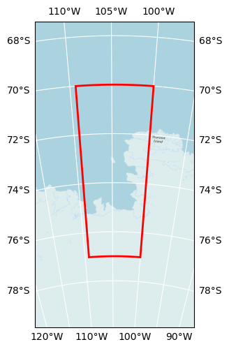

# Polar Data Cube v1.0.1

## How to open this dataset in DeepESDL JupyterLab
```python
from xcube.core.store import new_data_store
store = new_data_store("s3", root="deep-esdl-public", storage_options=dict(anon=True))
ds = store.open_data('polar-100m-1x2048x2048-1.0.1.zarr')
```

## Bounding box map

<br>
<span style="font-size: x-small">Map tiles and data from <a href="http://openstreetmap.org">OpenStreetMap</a>, under <a href="http://www.openstreetmap.org/copyright">the ODbL</a>.</span>

## Basic information

| Parameter | Value |
| ---- | ---- |
| Bounding box longitude (°) | -109.3 to -100 |
| Bounding box latitude (°) | -70 to -77 |
| Time range | 2013-01-01 to 2017-01-01 |
| Time period | 1461D |
| Publisher | DeepESDL Team |

[Click here for full dataset metadata.](#full-metadata)

## Variable list

Click on a variable name to jump to the variable’s full metadata.

| Variable | Long name | Units |
| ---- | ---- | ---- |
| [curie\_depth\_200km](#curie\_depth\_200km) | Curie Depth Estimates 200x200 km | m |
| [curie\_depth\_300km](#curie\_depth\_300km) | Curie Depth Estimates 300x300 km | m |
| [geothermal\_heat\_flow\_200km](#geothermal\_heat\_flow\_200km) | Geothermal Heat Flow 200x200 km | m |
| [geothermal\_heat\_flow\_300km](#geothermal\_heat\_flow\_300km) | Geothermal Heat Flow 300x300 km | m |
| [geothermal\_heat\_flow\_uncertainty\_200km](#geothermal\_heat\_flow\_uncertainty\_200km) | Geothermal Heat Flow Uncertainty 200x200 km | m |
| [geothermal\_heat\_flow\_uncertainty\_300km](#geothermal\_heat\_flow\_uncertainty\_300km) | Geothermal Heat Flow Uncertainty 300x300 km | m |
| [ice\_thickness](#ice\_thickness) | Ice Thickness | m |
| [magnetic\_anomaly](#magnetic\_anomaly) | Magnetic Anomaly | nT |
| [thw\_124](#thw\_124) | Subglacial Lake Thw 124 | 1 |
| [thw\_142](#thw\_142) | Subglacial Lake Thw 142 | 1 |
| [thw\_170](#thw\_170) | Subglacial Lake Thw 170 | 1 |
| [thw\_70](#thw\_70) | Subglacial Lake Thw 70 | 1 |

## Full variable metadata

### <a name="crs"></a>crs

| Field | Value |
| ---- | ---- |
| crs\_wkt | PROJCS\["WGS 84 / Antarctic Polar Stereographic",GEOGCS\["WGS 84",DATUM\["WGS\_1984",SPHEROID\["WGS 84",6378137,298\.257223563,AUTHORITY\["EPSG","7030"\]\],AUTHORITY\["EPSG","6326"\]\],PRIMEM\["Greenwich",0,AUTHORITY\["EPSG","8901"\]\],UNIT\["degree",0\.0174532925199433,AUTHORITY\["EPSG","9122"\]\],AUTHORITY\["EPSG","4326"\]\],PROJECTION\["Polar\_Stereographic"\],PARAMETER\["latitude\_of\_origin",\-71\],PARAMETER\["central\_meridian",0\],PARAMETER\["false\_easting",0\],PARAMETER\["false\_northing",0\],UNIT\["metre",1,AUTHORITY\["EPSG","9001"\]\],AXIS\["Easting",NORTH\],AXIS\["Northing",NORTH\],AUTHORITY\["EPSG","3031"\]\] |
| false\_easting | 0\.0 |
| false\_northing | 0\.0 |
| geographic\_crs\_name | WGS 84 |
| grid\_mapping\_name | polar\_stereographic |
| horizontal\_datum\_name | World Geodetic System 1984 |
| inverse\_flattening | 298\.257223563 |
| longitude\_of\_prime\_meridian | 0\.0 |
| prime\_meridian\_name | Greenwich |
| projected\_crs\_name | WGS 84 / Antarctic Polar Stereographic |
| reference\_ellipsoid\_name | WGS 84 |
| semi\_major\_axis | 6378137\.0 |
| semi\_minor\_axis | 6356752\.314245179 |
| spatial\_ref | PROJCS\["WGS 84 / Antarctic Polar Stereographic",GEOGCS\["WGS 84",DATUM\["WGS\_1984",SPHEROID\["WGS 84",6378137,298\.257223563,AUTHORITY\["EPSG","7030"\]\],AUTHORITY\["EPSG","6326"\]\],PRIMEM\["Greenwich",0,AUTHORITY\["EPSG","8901"\]\],UNIT\["degree",0\.0174532925199433,AUTHORITY\["EPSG","9122"\]\],AUTHORITY\["EPSG","4326"\]\],PROJECTION\["Polar\_Stereographic"\],PARAMETER\["latitude\_of\_origin",\-71\],PARAMETER\["central\_meridian",0\],PARAMETER\["false\_easting",0\],PARAMETER\["false\_northing",0\],UNIT\["metre",1,AUTHORITY\["EPSG","9001"\]\],AXIS\["Easting",NORTH\],AXIS\["Northing",NORTH\],AUTHORITY\["EPSG","3031"\]\] |
| standard\_parallel | \-71\.0 |
| straight\_vertical\_longitude\_from\_pole | 0\.0 |

### <a name="curie_depth_200km"></a>curie_depth_200km

| Field | Value |
| ---- | ---- |
| acknowledgement | 4DAntarctica |
| description | Curie depth estimates using a 200x200km window |
| grid\_mapping | crs |
| long\_name | Curie Depth Estimates 200x200 km |
| original\_add\_offset | 0\.0 |
| original\_name | z |
| original\_scale\_factor | 1\.0 |
| processing\_steps | Gridding nc dataset, Spatial resampling to 100 m using linear interpolation |
| references | [https://doi\.org/10\.1594/PANGAEA\.932452](https://doi.org/10.1594/PANGAEA.932452), [https://doi\.org/10\.1038/s43247\-021\-00242\-3](https://doi.org/10.1038/s43247-021-00242-3) |
| source | [https://download\.pangaea\.de/dataset/932452/files/200km\_Dziadek\_etal\_CurieDepth\_Results\.nc](https://download.pangaea.de/dataset/932452/files/200km_Dziadek_etal_CurieDepth_Results.nc) |
| standard\_name | curie\_depth\_estimates\_200km |
| units | m |

### <a name="curie_depth_300km"></a>curie_depth_300km

| Field | Value |
| ---- | ---- |
| acknowledgement | 4DAntarctica |
| description | Curie depth estimates using a 300x300km window |
| grid\_mapping | crs |
| long\_name | Curie Depth Estimates 300x300 km |
| original\_add\_offset | 0\.0 |
| original\_name | z |
| original\_scale\_factor | 1\.0 |
| processing\_steps | Gridding nc dataset, Spatial resampling to 100 m using linear interpolation |
| references | [https://doi\.org/10\.1594/PANGAEA\.932452](https://doi.org/10.1594/PANGAEA.932452), [https://doi\.org/10\.1038/s43247\-021\-00242\-3](https://doi.org/10.1038/s43247-021-00242-3) |
| source | [https://download\.pangaea\.de/dataset/932452/files/300km\_Dziadek\_etal\_CurieDepth\_Results\.nc](https://download.pangaea.de/dataset/932452/files/300km_Dziadek_etal_CurieDepth_Results.nc) |
| standard\_name | curie\_depth\_estimates\_300km |
| units | m |

### <a name="geothermal_heat_flow_200km"></a>geothermal_heat_flow_200km

| Field | Value |
| ---- | ---- |
| acknowledgement | 4DAntarctica |
| description | Geothermal Heat Flow from a 200x200km window |
| grid\_mapping | crs |
| long\_name | Geothermal Heat Flow 200x200 km |
| original\_add\_offset | 0\.0 |
| original\_name | z |
| original\_scale\_factor | 1\.0 |
| processing\_steps | Gridding nc dataset, Spatial resampling to 100 m using linear interpolation |
| references | [https://doi\.org/10\.1594/PANGAEA\.932452](https://doi.org/10.1594/PANGAEA.932452), [https://doi\.org/10\.1038/s43247\-021\-00242\-3](https://doi.org/10.1038/s43247-021-00242-3) |
| source | [https://download\.pangaea\.de/dataset/932452/files/200km\_GHF\_windowCenters\.nc](https://download.pangaea.de/dataset/932452/files/200km_GHF_windowCenters.nc) |
| standard\_name | geothermal\_heat\_flow\_200km |
| units | m |

### <a name="geothermal_heat_flow_300km"></a>geothermal_heat_flow_300km

| Field | Value |
| ---- | ---- |
| acknowledgement | 4DAntarctica |
| description | Geothermal Heat Flow from a 300x300km window |
| grid\_mapping | crs |
| long\_name | Geothermal Heat Flow 300x300 km |
| original\_add\_offset | 0\.0 |
| original\_name | z |
| original\_scale\_factor | 1\.0 |
| processing\_steps | Gridding nc dataset, Spatial resampling to 100 m using linear interpolation |
| references | [https://doi\.org/10\.1594/PANGAEA\.932452](https://doi.org/10.1594/PANGAEA.932452), [https://doi\.org/10\.1038/s43247\-021\-00242\-3](https://doi.org/10.1038/s43247-021-00242-3) |
| source | [https://download\.pangaea\.de/dataset/932452/files/300km\_GHF\_windowCenters\.nc](https://download.pangaea.de/dataset/932452/files/300km_GHF_windowCenters.nc) |
| standard\_name | geothermal\_heat\_flow\_300km |
| units | m |

### <a name="geothermal_heat_flow_uncertainty_200km"></a>geothermal_heat_flow_uncertainty_200km

| Field | Value |
| ---- | ---- |
| acknowledgement | 4DAntarctica |
| description | Geothermal Heat Flow Uncertainty from a 200x200km window |
| grid\_mapping | crs |
| long\_name | Geothermal Heat Flow Uncertainty 200x200 km |
| original\_add\_offset | 0\.0 |
| original\_name | z |
| original\_scale\_factor | 1\.0 |
| processing\_steps | Gridding nc dataset, Spatial resampling to 100 m using linear interpolation |
| references | [https://doi\.org/10\.1594/PANGAEA\.932452](https://doi.org/10.1594/PANGAEA.932452), [https://doi\.org/10\.1038/s43247\-021\-00242\-3](https://doi.org/10.1038/s43247-021-00242-3) |
| source | [https://download\.pangaea\.de/dataset/932452/files/200km\_GHF\_uncertainty\.nc](https://download.pangaea.de/dataset/932452/files/200km_GHF_uncertainty.nc) |
| standard\_name | geothermal\_heat\_flow\_uncertainty\_200km |
| units | m |

### <a name="geothermal_heat_flow_uncertainty_300km"></a>geothermal_heat_flow_uncertainty_300km

| Field | Value |
| ---- | ---- |
| acknowledgement | 4DAntarctica |
| description | Geothermal Heat Flow Uncertainty from a 300x300km window |
| grid\_mapping | crs |
| long\_name | Geothermal Heat Flow Uncertainty 300x300 km |
| original\_add\_offset | 0\.0 |
| original\_name | z |
| original\_scale\_factor | 1\.0 |
| processing\_steps | Gridding nc dataset, Spatial resampling to 100 m using linear interpolation |
| references | [https://doi\.org/10\.1594/PANGAEA\.932452](https://doi.org/10.1594/PANGAEA.932452), [https://doi\.org/10\.1038/s43247\-021\-00242\-3](https://doi.org/10.1038/s43247-021-00242-3) |
| source | [https://download\.pangaea\.de/dataset/932452/files/300km\_GHF\_uncertainty\.nc](https://download.pangaea.de/dataset/932452/files/300km_GHF_uncertainty.nc) |
| standard\_name | geothermal\_heat\_flow\_uncertainty\_300km |
| units | m |

### <a name="ice_thickness"></a>ice_thickness

| Field | Value |
| ---- | ---- |
| acknowledgement | CryoSMOS |
| description | Ice Thickness |
| long\_name | Ice Thickness |
| original\_add\_offset | 0\.0 |
| original\_name | est |
| original\_scale\_factor | 1\.0 |
| processing\_steps | Masking out no\-data values, Slicing dataset to the polar region \(&lt; \-60 degrees\), Reprojecting to EPSG:3031, Spatial resampling to 100 m using linear interpolation |
| references | [https://opensciencedata\.esa\.int/products/bedrock\-topography\-antarctica\-cryosmos](https://opensciencedata.esa.int/products/bedrock-topography-antarctica-cryosmos), [http://www\.ifac\.cnr\.it/cryosmos/products/CryoSMOS\_D8\_EDUM\_V2\.0\.pdf](http://www.ifac.cnr.it/cryosmos/products/CryoSMOS_D8_EDUM_V2.0.pdf) |
| source | [http://www\.ifac\.cnr\.it/cryosmos/products/SMOS\_IceThickness\_2015\_300\.nc](http://www.ifac.cnr.it/cryosmos/products/SMOS_IceThickness_2015_300.nc) |
| standard\_name | ice\_thickness |
| units | m |

### <a name="magnetic_anomaly"></a>magnetic_anomaly

| Field | Value |
| ---- | ---- |
| acknowledgement | 4DAntarctica |
| description | Magnetic Anomaly |
| long\_name | Magnetic Anomaly |
| original\_add\_offset | 0\.0 |
| original\_name |  |
| original\_scale\_factor | 1\.0 |
| processing\_steps | Spatial resampling to 100 m using linear interpolation |
| references | [https://doi\.org/10\.1594/PANGAEA\.932452](https://doi.org/10.1594/PANGAEA.932452), [https://doi\.org/10\.1038/s43247\-021\-00242\-3](https://doi.org/10.1038/s43247-021-00242-3) |
| source | [https://download\.pangaea\.de/dataset/932452/files/ASE\_MagneticCompilation\_Dziadeketal\_250m\.tif](https://download.pangaea.de/dataset/932452/files/ASE_MagneticCompilation_Dziadeketal_250m.tif) |
| standard\_name | magnetic\_anomaly |
| units | nT |

### <a name="thw_124"></a>thw_124

| Field | Value |
| ---- | ---- |
| acknowledgement | 4DAntarctica |
| color\_bar\_name | GnBu |
| description | Subglacial Lake Thw 124 |
| grid\_mapping | crs |
| long\_name | Subglacial Lake Thw 124 |
| original\_add\_offset | 0\.0 |
| original\_name |  |
| original\_scale\_factor | 1\.0 |
| processing\_steps | Spatial resampling to 100 m using nearest neighbor |
| references | [https://doi\.org/10\.1029/2020GL089658](https://doi.org/10.1029/2020GL089658) |
| source | [https://4d\-antarctica\.org/wp\-content/uploads/2021/01/Malczyk\_etal\_2020\_data\_v2\.tar](https://4d-antarctica.org/wp-content/uploads/2021/01/Malczyk_etal_2020_data_v2.tar) |
| standard\_name | thw\_124 |
| time\_coverage\_end | 2017\-01\-01 |
| time\_coverage\_start | 2013\-01\-01 |
| units | 1 |

### <a name="thw_142"></a>thw_142

| Field | Value |
| ---- | ---- |
| acknowledgement | 4DAntarctica |
| color\_bar\_name | GnBu |
| description | Subglacial Lake Thw 142 |
| grid\_mapping | crs |
| long\_name | Subglacial Lake Thw 142 |
| original\_add\_offset | 0\.0 |
| original\_name |  |
| original\_scale\_factor | 1\.0 |
| processing\_steps | Spatial resampling to 100 m using nearest neighbor |
| references | [https://doi\.org/10\.1029/2020GL089658](https://doi.org/10.1029/2020GL089658) |
| source | [https://4d\-antarctica\.org/wp\-content/uploads/2021/01/Malczyk\_etal\_2020\_data\_v2\.tar](https://4d-antarctica.org/wp-content/uploads/2021/01/Malczyk_etal_2020_data_v2.tar) |
| standard\_name | thw\_142 |
| time\_coverage\_end | 2017\-01\-01 |
| time\_coverage\_start | 2013\-01\-01 |
| units | 1 |

### <a name="thw_170"></a>thw_170

| Field | Value |
| ---- | ---- |
| acknowledgement | 4DAntarctica |
| color\_bar\_name | GnBu |
| description | Subglacial Lake Thw 170 |
| grid\_mapping | crs |
| long\_name | Subglacial Lake Thw 170 |
| original\_add\_offset | 0\.0 |
| original\_name |  |
| original\_scale\_factor | 1\.0 |
| processing\_steps | Spatial resampling to 100 m using nearest neighbor |
| references | [https://doi\.org/10\.1029/2020GL089658](https://doi.org/10.1029/2020GL089658) |
| source | [https://4d\-antarctica\.org/wp\-content/uploads/2021/01/Malczyk\_etal\_2020\_data\_v2\.tar](https://4d-antarctica.org/wp-content/uploads/2021/01/Malczyk_etal_2020_data_v2.tar) |
| standard\_name | thw\_170 |
| time\_coverage\_end | 2017\-01\-01 |
| time\_coverage\_start | 2013\-01\-01 |
| units | 1 |

### <a name="thw_70"></a>thw_70

| Field | Value |
| ---- | ---- |
| acknowledgement | 4DAntarctica |
| color\_bar\_name | GnBu |
| description | Subglacial Lake Thw 70 |
| grid\_mapping | crs |
| long\_name | Subglacial Lake Thw 70 |
| original\_add\_offset | 0\.0 |
| original\_name |  |
| original\_scale\_factor | 1\.0 |
| processing\_steps | Spatial resampling to 100 m using nearest neighbor |
| references | [https://doi\.org/10\.1029/2020GL089658](https://doi.org/10.1029/2020GL089658) |
| source | [https://4d\-antarctica\.org/wp\-content/uploads/2021/01/Malczyk\_etal\_2020\_data\_v2\.tar](https://4d-antarctica.org/wp-content/uploads/2021/01/Malczyk_etal_2020_data_v2.tar) |
| standard\_name | thw\_70 |
| time\_coverage\_end | 2017\-01\-01 |
| time\_coverage\_start | 2013\-01\-01 |
| units | 1 |

## <a name="full-metadata"></a>Full dataset metadata

| Field | Value |
| ---- | ---- |
| Conventions | CF\-1\.10 |
| acknowledgment | All ESDC data providers are acknowledged inside each variable |
| contributor\_name | University of Leipzig, Brockmann Consult GmbH |
| contributor\_url | [https://www\.uni\-leipzig\.de/](https://www.uni-leipzig.de/), [https://www\.brockmann\-consult\.de/](https://www.brockmann-consult.de/) |
| creator\_name | University of Leipzig, Brockmann Consult GmbH |
| creator\_url | [https://www\.uni\-leipzig\.de/](https://www.uni-leipzig.de/), [https://www\.brockmann\-consult\.de/](https://www.brockmann-consult.de/) |
| id | polar\-100m\-1x2048x2048\-1\.0\.1 |
| license | Terms and conditions of the DeepESDL data distribution |
| project | DeepESDL |
| publisher\_name | DeepESDL Team |
| publisher\_url | [https://www\.earthsystemdatalab\.net/](https://www.earthsystemdatalab.net/) |
| spatial\_ref | EPSG:3031 |
| time\_coverage\_end | 2017\-01\-01 |
| time\_coverage\_start | 2013\-01\-01 |
| title | Polar Data Cube v1\.0\.1 |

