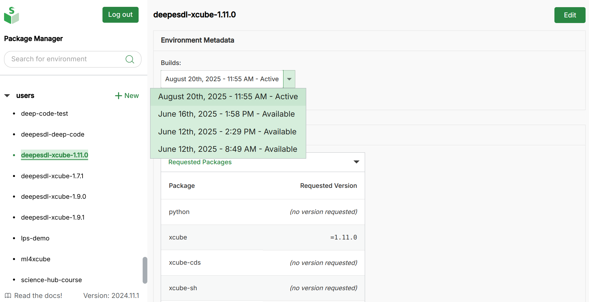

# Navigating the DeepESDL JupyterLab

## Logging in and starting the JupyterLab profile

To use the DeepESDL JupyterLab environment, navigate to
<https://deep.earthsystemdatalab.net/> with a web browser (a recent version of
Firefox, Chrome, or Safari is recommended).

Before you can start using the JupyterLab, you need to be onboarded first.
To this, we kindly ask you to write as an email at `esdl-support@brockmann-consult.de` 
and we will see if we can already onboard you.

DeepESDL uses a GitHub to authenticate, so if you are already registered as a
DeepESDL user, please use your GitHub account to log in.
If your Jupyter server is not already running, you may be presented
with a menu of user JupyterLab profiles to use for your session; there might be
one or more JupyterLab profiles to choose from, depending on the computational
resources needs of your team. Please select a suitable profile for
your current task; it might not always require the profile with the strongest
computational resources available.
After choosing your environment, you will see a progress bar appearing for a few
moments while it is started for you.
The JupyterLab interface will then appear in your web browser, ready for
use.

## Changing a JupyterLab profile

If you have already started your session and need to change the JupyterLab profile,
you can do this by selecting _Hub control panel_ from the _File_ menu within
JupyterLab. Then click the `Stop my server` button and wait for your current
server to shut down. When the `Start my server` button appears, you can click
on it to return to the user JupyterLab profiles menu.

## Logging out

To log out, select _Log out_ from the _File_ menu within JupyterLab.

Note that your JupyterLab session will continue in the background even after
you have logged out, but will eventually be terminated due to inactivity.
If you wish to stop your session explicitly,
you can use the hub control panel as described in the
[Changing a JupyterLab profile](#changing-a-jupyterlab-profile) section above.

## Python environment selection of the Jupyter Kernel

If you wish to use a special set of python packages, you can adjust it in the
top right corner of the notebook. Next, a drop-down menu will appear, and you
can select the desired kernel environment from it.

If the selected kernel seems not to load, it could be due to caching of kernels
which do not exist anymore. To remove cached non-existing environment kernels,
follow these steps:

1. Open the terminal within the JupyterLab.
2. `$ rm -r .local/*`
3. It is alright to get a message like: _"rm: cannot remove
   '.local/share/jupyter': Directory not empty"_ because you might have
   notebooks open, which are in the cache. Make therefor sure not to force
   the `rm` command!
4. Restart your JupyterLab server by selecting *Hub control panel* from the
   *File* menu within JupyterLab. Then click the `Stop my server` button and
   wait for your current server to shut down. Select the `Start my server`
   button once it appears to return to the user JupyterLab profiles menu and
   restart your session.

To get a custom environment which suits your needs, please contact the DeepESDL
team directly.

## Creating custom team python environment

Up to two team members may create a custom python conda
environment for a team. Please inform the DeepESDL Team
who should be granted these permissions.

Steps to create custom team conda environments:

1.  Head over to <https://deep.earthsystemdatalab.net/conda-store>.
2.  Login with your GitHub Account which you also use to access the DeepESDL
    JupyterLab.
3.  On the left-hand side you see a list of namespaces. You can create a new 
    environment in your own user namespace or if you have sufficient 
    permissions also in a team namespace.
4.  Click on the Plus-sign next to namespace for which you want to create an 
    environment.
5.  In the top section, set a meaningful name for your environment.
6.  You may either choose to use the GUI to add packages or switch to YAML view
    and write your env configuration in yaml style
    [environment configuration](https://docs.conda.io/projects/conda/en/latest/user-guide/tasks/manage-environments.html#create-env-file-manually)
    It should look something like this example:

        channels:
            - conda-forge
        dependencies:
            - xcube=1.1.1
            - xcube-cds
            - xcube-sh
            - xcube-cmems
            - xcube-cci
            - xcube_geodb
            - boto3
            - rasterio>=1.3.6
            - cartopy
            - ipykernel
        variables: {}

7.  Once you are happy with your environment hit save and grab a coffee. It
    will take some time to create your custom environment.
8.  After submission, it will appear in the overview under your namespace on
    <https://deep.earthsystemdatalab.net/conda-store/>.
9.  You can click on the name of your newly created environment and see its
    status. There are three different statuses: Building, Completed, Failed
10. Once the build is completed, refresh your jupyterhub browser window
    to make it available in the kernel selection. Instructions how to change
    the kernel to your custom environment are provided
    in the section [python environment selection of the jupyter kernel](#python-environment-selection-of-the-jupyter-kernel).

You can also modify an existing environment and rebuild it; the conda-store
will keep all the builds' logs.
It will look similar to the screenshot below.

The conda-build highlighted in dark green is the one, which you will use in you
DeepESDL JupyterLab, per default it is the latest successful build. If you
wish to make a different build the one to be used in DeepESDL JupyterLab,
change it in the EDIT to the desired conda-build.
On the bottom of the page you have the possibility to delete the environment.

## Getting-started notebooks

You can find example notebooks in DeepESDL JupyterLab to help you to get
started.

To access them:

1.  Head to the JupyterLab `Launcher`
    
    If your `Launcher` is not visible right away, you can open it via the `plus`
    button in the top left corner, which is highlighted in blue in the
    screenshot.
2.  On the bottom of the Launcher you see a tile called `CATALOG DeeESDL`.
    Please select this tile.
3.  Once selected you see several example notebooks:
    
4.  Select one of them, and you will see a preview of the notebook, to execute
    the selected notebook click on `EXECUTE NOTEBOOK` in the top right corner.
    
5.  The notebook is copied into your workspace, and you can run it and adjust
    it according to your needs.

## Team resources

If you are using DeepESDL JupyterLab with others in a team, you can share
content with each other and access the team S3 bucket for data storage.

### Team shared directory

To access the team shared directory, you can mount it into your workspace.
This is a one-time action, and once mounted, it will persist in your workspace
unless you choose to remove the mount. If you are part of multiple teams, you
only need to mount the directory once; there’s no need to do so for each team
separately.

To mount the team shared directory:

1.  Open the terminal in the DeepESDL Jupyter Lab via the Launcher.
2.  `$ ln -s /extra ~/team-shared`

That’s it! You will now see the team shared directory in your workspace.
Please be aware that anyone in the team can see, add, modify, or delete
content in this directory.

### Team shared S3 bucket

How to make use of the DeepESDL Team shared bucket is demonstrated in the
example notebook **Save_cube_to_team_storage.ipynb**. The notebook is located
in the DeepESDL notebook catalog in the "team-shared" category.

## Proxy server processes like Dashboards, WebServer UIs,...

If you start a server process on a specific port (e.g. 8080) within your JupyterLab
session, you can access it via the url
`https://deep.earthsystemdatalab.net/user/<your-username>/proxy/<port>/`, e.g.
user `joe` can access his server process on port 8080 at
`https://deep.earthsystemdatalab.net/user/joe/proxy/8080/`.

This url is only accessible as long as the JupyterLab session is running.
