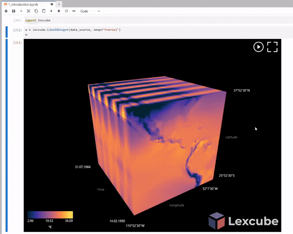
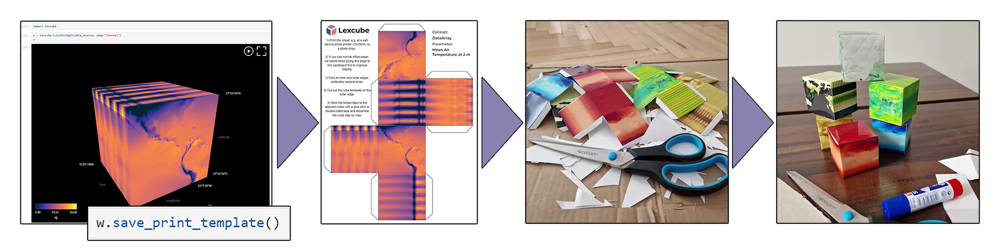

# Lexcube: Interactive 3D Data Cube Visualization 

Lexcube is an interactive 3D data cube visualization tool. It exists in two versions: 

* [Lexcube.org](https://www.lexcube.org): Hosted online, very fast visualization, no setup required. 

* [Lexcube for Jupyter](https://github.com/msoechting/lexcube): Open-source Python package for Jupyter notebooks, visualize any data.

You can interact with the cube in multiple ways: zoom in/out or pan around in the data set, and rotate the cube around. With the "play" button, you can animate through a selected dimension (typically time) and optionally record it as a MP4, GIF or WebM video. 

To give geospatial context, GeoJSON vectors can be overlaid over the cube. On Lexcube.org, Natural Earth administrative boundaries are automatically displayed. In Lexcube for Jupyter, any user-provided GeoJSON can be visualized. 

At any point, you can create a print template from your currently visualized cube for crafting a corresponding paper cube:

## Lexcube.org

At [Lexcube.org](https://www.lexcube.org), users can explore a selection of data sets from DeepESDL and other data providers. This works on all modern devices, including smartphones and tablets, making the data particularly accessible without any setup or coding knowledge necessary. 

In the data selection menu (top right, "database/cog" icon), the currently visualized data set and parameter can be selected. For each parameter, the difference in comparison to the smoothed mean seasonal cycle at the respective day-of-year can be explored ("anomalies" in the parameter selection).

Currently available data sets:

* Earth System Data Cube v2.1.1 (*72 parameters*)

* Earth System Data Cube v3.0.2 (*42 parameters*)

* ERA5 Specific Humidity (*1 parameter*)

* Spectral Indices from Sentinel-2 in Hainich, Germany (*97 parameters*)

* EAC4 CAMS global reanalysis (*33 parameters*)

## Lexcube for Jupyter

[Lexcube for Jupyter](https://github.com/msoechting/lexcube) is an open-source Python package that allows interactive 3D data cube visualization in Jupyter notebooks. This means that any 3D Xarray or Numpy data set from any source (in-memory, local file, remote HTTP/S3/...) can be visualized and explored within the notebook (see demo GIF at the top). The API allows to customize the colormaps, overlay GeoJSON and make precise data selections. For a more detailed description of the capabilities, refer to the [README](https://github.com/msoechting/lexcube?tab=readme-ov-file) on Github.

To get started using Lexcube for Jupyter, please refer to the ["Visualize data with Lexcube"](/guide/jupyterlab/notebooks/Visualise_data_with_Lexcube/) example notebook. 