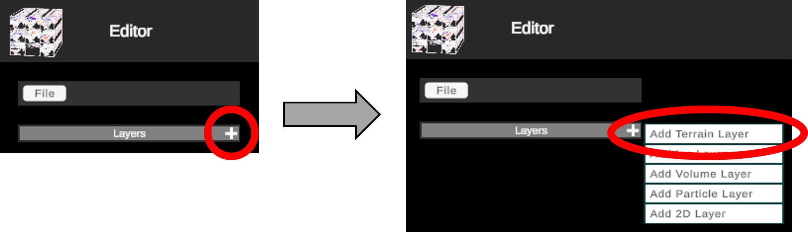
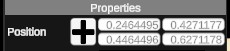

# 4D Viewer

## Introduction

The 4D-Viewer tool was built to enable reconstructions of geo-spatial data and its evolution through time.

The publicly hosted instance of the 4D-Viewer tool is at [https://4dviewer.com/](https://4dviewer.com/).

The DeepESDL project enabled xcube served data sources to be viewed within the 4dviewer tool.

## The User Interface

4D worlds are built from a series of layers and potentially child layers. A typically workflow would start by adding a "Terrain" layer - i.e. a rendered Digital Elevation Model. E.g.:

Most layers will depend on the selection of a data source. In such cases, the Data Browser will be opened through which a data source can be selected.

Data sources are grouped into tree hierarchies, double-click through each "Directory" to select the relevant data source, aka "File Name" again via a double-click.

## Layer Types

Below is a summary of the useful layer types. Those that are present in the app but not listed below are experimental and excluded from this document on purpose.

### Terrain (DEM)

As mentioned above, this is a basic DEM data where each pixel value is interpreted as an elevation. The details of the expected data formats is not covered in detailed here.

Once a terrain layer has been selected, basic formatting and colorization of the layer can be achieved via its layer menu options.

Terrain style exposes some default layer styles to mimic water, rock, grass etc. There are 2 special cases worth mentioning here:

1. *Water 2*: this can only render on a flat plane and as you zoom in uses rendering effects to mimic ocean waves
2. *White + color Ramp*: To color elevations using one of the built-in color ramps (per the example shown above), select the "White" terrain style and check "Use Color Ramp". Lastly select the desired color ramp from the drop down

#### Heatmap

Child layers can be added to a terrain layer by clicking the plus beside the terrain layer. e.g.

Again, the data browser is opened and a data source must be selected. Once selected, a set of presentation choices can be applied:

1. *Alpha*: Set transparency of the layer
2. *Color Ramp*: Select a set of colors to apply to the data set
3. *Min/Max Value*: Set color saturation limits

### Volume  (3D+Time Data Cube)

This layer represents a cube of data in 4 dimensions. Color ramps and saturations can be applied per the "Heatmap" layer.
Additionally, one can select which dimension slices to show. E.g. the examples below show both an example of both vertical slices and an example of a vertical and horizontal slice.

### 2D (Text and Image Overlays)

These layer types exist to help convey useful information about the data being displayed.

#### Text

This adds a simple text box. The "Text" field is used to set the text box content. The remaining fields drive basic styling and font changes such as color and opacity. The location of the box can be manually set using the following properties or by clicking the "+" button and dragging and dropping the box in the active view.

#### Image

This allows a public image url to be rendered via the "Select Image" button.

### Pre-Canned Configurations

Once a valid world has been created, you can export the current configuration to your local downloads directory via:

* File -> save

To reload the config in a future session, simply open the application and use:

* File -> Open file... -> select local configuration file

## xcube Server - 4D-Viewer Integration

The following components and services must be running and correctly configured for data to be loaded from an xcube server into the 4dviewer

* Base xcube server (with appropriate data available)
* The xcube server must have the xcube-4d-viewer [plugin](https://github.com/Virtuagraphics/xcube-4d-viewer) installed.
* The 4d-viewer [gateway](https://pypi.org/project/gateway-4d-viewer/) must be configured to register the above xcube server instance (see the provided example below)
* The 4d-viewer must be configured to use the above instance of the 4d-viewer gateway.

### A Self Service Example - Hosting xcube Data Locally with the 4DViewer

An example repo has been created that provides a reproducible, dockerised environment for running and configurating all of the above services. At the time of writing, this is the simplest way for a user to see their own data in the 4D-Viewer via xcube data structures.
The repo contains the setup guide: [local_xcube_4dviewer](https://github.com/hortonal/local_xcube_4dviewer)
