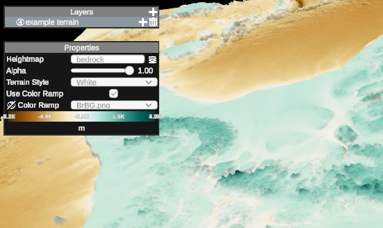

# Visualisation

DeepESDL provides multiple options to share and display dataset. Visualization datasets in Jupyter Notebooks 
with [xcube Viewer](/xcube-viewer) and [Lexcube](/lexcube-viewer) or visualise data sets in public xcube Viewer 
application at [viewer.earthsystemdatalab.net](viewer.earthsystemdatalab.net).

 

  <a href="/guide/visualisation/xcube-viewer" class="card-link">
    

      
      <h3>xcube Viewer</h3>
    

  </a>
  <a href="/guide/visualisation/lexcube-viewer" class="card-link">
    

      
      <h3>Lexcube Viewer</h3>
    

  </a>
  <a href="/guide/visualisation/4d-viewer" class="card-link">
    

      
      <h3>4D Viewer</h3>
    

  </a>

 

