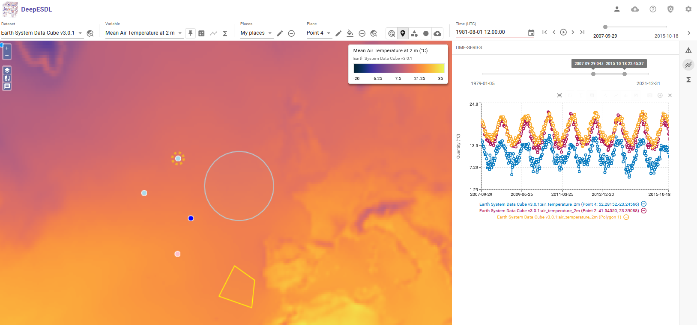

# xcube Viewer

The DeepESDL xcube Viewer is reachable at [viewer.earthsystemdatalab.net](https://viewer.earthsystemdatalab.net).

The **xcube Viewer** is a browser-based visualization tool, built for exploring spatiotemporal Earth System
data cubes. Optimized for handling large, multidimensional datasets it allows users to interactively view, analyze,
and compare datasets directly in the browser. With a rich feature set tailored to the needs of Earth Science, like

* Interactive exploration of data cubes through time and space

* Pixel-level statistics and time series for selected points or areas

* Comparison of two variables side-by-side 

* Creation of new variables directly within the Viewer using expressions or operations on existing variables

* Adjustable color scales, value ranges, and visualization styles to highlight relevant data features

* Access to public datasets, with support for user- and team-specific cubes available upon
  login (using DeepESDL credentials)

For a more detailed description of the Viewer functionality, please read the 
[xcube Viewer documentation](https://xcube-dev.github.io/xcube-viewer).

## Publish a dataset in a public DeepESDL Viewer

In order to publish a data cube in a public DeepESDL Viewer take the following steps:

* Check if the data cube is ready for publication with the following tools

     * **[xrlint](https://bcdev.github.io/xrlint/):** to validate the `xrarray.Dataset` with a set of recommended rules 
     * **xcube Viewer extension:** in the JuypterLab use the dedicated Jupyter Notebook to test the presentation of
       the data in the xcube Viewer (see `Visualize_data_with_xcube_viewer.ipynb`)

* Store the data cube in team storage on S3 
  
    * for more information see `Save_cube_to_team_storage.ipynb`

* For the publication contact the DeepESDL team (`esdl-support@brockmann-consult.de`) and communicate whether 

    * the data cube should be published in the Viewer **and** stored in a public DeepESDL bucket, or
    * the data cube should be published in the Viewer (visualisation only)

