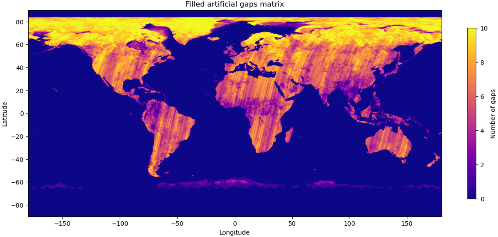

## get_gap_heat_map

```python
def get_gap_heat_map(cube: xr.DataArray, count_dim: str) -> xr.DataArray
```

### Description
A heat map of value counts (non-`NaN` values) for each pixel of dimensions in an `xarray.DataArray` is genrated. 
This heat map helps in visualizing the distribution and density of gaps across the spatial dimensions.

### Parameters
- **cube** (`xarray.DataArray`): The input data cube.
- **count_dim** (`str`): The dimension along which to count non-`NaN` values, typically spatial dimensions such as 'latitude' or 'longitude'.

### Returns
- `xarray.DataArray`: Heat map of non-`NaN` value counts for each pixel across one dimension.

### Example

```python
import xarray as xr
from ml4xcube.xr_plots import plot_slice
from ml4xcube.cube_insights import get_gap_heat_map

# Load sample data
ds = xr.open_zarr('sample_data.zarr')
ds = ds['temperature']

# Generate and visualize the gap heat map
gap_heat_map = get_gap_heat_map(ds)
dataset   = gap_heat_map.to_dataset(name='temperature')

plot_slice(
    ds          = dataset,
    var_to_plot = 'temperature', 
    color_map   = "plasma",
    title       = "Filled artificial gaps matrix",
    label       = "Number of gaps",
    xdim        = "lon",
    ydim        = "lat"
)


```
Running this example results in an illustration as the following:

<p align="center">
    
</p>