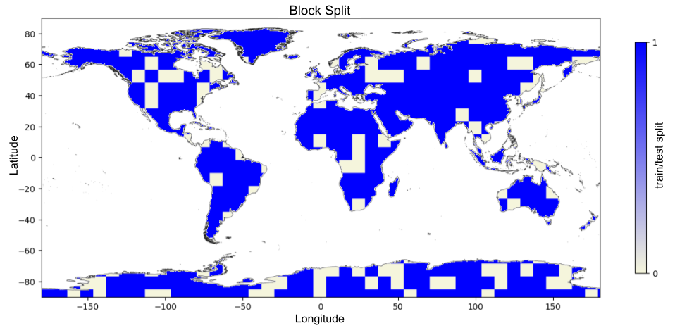

## assign_block_split

```python
def assign_block_split(ds: xr.Dataset, block_size: List[Tuple[str, int]] = None, split: float = 0.8) -> xr.Dataset
```

### Description
When dividing data into train and test set, remotely sensed datasets naturally challenge ML applications.
The data exhibit significant autocorrelation, where data points in close spatio-temporal vicinity share similar 
characteristics. Therefore the this function was designed.
It assigns blocks of data to training or testing sets based on a specified split ratio. 


### Parameters
- **ds** (`xarray.Dataset`): The input dataset.
- **block_size** (`List[Tuple[str, int]]`): List of tuples specifying the dimensions and their respective sizes for block division. If `None`, chunk sizes are inferred from the dataset.
- **split** (`float`): The fraction of data to assign to the training set. The remainder is assigned to the testing set. Default is `0.8`.

### Returns
- `xarray.Dataset`: The dataset with an added 'split' variable that indicates whether each block belongs to the training set (`1.`) or the testing set (`0.`).

### Example

```python
import numpy as np
import xarray as xr
from ml4xcube.data_split import assign_block_split

# Example dataset
data = xr.Dataset({'temperature': (('time', 'lat', 'lon'), np.random.rand(10, 2, 3))})
block_size = [('time', 5), ('lat', 2), ('lon', 3)]
split_dataset = assign_block_split(data, block_size, 0.8)
print(split_dataset)
```
The data is divided in blocks of the specified size, each block in the dataset is randomly assigned to the train set 
with a 70% probability or to the test set with a 30% probability. This strategy keeps closely related data points together, reducing in-
formation leakage.

<p align="center">

</p>
<p align = "center"><i>
Block Assignment of Train/Test Split</i>
</p>