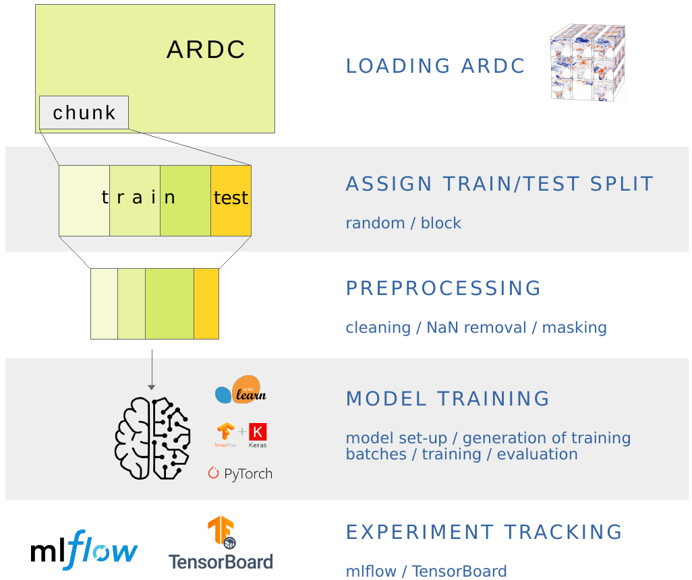

# Example Use Cases
This toolkit provides a series of tutorial notebooks designed to support geospatial data processing and machine learning 
tasks on Earth System Data Cubes (ESDCs). Key use cases include:

1. **[Land Surface Temperature Prediction](#1-land-surface-temperature-prediction)**: Demonstrates land surface temperature prediction. This serves as an introductory example for ESDC analysis.

2. **[Distributed Machine Learning](#2-distributed-machine-learning)**: Showcases efficient preparation and training of large datasets on distributed systems.

3. **[Transfer Learning](#3-transfer-learning)**: Illustrates how to reuse pre-trained models for related tasks with limited data.

2. **[Cube Insights](#4-cube-insights)**: Explores the characteristics of data cubes, helping inform preprocessing and modeling decisions.

5. **[Gap Filling](#5-gapfilling)**: Provides techniques to fill missing data in remote sensing datasets using support vector regression (SVR).

6. **[ML for Multidimensional Samples with missing values](#6-coastal-predictions-for-multidimensional-samples)**: Demonstrates predictions on multidimensional data, utilizing simpler data imputation methods to address gaps.

Each of these use cases is accompanied by a corresponding Jupyter notebook/Python script, providing step-by-step 
instructions, code examples, and visualizations to guide users through the entire workflow. Whether you're looking 
to explore your data, fill gaps, or train machine learning models, this toolkit offers a set of resources to help 
you achieve your goals.


## 1. Land Surface Temperature prediction

This generic use case aims at the prediction of land surface temperature 
values based on air temperature values derived from the ESDC 
(Sentinel 3 SLSTR and Terra MODIS sensor, s3 store). 

Satellite monitoring is highly sensitive to atmospheric conditions, in 
particular to cloud cover, leading to the loss of a significant part of data,
especially at high latitudes. This may even affect some pixels of an image 
which are not cloudy, but strongly influenced by cloud cover, usually 
because they were cloudy shortly before the moment of sensing or because of 
cloud shadows (Sarafanov et al. 2020).
Therefore, remotely sensed land surface temperature images are patchy and 
gaps need to be filled in to complete the data set. 
Here, we propose a shallow neural network (Linear Regression) to predict 
missing values of land surface temperature from consistent air 
temperature values.

<p align="center">

</p>
<p align = "center"><i><strong>
ML prediction of missing Land Surface Temperature values from Air Temperature values (xcube viewer)</strong></i>
</p>


### Demo Notebooks

All Jupyter Notebooks follow the same approach, involving five major sections supported by markdown cells, comments, 
and plots:


1. [Landsurface Temperature Prediction *scikit-learn*](https://github.com/deepesdl/ML-Toolkits/blob/master/Examples/use_case_lst_at_scikit-learn_mlflow.ipynb)
2. [Landsurface Temperature Prediction *PyTorch*](https://github.com/deepesdl/ML-Toolkits/blob/master/Examples/use_case_lst_at_pytorch_mlflow.ipynb)
3. [Landsurface Temperature Prediction *TensorFlow*](https://github.com/deepesdl/ML-Toolkits/blob/master/Examples/use_case_lst_at_tensorflow_tensorboard.ipynb)


### Approach
0. Import necessary libraries and mltools
1. Load Earth System Data Cube (s3 object store) 
2. Initialize data mask
3. Assign train/test split
4. Preprocessing (filtering NaNs, standardization, normalization)
5. Model set-up (linear regression with 1 node/ shallow neural network)
6. Model training and validation over a number of epochs:
      - Training:
        - Generate training batches using existing data loading and transformation mechanisms from Keras and PyTorch (DataGenerator, DataLoader)
        - Train model, and compute average epoch training loss
      - Validation:
        - Generate testing batches using existing data loading and transformation mechanisms from Keras and PyTorch (DataGenerator, DataLoader)
        - Test model, and compute average epoch validation loss
7. Use model to make predictions & plot results
 

<p align="center">

</p>
<p align = "center"><i><strong>
Machine Learning workflow on Analysis Ready Data Cubes</strong></i>
</p>


### Preliminary Condition
As initially described in the [demo cases](#demo-notebooks), the missing values of land surface temperature 
are predicted from consistent air temperature values.

<table align="center" style="border-collapse: collapse; margin: 0 auto;">
  <tr>
    <td width="50%" style="border: none; text-align: center;">
      <br/>
      <i><strong>Air Temperature</strong> </i>
    </td>
    <td width="50%" style="border: none; text-align: center;">
      <br/>
      <i><strong>Land Surface Temperature</strong> </i>
    </td>
  </tr>
</table>

### Machine Learning Approach
In this section, the machine learning approach is briefly illustrated based on the
[TenorFlow notebook](https://github.com/deepesdl/ML-Toolkits/blob/master/Examples/use_case_lst_at_tensorflow_tensorboard.ipynb).
For comprehensive implementations, refer to the  [demo notebooks](#demo-notebooks) to see the full implementations.

##### 1. Load Earth System Data Cube
First, the `zarr` data cube is loaded from the s3 data store. The ESDC consists of three dimensions: longitude, 
latitude, and time. The focus will be on two variables: "land_surface_temperature" and "air_temperature_2m".

```python
from xcube.core.store import new_data_store

# Initialize the data store for accessing the s3 bucket
data_store = new_data_store("s3", root="esdl-esdc-v2.1.1", storage_options=dict(anon=True))

# Open the dataset
dataset = data_store.open_data("esdc-8d-0.083deg-184x270x270-2.1.1.zarr")

# Select a smaller subset of the data for this demo case
start_time = "2002-05-21"
end_time = "2002-08-01"
ds = dataset[["land_surface_temperature", "air_temperature_2m"]].sel(time=slice(start_time, end_time))
```
#### 2. Add land mask variable
Fir the prediction of the land surface temperature values only terrestrial regions are relevant.
Therefore, a land variable is assigned to the ESDC to exclude the oceanic regions. 

```python
import numpy as np
import dask.array as da
from global_land_mask import globe
from ml4xcube.preprocessing import assign_mask

lon_grid, lat_grid = np.meshgrid(ds.lon,ds.lat)
lm0                = da.from_array(globe.is_land(lat_grid, lon_grid))
xdsm               = assign_mask(ds, lm0) 
xdsm
```
#### 3. Train-/ Test Split on Geo-Data

The `ml4xcube.splits` module provides two methods to split the data into training and test sets: 
random split and block split.


**1. Random Split**

The random split is a straight forward procedure in classical machine learning application to divide data in 
a train and a test set.
Every data sample is assigned randomly with a predefined probability either to 
the train or the test. 
This approach can lead to issues due to spatio-temporal distances and auto-correlation within chunks.

**2. Block Split**

It is therefore mandatory to utilize techniques that respects the basic 
principles of geo-data way beyond naive random split method in 
the Earth system context. To avoid auto-correlation during the training 
phase of the model, data splitting should rather be guided by the block 
split strategy, which segments data
into contiguous blocks based on geographical and temporal
proximity, assigning data points from these blocks to either
training or test sets with a specific probability. This strategy keeps 
closely related data points together, reducing information leakage 
across the train-test divide and enhancing
testing integrity.

<table align="center" style="border-collapse: collapse; margin: 0 auto;">
  <tr>
    <td width="50%" style="border: none; text-align: center;">
      <br/>
      <i><strong>Random Train-Test Assignment</strong> </i>
    </td>
    <td width="50%" style="border: none; text-align: center;">
      <br/>
      <i><strong>Balanced Stratified Train-Test Assignment</strong> </i>
    </td>
  </tr>
</table>

For this case, the `assign_block_split` method is employed to allocate each data point to either the training or test set:
```python
from ml4xcube.splits import assign_rand_split, assign_block_split

# random splitting
"""
xds = assign_rand_split(
    ds    = xdsm,
    split = 0.8
)
"""

# block splitting
xds = assign_block_split(
    ds         = xdsm,
    block_size = [("time", 10), ("lat", 100), ("lon", 100)],
    split      = 0.8
)
xds
```

#### 4. Train-/ and Test Set Creation and Preprocessing
In this step, data is preprocessed for training using the designated sampler. The dataset undergoes standardization and 
is segmented into manageable samples. The feature scaling strategy can be customized via the `scale_fn` parameter, which 
allows for normalization or can be set to None for manual adjustments. If `None`, a custom feature scaling function can be 
introduced using the `callback parameter`, enabling further preprocessing flexibility with costum functions.

By default, missing values are omitted from the dataset. To apply alternative imputation strategies, adjust the `drop_nan` 
parameter of the `XrDataset`. For comprehensive guidance on these options, please consult the 
[ml4xcube API description](api-reference.md#6-datasets) description.

Following preprocessing, the data is allocated into training and testing sets based on the previously determined block 
split strategy, ensuring readiness for the subsequent training phase.

```python
import tensorflow as tf
from ml4xcube.datasets.xr_dataset import XrDataset

sampler               = XrDataset(ds=xds, num_chunks=3, rand_chunk=False, to_pred='land_surface_temperature')
train_data, test_data = sampler.get_datasets()

# Create TensorFlow 6-datasets for 7-training and testing
train_ds = tf.data.Dataset.from_tensor_slices(train_data).batch(32)
test_ds = tf.data.Dataset.from_tensor_slices(test_data).batch(32)
```
#### 5. Model Setup, Optimizer and Loss Definition

A simple linear regression model using TensorFlow is defined, followed by the setup of the optimizer and the loss function definition.
```python
import tensorflow as tf
from tensorflow.keras import layers as L

# Define epoch and learning rate
lr     = 0.1
epochs = 10

# Create model
inputs      = L.Input(name="air_temperature_2m", shape=(1,))
output      = L.Dense(1, activation="linear", name="land_surface_temperature")(inputs)
model       = tf.keras.models.Model(inputs=inputs, outputs=output)
model.compile(optimizer="adam", loss="mean_squared_error", metrics=["mae"])

model.optimizer.learning_rate.assign(lr)
```

#### 6. Model Training and Validation

Finally, the model is trained using `train_ds` and validated with the `test_ds` dataset. Early stopping is employed to 
prevent overfitting. The best model weights, according to the validation score, are saved, and the trained model is 
returned, ready for predictions.

```python
from ml4xcube.training.tensorflow import Trainer

trainer = Trainer(
    model=model,
    train_data=train_ds,
    test_data=test_ds,
    early_stopping=True,
    patience=5,
    model_path="best_model.keras",
    mlflow_run=mlflow,
    epochs=epochs,
    create_loss_plot=True
)

model = trainer.train()
```
### Results
After conducting the entire [machine learning approach](#approach) 
the trained model can be used to make predictions for the missing land surface temperature values:

<p align="center">

</p>
<p align = "center"><i>
<strong>Land Surface Temperature Filled</strong></i>
</p>

### Model Tracking
Within the land surface temperature use cases model tracking is realized through the usage of [TensorBoard](https://www.tensorflow.org/tensorboard) and 
[mlflow](https://mlflow.org/). These tools offer science teams an easy-to-use platform allowing to run and scale their Machine Learning workloads in a collaborative environment supporting versioning and sharing of parameters, models, artefacts, results, etc. within the team and potentially external users.
Mlflow supports the MLOps pipelines particularly to log and evaluate experiment runs as well as to store models in a registry​. Persistent mlflow deployments are made available on team level to allow each team member to compare their experiments with those of the other team members and to use the trained models of others.
TensorBoard as another collaborative tool in this MLOPs space is currently evaluated by the science teams and available as part of the TensorFlow conda kernel to individual users within their JupyterLab session.

<p align="center">

</p>
<p align = "center"><i>
<strong>Collaborative Experiment Tracking with mlflow.</strong></i>
</p>


## 2. Distributed Machine Learning
Satellites continuously monitor various Earth parameters across, generating vast amounts of data ideal for training sophisticated machine learning models. 
However, preparing and training with such large datasets can be time-consuming and resource-intensive.
The `ml4xcube` package facilitates efficient handling, preparation, and distributed training of large geospatial datasets, providing tools and workflows 
designed to optimize these processes.
Below are demonstrations on efficient dataset preparation (4) and distributed machine learning (5).
For simplicity the [previous setup](#1-land-surface-temperature-prediction) is leveraged to illustrate the functionality.

### Demo Scripts

4. [Distributed Dataset Creation](https://github.com/deepesdl/ML-Toolkits/blob/master/Examples/distributed_dataset_creation.py). 
5. [Distributed Machine Learning](https://github.com/deepesdl/ML-Toolkits/blob/master/Examples/distributed_training.py). 

#### Data Preparation
Before training machine learning models, data must be preprocessed and organized. This snippet is crucial for understanding how data, particularly large and 
complex datasets like those from satellites, is preprocessed before being used for machine learning. It demonstrates loading the data, computing statistics 
necessary for normalization, and applying these statistics to standardize the data with the help of a callback function. The callback function is used to apply 
transformations on-the-fly to each data chunk, ensuring that all data is processed uniformly. Further custom preprocessing steps can be added  accordingly.

```python
import xarray as xr
from ml4xcube.preprocessing import get_statistics, standardize
from ml4xcube.datasets.multiproc_sampler import MultiProcSampler

# Load sample data
ds = xr.open_zarr('sample_data.zarr')
ds = ds['temperature']

# Create a train and a test set and save them as train.zarr and test.zarr
train_set, test_set = MultiProcSampler(
    ds          = ds,
    train_cube  = 'train.zarr',
    test_cube   = 'test.zarr',
    nproc       = 5,
    chunk_batch = 10,
).get_datasets()
```

In the next step, the environment for training must be prepared by converting datasets to a format compatible with PyTorch, setting up a basic neural network model, and configuring 
the training process. Since in this example 1D data points are utilized for training, the dimension names assigned correspond to a 1D Tuple as well.
If the usage of multidimensional data samples is intended, please define the parameter sample_size of the `MultiProcSampler` class (e.g. `sample_size=[('time', 1), ('lat', 3), ('lon', 3)]`).
Overlapping samples are also possible (`overlap=[('time', 0.), ('lat', 0.33), ('lon', 0.33)]`). For further details check out the corresponding definition in the [ml4xcube API](api-reference/6-datasets/multiproc-sampler.md)
```python
import zarr 
import torch
import xarray as xr
import dask.array as da
from ml4xcube.datasets.pytorch import PTXrDataset

def load_train_objs():
    train_store = zarr.open('train.zarr')
    test_store = zarr.open('test.zarr')

    train_set = xr.Dataset(train_data)
    test_set  = xr.Dataset(test_data)

    # Create PyTorch data sets
    train_ds = PTXrDataset(train_set)
    test_ds  = PTXrDataset(test_set)

    # Initialize model and optimizer
    model     = torch.nn.Linear(in_features=1, out_features=1, bias=True)
    optimizer = torch.optim.SGD(model.parameters(), lr=0.01)
    loss      = torch.nn.MSELoss(reduction='mean')

    return train_ds, test_ds, model, optimizer, loss
```
This final snippet sets up and runs the distributed training process using PyTorch. It includes initializing the distributed data parallel training environment, preparing data 
loaders with parallel processing capabilities, and defining the training loop. This approach significantly enhances the training efficiency on large-scale datasets by leveraging 
multiple processing units.
```python
from ml4xcube.datasets.pytorch import prepare_dataloader
from ml4xcube.training.pytorch_distributed import ddp_init, Trainer, dist_train

# Initialize distributed data parallel training
ddp_init()

# Load training objects
train_set, test_set, model, optimizer, loss = load_train_objs()

# Prepare data loaders
train_loader, test_loader = prepare_dataloader(train_set, test_set, batch_size, num_workers=5, parallel=True)

# Initialize the trainer and start training
trainer = Trainer(
    model                = model,
    train_data           = train_loader,
    test_data            = test_loader,
    optimizer            = optimizer,
    save_every           = save_every,
    model_path           = best_model_path,
    early_stopping       = True,
    patience             = 3,
    loss                 = loss,
    validate_parallelism = True
)
```

## 3. Transfer Learning
  
Transfer learning corresponds to a way to reuse information obtained by previous model training for a second related 
task. This can be necessary when only a concise amount of data is available. Therefore, a PyTorch based Jupyter 
Notebook provides the implementation of Transfer Learning. This technique was illustrated  for the same setting as the 
[first example](#1-land-surface-temperature-prediction), predicting missing land surface temperature values.

### Demo Notebook
6. [Transfer Learning](https://github.com/deepesdl/ML-Toolkits/blob/master/Examples/transfer_learning.ipynb). 

<p align="center">

</p>
<p align = "center"><i>
<strong>The Basic Concept of Transfer Learning.</strong></i>
</p>


## 4. Cube Insights
In order to decide which preprocessing steps are required by your machine learning application, the `insights` module 
offers tools for extracting and analyzing characteristics of an `xarray.DataArray` object. This module includes 
functions to assess the completeness and distribution of data within the cube.

### Demo Notebook

The corresponding Jupyter notebook containing the entire workflow can be accessed here:


7. [Landsurface Temperature Insights](https://github.com/deepesdl/ML-Toolkits/blob/master/Examples/cube_insights.ipynb)

The detailed workflow in order to analyze the specifics of a data cube is demonstrated in the following:


```python
import xarray as xr
from ml4xcube.insights import get_insights

# Load sample data
ds = xr.open_zarr('sample_data.zarr')
ds = ds['temperature']

# Get insights from the data cube
get_insights(ds)
```
The `get_insights` function, prints the following statistics (example for a cube containing dimensions named time, latitude, and longitude):

```
100%|████████████████████| 10/10 [00:09<00:00,  1.10it/s]
The data cube has the following characteristics:
 
Variable:             Land Surface Temperature
Shape:                (time: 10, lat: 2160, lon: 4320)
Time range:           2002-05-21 - 2002-08-01
Latitude range:       -89.958° - 89.958°
Longitude range:      -179.958° - 179.958°
Total size:           93312000
Size of each layer:   9331200
Total gap size:       74069847 -> 79 %
Maximum gap size:     87 % on 2002-06-06
Minimum gap size:     75 % on 2002-08-01
Value range:          222.99 - 339.32
```

Utiliting the get_gap_heat_map the amount of missing values over time can be computed for every latitude/longitude pixel:

```python
import xarray as xr
from ml4xcube.plotting import plot_slice
from ml4xcube.insights import get_gap_heat_map

# Load sample data
ds = xr.open_zarr('sample_data.zarr')
ds = ds['temperature']

# Generate and visualize the gap heat map
gap_heat_map = get_gap_heat_map(ds)
dataset   = gap_heat_map.to_dataset(name='temperature')

plot_slice(
    ds          = dataset,
    var_to_plot = 'temperature', 
    color_map   = "plasma",
    title       = "Filled artificial gaps matrix",
    label       = "Number of gaps",
    xdim        = "lon",
    ydim        = "lat"
)


```
Running this example results in an the following illustration, showing a heatmap of data gaps in the land surface temperature 
variable over time. The number of available data ranges from 0 to 10, corresponding to the 10 frames in the analyzed cube:

<p align="center">
    
</p>
<p align = "center"><i>
<strong>Heatmap of available data in the land surface temperature variable over time.</strong></i>
</p>


## 5. Gapfilling

The gapfilling module provides a method for filling gaps in ESDCs, particularly tailored for remote sensing datasets 
(Sarafanov et al. 2020). This approach utilizes a support vector regression model to predict missing values based 
on available data. 

After examining the amount of missing values in the cube, the module can be applied to fill the corresponding 
areas in the cube as showcased in the following example:

### Demo Notebook
8. [Gap Filling Process](https://github.com/deepesdl/ML-Toolkits/blob/master/Examples/gapfilling_process.ipynb). 

## 6. Coastal Predictions for Multidimensional Samples
An alternative to [gap filling](#5-gapfilling) can be using simpler methods. For example, missing values can be imputed 
by replacing them with the mean or a constant placeholder. After exploring the data, it might be evident that gaps 
are not frequent. In some cases, in environmental modeling for specific regions, missing values may be intentional.
For instance, values may appear only in terrestrial regions.

In such scenarios, data imputation can enable the effective use of the entire dataset, allowing for model training and analysis without the complications of incomplete data.

The following notebooks demonstrate the workflow for land surface temperature prediction using multidimensional data with missing values.

### Demo Notebooks

9. [Machine Learning for Multidimensional Samples (PyTorch)](https://github.com/deepesdl/ML-Toolkits/blob/master/Examples/use_case_lst_pytorch_nd.ipynb). 
10. [Machine Learning for Multidimensional Samples (TensorFlow)](https://github.com/deepesdl/ML-Toolkits/blob/master/Examples/use_case_lst_tensorflow_nd.ipynb). 

<p align="center">

</p>
<p align = "center"><i>
<strong>Filling areas outside the continent with constant value.</strong></i>
</p>