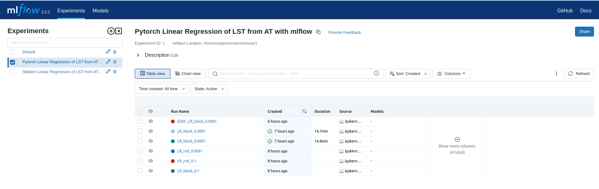

# 1. Land Surface Temperature prediction

This generic use case aims at the prediction of land surface temperature
values based on air temperature values derived from the ESDC
(Sentinel 3 SLSTR and Terra MODIS sensor, s3 store).

Satellite monitoring is highly sensitive to atmospheric conditions, in
particular to cloud cover, leading to the loss of a significant part of data,
especially at high latitudes. This may even affect some pixels of an image
which are not cloudy, but strongly influenced by cloud cover, usually
because they were cloudy shortly before the moment of sensing or because of
cloud shadows (Sarafanov et al. 2020).
Therefore, remotely sensed land surface temperature images are patchy and
gaps need to be filled in to complete the data set.
Here, we propose a shallow neural network (Linear Regression) to predict
missing values of land surface temperature from consistent air
temperature values.

<p align="center">

</p>
<p align = "center"><i>
ML prediction of missing Land Surface Temperature values from Air Temperature values (xcube viewer)</i>
</p>

## Demo Notebooks

All Jupyter Notebooks follow the same approach, involving five major sections supported by markdown cells, comments,
and plots:

- [Landsurface Temperature Prediction _scikit-learn_](https://github.com/deepesdl/ML-Toolkits/blob/master/Examples/use_case_lst_at_scikit-learn_mlflow.ipynb)
- [Landsurface Temperature Prediction _PyTorch_](https://github.com/deepesdl/ML-Toolkits/blob/master/Examples/use_case_lst_at_pytorch_mlflow.ipynb)
- [Landsurface Temperature Prediction _TensorFlow_](https://github.com/deepesdl/ML-Toolkits/blob/master/Examples/use_case_lst_at_tensorflow_tensorboard.ipynb)

## Approach

0. Import necessary libraries and mltools
1. Load Earth System Data Cube (s3 object store)
2. Initialize data mask
3. Assign train/test split
4. Preprocessing (filtering NaNs, standardization, normalization)
5. Model set-up (linear regression with 1 node/ shallow neural network)
6. Model training and validation over a number of epochs:
    - Training:
        - Generate training batches using existing data loading and transformation mechanisms from Keras and PyTorch (DataGenerator, DataLoader)
        - Train model, and compute average epoch training loss
    - Validation:
        - Generate testing batches using existing data loading and transformation mechanisms from Keras and PyTorch (DataGenerator, DataLoader)
        - Test model, and compute average epoch validation loss
7. Use model to make predictions & plot results

<p align="center">

</p>
<p align = "center"><i>
Machine Learning workflow on Analysis Ready Data Cubes</i>
</p>

## Preliminary Condition

As initially described in the [demo cases](#demo-notebooks), the missing values of land surface temperature
are predicted from consistent air temperature values.

<table align="center" style="border-collapse: collapse; margin: 0 auto;">
  <tr>
    <td width="50%" style="border: none; text-align: center;">
      <br/>
      <i>Air Temperature</i>
    </td>
    <td width="50%" style="border: none; text-align: center;">
      <br/>
      <i>Land Surface Temperature</i>
    </td>
  </tr>
</table>

## Machine Learning Approach

In this section, the machine learning approach is briefly illustrated based on the
[TenorFlow notebook](https://github.com/deepesdl/ML-Toolkits/blob/master/Examples/use_case_lst_at_tensorflow_tensorboard.ipynb).
For comprehensive implementations, refer to the [demo notebooks](#demo-notebooks) to see the full implementations.

### 1. Load Earth System Data Cube

First, the `zarr` data cube is loaded from the s3 data store. The ESDC consists of three dimensions: longitude,
latitude, and time. The focus will be on two variables: "land_surface_temperature" and "air_temperature_2m".

```python
from xcube.core.store import new_data_store

# Initialize the data store for accessing the s3 bucket
data_store = new_data_store("s3", root="esdl-esdc-v2.1.1", storage_options=dict(anon=True))

# Open the dataset
dataset = data_store.open_data("esdc-8d-0.083deg-184x270x270-2.1.1.zarr")

# Select a smaller subset of the data for this demo case
start_time = "2002-05-21"
end_time = "2002-08-01"
ds = dataset[["land_surface_temperature", "air_temperature_2m"]].sel(time=slice(start_time, end_time))
```

### 2. Add land mask variable

Fir the prediction of the land surface temperature values only terrestrial regions are relevant.
Therefore, a land variable is assigned to the ESDC to exclude the oceanic regions.

```python
import numpy as np
import dask.array as da
from global_land_mask import globe
from ml4xcube.preprocessing import assign_mask

lon_grid, lat_grid = np.meshgrid(ds.lon,ds.lat)
lm0                = da.from_array(globe.is_land(lat_grid, lon_grid))
xdsm               = assign_mask(ds, lm0)
xdsm
```

### 3. Train-/ Test Split on Geo-Data

The `ml4xcube.splits` module provides two methods to split the data into training and test sets:
random split and block split.

*1. Random Split*

The random split is a straight forward procedure in classical machine learning application to divide data in
a train and a test set.
Every data sample is assigned randomly with a predefined probability either to
the train or the test.
This approach can lead to issues due to spatio-temporal distances and auto-correlation within chunks.

*2. Block Split*

It is therefore mandatory to utilize techniques that respects the basic
principles of geo-data way beyond naive random split method in
the Earth system context. To avoid auto-correlation during the training
phase of the model, data splitting should rather be guided by the block
split strategy, which segments data
into contiguous blocks based on geographical and temporal
proximity, assigning data points from these blocks to either
training or test sets with a specific probability. This strategy keeps
closely related data points together, reducing information leakage
across the train-test divide and enhancing
testing integrity.

<table align="center" style="border-collapse: collapse; margin: 0 auto;">
  <tr>
    <td width="50%" style="border: none; text-align: center;">
      <br/>
      <i>Random Train-Test Assignment</i>
    </td>
    <td width="50%" style="border: none; text-align: center;">
      <br/>
      <i>Balanced Stratified Train-Test Assignment</i>
    </td>
  </tr>
</table>

For this case, the `assign_block_split` method is employed to allocate each data point to either the training or test set:

```python
from ml4xcube.splits import assign_rand_split, assign_block_split

# random splitting
"""
xds = assign_rand_split(
    ds    = xdsm,
    split = 0.8
)
"""

# block splitting
xds = assign_block_split(
    ds         = xdsm,
    block_size = [("time", 10), ("lat", 100), ("lon", 100)],
    split      = 0.8
)
xds
```

### 4. Train-/ and Test Set Creation and Preprocessing

In this step, data is preprocessed for training using the designated sampler. The dataset undergoes standardization and
is segmented into manageable samples. The feature scaling strategy can be customized via the `scale_fn` parameter, which
allows for normalization or can be set to None for manual adjustments. If `None`, a custom feature scaling function can be
introduced using the `callback parameter`, enabling further preprocessing flexibility with costum functions.

By default, missing values are omitted from the dataset. To apply alternative imputation strategies, adjust the `drop_nan`
parameter of the `XrDataset`. For comprehensive guidance on these options, please consult the
[ml4xcube API description](../api-reference/index.md#6-datasets) description.

Following preprocessing, the data is allocated into training and testing sets based on the previously determined block
split strategy, ensuring readiness for the subsequent training phase.

```python
import tensorflow as tf
from ml4xcube.datasets.xr_dataset import XrDataset

sampler               = XrDataset(ds=xds, num_chunks=3, rand_chunk=False, to_pred='land_surface_temperature')
train_data, test_data = sampler.get_datasets()

# Create TensorFlow 6-datasets for 7-training and testing
train_ds = tf.data.Dataset.from_tensor_slices(train_data).batch(32)
test_ds = tf.data.Dataset.from_tensor_slices(test_data).batch(32)
```

### 5. Model Setup, Optimizer and Loss Definition

A simple linear regression model using TensorFlow is defined, followed by the setup of the optimizer and the loss function definition.

```python
import tensorflow as tf
from tensorflow.keras import layers as L

# Define epoch and learning rate
lr     = 0.1
epochs = 10

# Create model
inputs      = L.Input(name="air_temperature_2m", shape=(1,))
output      = L.Dense(1, activation="linear", name="land_surface_temperature")(inputs)
model       = tf.keras.models.Model(inputs=inputs, outputs=output)
model.compile(optimizer="adam", loss="mean_squared_error", metrics=["mae"])

model.optimizer.learning_rate.assign(lr)
```

### 6. Model Training and Validation

Finally, the model is trained using `train_ds` and validated with the `test_ds` dataset. Early stopping is employed to
prevent overfitting. The best model weights, according to the validation score, are saved, and the trained model is
returned, ready for predictions.

```python
from ml4xcube.training.tensorflow import Trainer

trainer = Trainer(
    model=model,
    train_data=train_ds,
    test_data=test_ds,
    early_stopping=True,
    patience=5,
    model_path="best_model.keras",
    mlflow_run=mlflow,
    epochs=epochs,
    create_loss_plot=True
)

model = trainer.train()
```

## Results

After conducting the entire [machine learning approach](#approach)
the trained model can be used to make predictions for the missing land surface temperature values:

<p align="center">

</p>
<p align = "center"><i>
Land Surface Temperature Filled</i>
</p>

## Model Tracking

Within the land surface temperature use cases model tracking is realized through the usage of [TensorBoard](https://www.tensorflow.org/tensorboard) and
[mlflow](https://mlflow.org/). These tools offer science teams an easy-to-use platform allowing to run and scale their Machine Learning workloads in a collaborative environment supporting versioning and sharing of parameters, models, artefacts, results, etc. within the team and potentially external users.
Mlflow supports the MLOps pipelines particularly to log and evaluate experiment runs as well as to store models in a registry​. Persistent mlflow deployments are made available on team level to allow each team member to compare their experiments with those of the other team members and to use the trained models of others.
TensorBoard as another collaborative tool in this MLOPs space is currently evaluated by the science teams and available as part of the TensorFlow conda kernel to individual users within their JupyterLab session.

<p align="center">

</p>
<p align = "center"><i>
Collaborative Experiment Tracking with mlflow</i>
</p>
