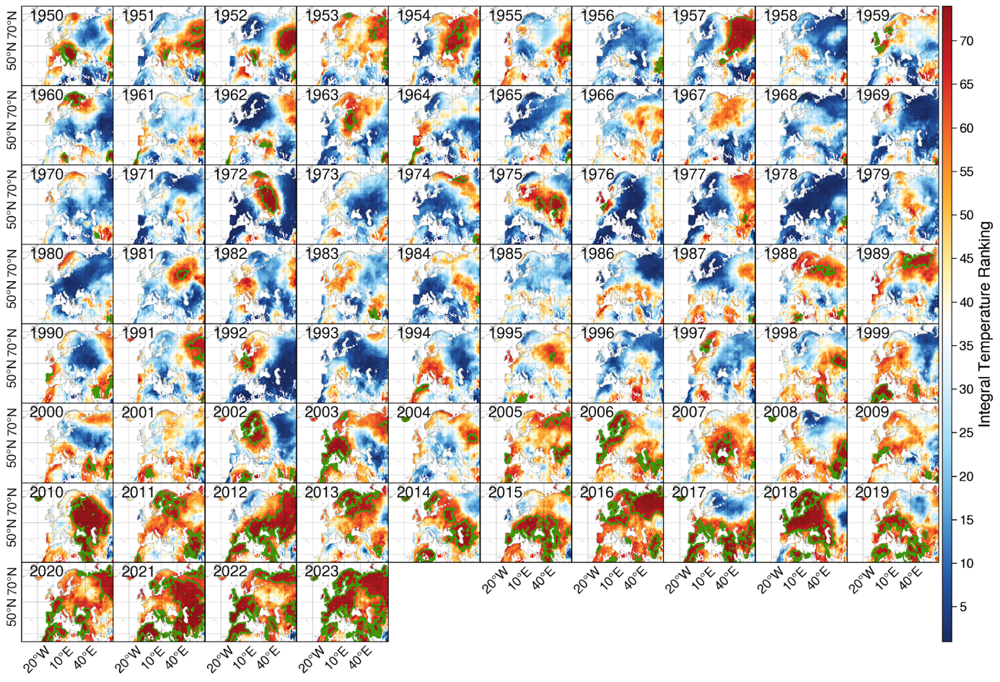
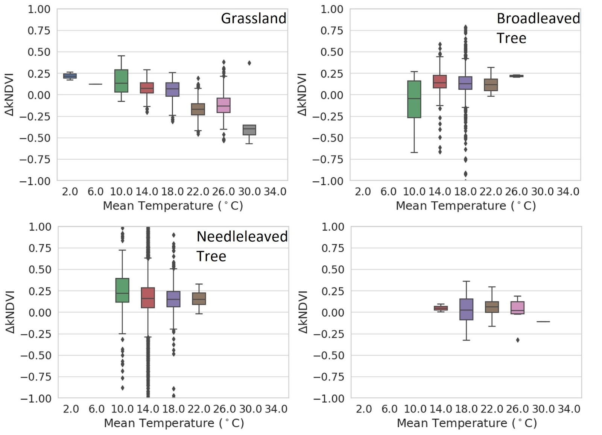
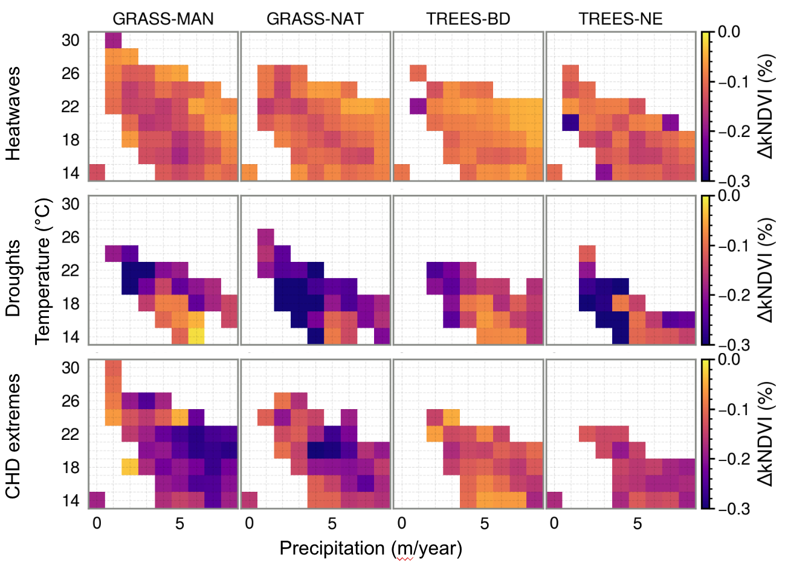

# Science Case **“Drought Effect”**: Linear estimation of drought effects on productivity

**Authors:** Chaonan Ji

The rationale for the demonstration case on climate extremes is the following:
especially excess drought and heatwave events (DHEs) are increasingly
co-occurring, severely reducing the productivity of both semi-natural vegetation
and crops and, therefore, carbon sequestration. Although the impacts of
individual extreme events are partly very well investigated, we still lack a
general understanding of the impacts of compound event years on ecosystems.
Specifically, it remains unclear, firstly, whether DHEs systematically reduce
vegetation’s productivity potential of the entire growing season, if temporal
compensations undo these effects, and secondly, how such responses differ among
vegetation types. In a first exploratory phase (Ji et al. in prep – figures
below), we analysed European climate conditions from 2001 to 2022 and used a
rank-based method to identify the hottest and driest compound event per year for
the entire continent. We used vegetation greenness data per vegetation classes
to assess the integral growing season greenness anomalies across events and
climate zones. Our results clearly show the large-scale signatures of DHEs on
the annual growing conditions for vegetation, which lead to clear impacts on
vegetation growing conditions that cannot be compensated. However, the effect is
much more pronounced for grasslands than forests, which seem to have much higher
seasonal resilience to DHE events. In the case of subsequent DHE years, the
effects on forests are, however, much more pronounced indicating the risks of
clustered extremes as we expect them in the near future. Given that this study
investigated growing-season integrals, it corroborates earlier findings that
individual extreme events have the potential to affect the inter-annual
variability of the terrestrial carbon cycle. Future land-management strategies
should consider such effects in landscape planning for buffering the impacts of
climate extremes, reducing the volatility of the carbon sequestration potential
of ecosystems, and regulating regional climate feedback.

<figure markdown="span">
    
    <figcaption>
        Ranking results of CHD years for Europe identifies regions experiencing
        sweltering summers, defined by the top three temperature years in the ranking,
        shown in reddish tones and highlighted with green edges. Similar analyses were
        done for all relevant climate variales.
    </figcaption>
</figure>

<figure markdown="span">
    
    <figcaption>
        kNDVI value reductions by temperature but in different vegetation types. Clear
        reductions are seen in grasslands for very high temperature regimes, showing the
        susceptibility of these ecosystems to DHS.
    </figcaption>
</figure>

<figure markdown="span">

    <figcaption>
        Vegetation responses in climate space. 
    </figcaption>
</figure>

Figures 4-6 aim to investigate the responses of different vegetation types
(e.g., grasslands, conifers) in hot and dry years worldwide. Specifically, we
would like to address (1) the rapid detection of extreme years, (2) the spatial
trend of vegetation responses, and (3) the different responses of different
vegetation types. We used ERA5 T, P, and soil moisture data, spectral indices,
and land cover maps to investigate these points. Based on these preliminary
results, we embarked with developing deep learning frameworks that can
effectively predict the responses especially in ecosystems that do not show
obvious results i.e., forest ecosystems. One first methodological idea towards
deep learning was using Echo State Networks, an advanced variant of recurrent
neural networks. The results by Martinuzzi et al. (accepted) has not been as
conclusive in the sense of gaining significant improvements over existing RNNs
as expected. In Echo State Networks (ESNs) only the last layer is trained
through linear regression. The absence of derivatives guarantees no vanishing or
exploding gradients, offering an alternative solution to gating. To ensure a
comprehensive comparison, we also investigate the performance of other RNN
architectures. The comparison of these models has a strong focus on the extreme
responses of vegetation indices to climate drivers. The primary focus of this
model comparison lies in understanding vegetation’s extreme responses to climate
drivers. We conducted a comprehensive analysis of recurrent neural networks in
the context of modeling biosphere dynamics in response to climate factors. By
using daily data, we assessed the effectiveness of these network architectures
in capturing extreme events within vegetation dynamics. To discern variations in
performance across different scenarios, we employed various metrics. Echo State
Networks (ESNs) slightly outperformed other RNNs, but the improvements are
relatively minor, despite multiple theoretical arguments in favour of ESN. This
is why we still started to explore other methodological avenues before going to
a continent-wide deep analysis of extremes in DeepESDL.

