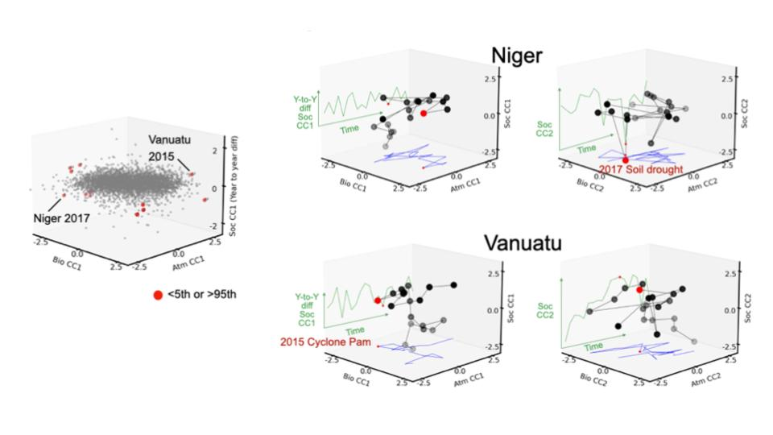
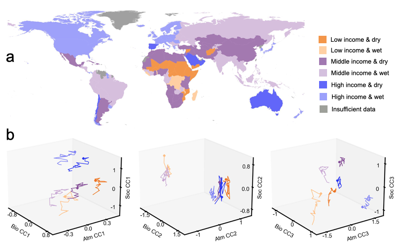

# **Land-Biosphere-Society**: Diagnosing syndromes of biosphere-atmosphere-socioeconomic change

  

    <strong>Authors:</strong>  Wanton Li, Gregory Duveiller, Fabian Gans, Jeroen Smits, Guido Kraemer, Dorothea Frank,
Miguel Mahecha, Ulrich Weber, Mirco Migliavacca, Andrey Ceglar, Markus Reichstein
  

  

    <a href="../../guide/jupyterlab/notebooks/science-cases/land_biosphere_society/" class="md-button">Access Workflow</a>
  

While previous work (Kraemer et al. 2020) to create an index of the Earth System
focussed on describing the different spheres (Atmosphere - Biosphere - Society)
separately this use case focuses on describing the interaction between these
individual spheres. To obtain a first understanding on the main signal that can
be extracted from the ESDC we applied canonical correlation analysis (CCA) on
annually aggregated time series per country. Applying a linear method first  can
be seen as creating a baseline to understand the relationships between variables
before applying nonlinear deep-learning methods. The main difference of using
CCA in comparison to PCA is that instead of maximizing the explanation of
variance in a dataset itself, the CCA tries to explain as much variance as
possible for an independent dataset. This method can be applied as a 3-way CCA
to sub-datasets of the ESDC from the biosphere and atmosphere as well as to a
compiled dataset based on World-Bank socioeconomic indicators. In order to
remove confounding spatial patterns, we spatially detrended the input data to
concentrate the analysis on the temporal evolution of the country-based data.

Finally, the result of our analysis is a time-dependent interaction index for
each country and every pair of variables that encodes the possible interaction
between these spheres. This can be interesting from two viewpoints. First one
can examine certain known events for single countries and test if there is a
signal in multiple of the interaction data streams. This can be an indication
that an event had an effect on multiple spheres and hypotheses can be generated
about the possible interactions and causal effects.

{ width="300" }
/// caption
We use canonical correlation analysis (CCA) to construct interactive
socio-biosphere-atmosphere indices and monitor their temporal changes across
different countries. The left plot shows a 3d scatter plot of the first
component of every sphere for all countries and years. Outliers points are
marked in red color. For two of the outliers (Niger and Vanuatu) the time
evolution of these indices is shown and the outliers can be related to known
events (2017 Niger soil drought and 2015 Cyclone in Vanuatu).
///

Another approach to investigate the data is to summarize the long-term
trajectories different countries take on decadal time scales. For example, it is
possible to define clusters of countries with similar co-evolution of different
indices based on  trend and standard deviation of their index time series.

{ width="300" }
/// caption
The upper figure (a) shows that global countries are distinguished into seven common groups based on clustering on the CCA constructed components. The button figure (b) shows the mean trajectories of CCA constructed socio-biosphere-atmosphere indices across the groups.  
///

We conclude that our results demonstrate the possibilities to explore the
interactions of different Earth System components by using dimensionality
reduction techniques that aim to summarize the interaction between different
data domains. Since these interactions can be very complex and nonlinear there
will be future possibilities to explore nonlinear Deep-Learning based extensions
of our methods to improve the robustness of our results and provide more
capabilities of diagnosing data-driven trends and generating hypotheses on
interactions in the Earth System. Work is also foreseen in collaboration with
the EU funded Open-Earth-Monitor (OEMC) project, in which the concept is being
further developed with a specific use case involving the European Central Bank
to diagnose interactions between the financial sector and the natural system.
