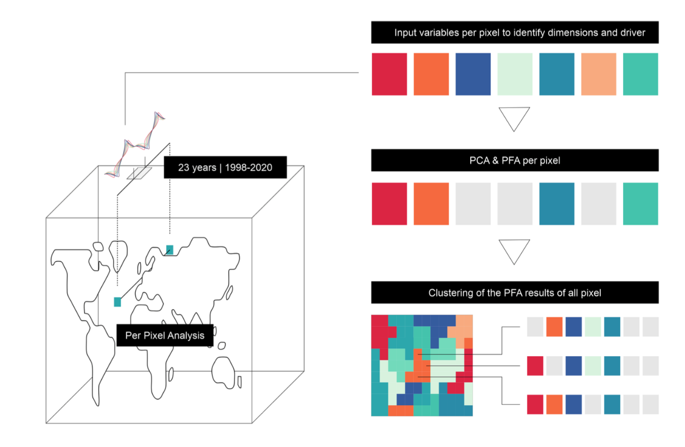
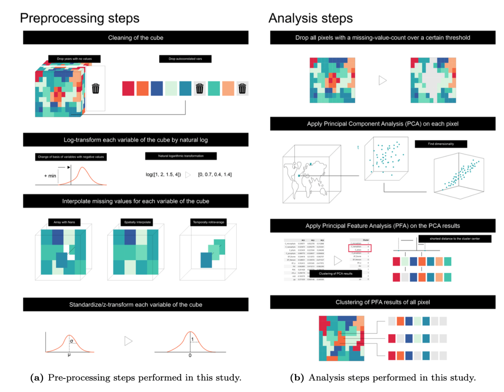
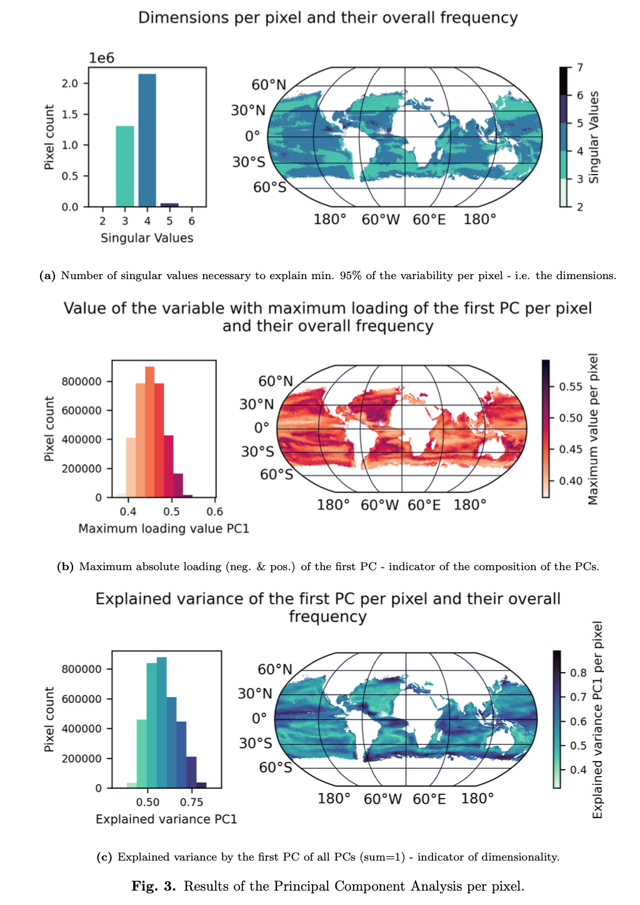

# **Ocean Carbon Cycle** 

  

    <strong>Authors:</strong> Julia Klima, Jannes Kruse, Jonas Neumann
  

  

    <a href="../../guide/jupyterlab/notebooks/science-cases/ocean_carbon_cycle/" class="md-button">Access Workflow</a>
  

A novel approach was explored to understanding the ocean carbon cycle through
the utilization of a recently developed, uniformly structured data cube
encompassing key ocean carbon cycle variables. The methodology involves a
combination of dimensionality reduction and feature selection techniques,
enabling to unravel the intricacies of the carbon cycle across various
geographic locations. The study spans a period from 1998 to 2020, during which
the complexity of the ocean's carbon cycle was analysed. We find that the
originally eight-dimensional feature space can be effectively condensed into
three to four dimensions. This reduction not only simplifies the representation
but also enhances our understanding of the underlying processes. A significant
aspect of our analysis is the identification of geographical patterns in the
carbon cycle's complexity. These patterns are closely linked to the dynamics of
thermohaline circulation and the movement of water masses. Specifically, areas
of intense upwelling and the warm, surface-near currents of the Global Conveyor
Belt are highlighted, along with their anomalies and regional extreme events.

This research pinpoints several key variables, such as Particulate Inorganic
Carbon and Mixed Layer Depth, as critical in both a global and regional context
for representing the simplified dimensions of the carbon cycle. These findings
are pivotal in deepening our understanding of the carbon cycle's regional
behaviours. We will now iterate the findings with the data providers in order to
understand how to enhance the predictability and effectiveness of future
research in carbon modelling and oceanic pathways.

<figure markdown="span">
    
    <figcaption>
        Study design using a data cube of oceanic carbon indicators.
    </figcaption>
</figure>

<figure markdown="span">
    
    <figcaption>
        Steps performed to obtain the dimensionally reduced and clustered new
        data cubes
    </figcaption>
</figure>

<figure markdown="span">
    
    <figcaption>
        Results of the Principal Component Analysis per pixel. 
    </figcaption>
</figure>

The study presented here is still in preliminatry state. However, we find that
using Principal Component Analysis (PCA) and Principal Feature Analysis (PFA) is
very helpful to analyze ocean carbon cycle variables from a data cube. The key
findings are summarized as follows:

- Dimensionality Reduction: The PCA results indicated that most of the ocean's
  carbon cycle can be described by three to four dimensions, significantly
  reducing the original eight-dimensional feature space. This suggests that many
  ocean carbon pump variables are interrelated and exhibit coordinated
  variations over time.
- Geographical Patterns: The study revealed distinct geographical patterns in
  the number of dimensions per pixel. These patterns are associated with ocean
  currents, upwelling regions, wind zones, and differences between coastal and
  open-sea areas. In open-sea regions, the data cube variables often require
  four dimensions for description, while near coastlines, three dimensions are
  generally sufficient.
- Regional Variations: The analysis identified specific regions with unique
  dimensional patterns. For example, large areas above 30° N and 30° S in the
  westerly wind zone predominantly show three dimensions. Notable regions like
  the equatorial-subtropical zone, the Pacific-Indian Ocean transition, and
  areas around the Global Conveyor Belt also exhibit distinct patterns.
- El Niño-Southern Oscillation Area: This area is mostly represented by four
  dimensions, with patterns influenced by trade winds, upwelling regions, and
  warm ocean currents. The equatorial-subtropical zone is the only area where
  five dimensions are occasionally present.
- Principal Component Variability: The first principal component (PC1) explains
  a significant portion of the variability in many regions, especially around
  the equator. However, in areas like the East Pacific Rise, the variability is
  spread across multiple dimensions.
- Principal Feature Analysis (PFA) Results: PFA identified key variables that
  describe the reduced dimensionality of the ocean carbon cycle. Particulate
  Inorganic Carbon (PIC) is a major variable, present in almost all pixels,
  indicating its importance in describing the variability of the ocean carbon
  pump.
- Phytoplankton Variability: Different types of phytoplankton (micro, pico, and
  nano) show varying presence across different regions, indicating their role in
  the ocean carbon cycle's variability.
- Mixed Layer Depth (MLD) and Other Variables: MLD is generally important for
  describing variability, but its presence varies geographically. Other
  variables like Primary Production (PP) and Particulate Organic Carbon (POC)
  also show varying importance across different locations.
- Cluster Analysis: The clustered PFA results reveal patterns in variable
  importance across different ocean regions. These clusters help in
  understanding the regional differences in the ocean carbon cycle
- Implications and Limitations: The study provides insights into the
  interconnected nature of oceanic processes affecting the carbon cycle.
  However, it also acknowledges limitations such as the exclusion of certain
  variables, the lack of a comprehensive theoretical framework, and the absence
  of data in certain latitudes.

Overall, the study offers a nuanced understanding of the ocean carbon cycle's
complexity and its geographical variability, highlighting the interconnectedness
of various oceanic processes and their impact on carbon cycling.

