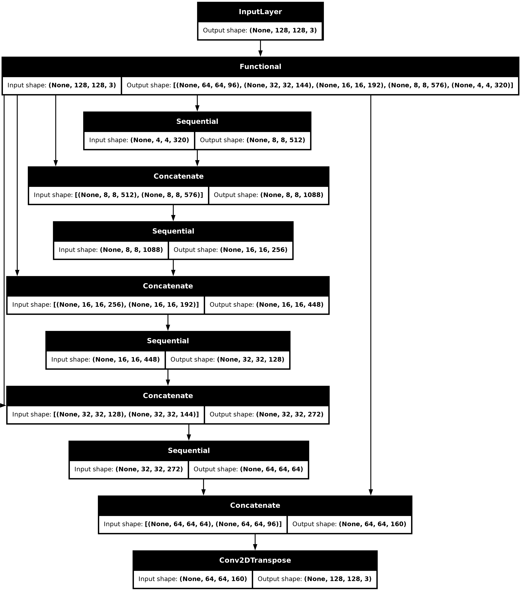

# **Polar Science**: Automatic ice damage detection from Sentinel-1 radar imagery

  

    <strong>Authors:</strong> Andrea Incatasciato, Martin Wearing, Livia Jakob, Noel Gourmelen
  

The level of ice damage (or inversely, its stiffness) plays a key role in
controlling its resistance against the gravitational flow into the ocean.
More ice damage leads to faster ice flow, resulting in increased mass loss
from the ice sheet, which directly contributes to global sea-level rise.
Despite its importance, our current understanding of how ice damage evolves
over time remains poor, and damage is not yet included in the models used to
project future ice dynamics and sea-level changes. Improving our ability to
quantify the ice damage is therefore crucial for improving ice-sheet models
and making more accurate future projections. 

Traditionally, ice damage is derived from ice thickness and surface velocity
measurements. However, coincident measurements of these two quantities are
often not available. Alternatively, it can also be linked to the visible
surface damage, such as fractures and crevasses. These surface damages serve
as proxies for internal ice stresses, provided certain assumptions about
the temperature vertical profile are made. 

This study aimed at training a neural network to assess ice damage levels
directly from satellite imagery data, with the use of Sentinel-1 imagery
obtained in 2015-2016 and a completely independent damage model (Fig. 1),
generated with an ice-sheet model inversion based on measurements of
ice thickness and surface velocity obtained during the same period.

<figure markdown="span">
    
    <figcaption>
        Fig. 1: The three pre-generated input ice damage models for
        Amery Ice Shelf, that depend on the assumption
        on the ice temperature vertical profile.
    </figcaption>
</figure>

The area of investigation was Amery Ice Shelf and the imagery used for training
and testing the neural network was acquired during the Spring/Summer months
of 2015 and 2016. We used contains co-polarised imagery,
obtained with either IW (Interferometric Wide) and EW (Extra Wide) swath modes,
and in either high and medium resolution (between 10 m and 40 m).
We also did not distinguish the orbital direction of the satellite
at the moment of the acquisition.

The query, preprocessing and download of the imagery data was performed through
SentinelHub. The use of SentinelHub was made possible by the DeepESDL
Early Adopters scheme, which provided access to SentinelHub Processing Units.
The retrieved Sentinel-1 data was organised into a data cube format,
with the static ice damage masks added as additional variables. We included
three masks, one for each assumption on the ice temperature vertical profile.
This data cube were published to an S3 data store, allowing future users
to access this data directly and run the example JupyterNotebook without
retriggering the SentinelHub query/preprocessing/download steps.

The neural network was implemented using TensorFlow and Keras, incorporating
within a U-Net architecture (Fig. 2) a pre-trained MobileNetV2 encoder and
a trainable pix2pix decoder.

<figure markdown="span">
    
    <figcaption>
        Fig. 2: The U-Net architecture used.
    </figcaption>
</figure>

By looking at Fig. 3, showing the evolution of the accuracy and of the loss
of the neural network during the training and the validation phase, we noticed
that the learning process was very fast and the overfitting was minimal,
when compared to the corresponding results using different setups and
different training strategies (not shown here). We didn't notice
any striking difference in the performances of the neural network between
the three different assumptions on the ice temperature vertical profile.

<figure class="my-figure">
  

  

    
    
  

  <figcaption>
    Fig. 3: Accuracy and Loss of the neural network trained on the Sentinel-1 imagery described above
    and on the damage model that assumes the observed surface temperature as valid at any depth,
    without vertical gradient.
  </figcaption>
</figure>

    

Given these initial results, this method looks very promising.
The frequent acquisition of Sentinel-1 data over Antarctica makes it
an excellent tool for building a time series of ice damage, without the need
for coincident ice thickness and surface velocity measurements, that are often
not available.

Future expansions of this work include and are not limited to:

- Extending the areas of investigation to include other ice shelves, such as
Amundsen and Getz, on the other side of Antarctica.
- Investigating a strategy to preserve some high-resolution information, 
when smoothing the imagery data to match the damage models resolution (500 m).
- Separately training the neural network on imagery with different polarisation
and satellite orbit direction.
- Augmenting Sentinel-1 imagery with other datasets, such as Sentinel-2 and
Landsat-8 optical imagery or ice surface velocity maps.
- Investigating potential modifications to the neural network architecture,
for example reducing the capacity at the bottleneck layer, adjusting
the loss function or using larger and overlapping tiles.