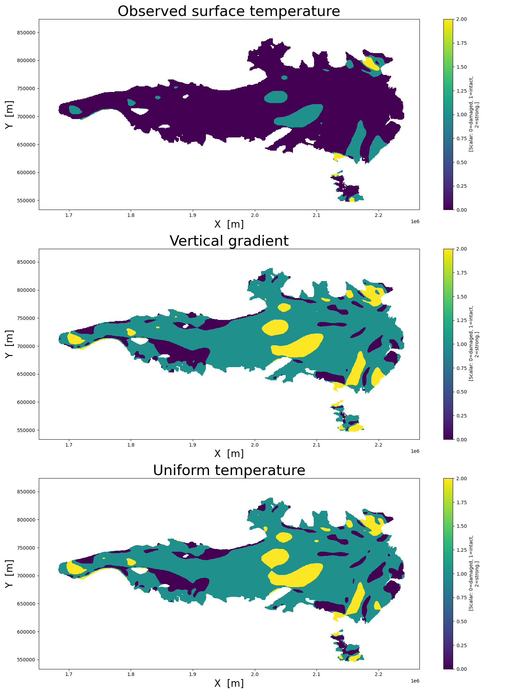

# Science Demonstration Case “Polar Science”

## Automatic ice damage detection from Sentinel-1 radar imagery

Authors: Andrea Incatasciato, Martin Wearing, Livia Jakob, Noel Gourmelen

The level of ice damage (or inversely, its stiffness) plays a key role in
controlling its resistance against the gravitational flow into the ocean.
More ice damage leads to faster ice flow, resulting in increased mass loss
from the ice sheet, which directly contributes to global sea-level rise.
Despite its importance, our current understanding of how ice damage evolves
over time remains poor, and damage is not yet included in the models used to
project future ice dynamics and sea-level changes. Improving our ability to
quantify the ice damage is therefore crucial for improving ice-sheet models
and making more accurate future projections. 

Traditionally, ice damage is derived from ice thickness and surface velocity
measurements. However, coincident measurements of these two quantities are
often not available. Alternatively, it can also be linked to the visible
surface damage, such as fractures and crevasses. These surface damages serve
as proxies for internal ice stresses, provided certain assumptions about
the temperature vertical profile are made. 

This study aims at training a neural network to assess ice damage levels
directly from satellite imagery data, with the use of Sentinel-1 imagery
obtained in 2015-2016 and a completely independent damage model, generated
with an ice-sheet model inversion based on measurements of ice thickness and
surface velocity obtained during the same period. The frequent acquisition of
Sentinel-1 data over Antarctica makes it an excellent tool
for building a time series of ice damage.

<figure markdown="span">
    
    <figcaption>
        The U-Net architecture employed within the project.
    </figcaption>
</figure>

