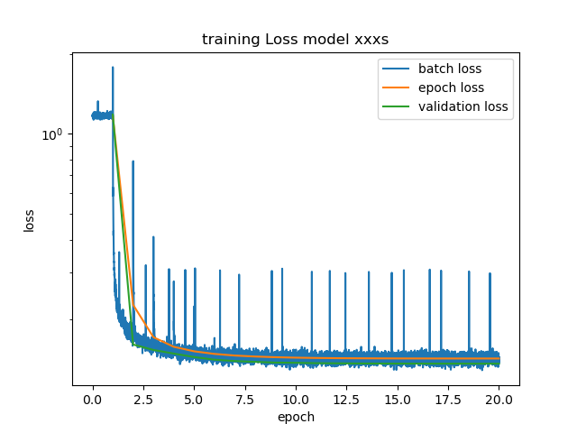
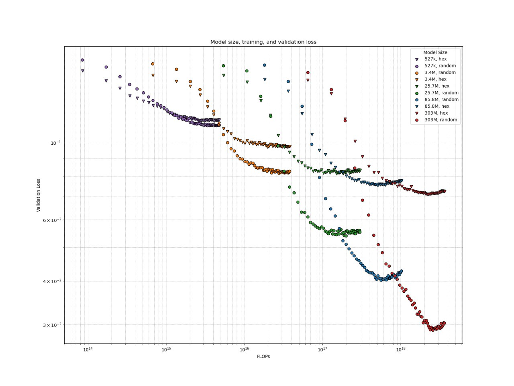
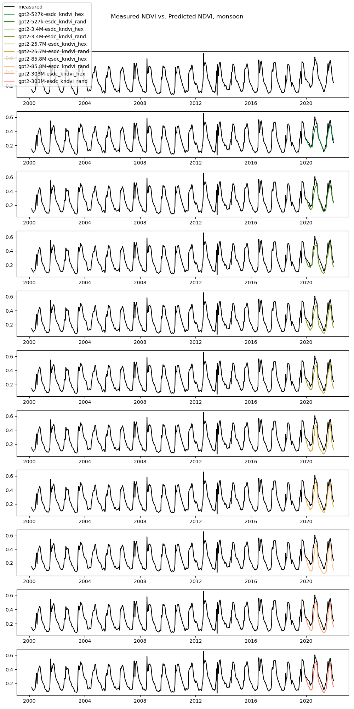
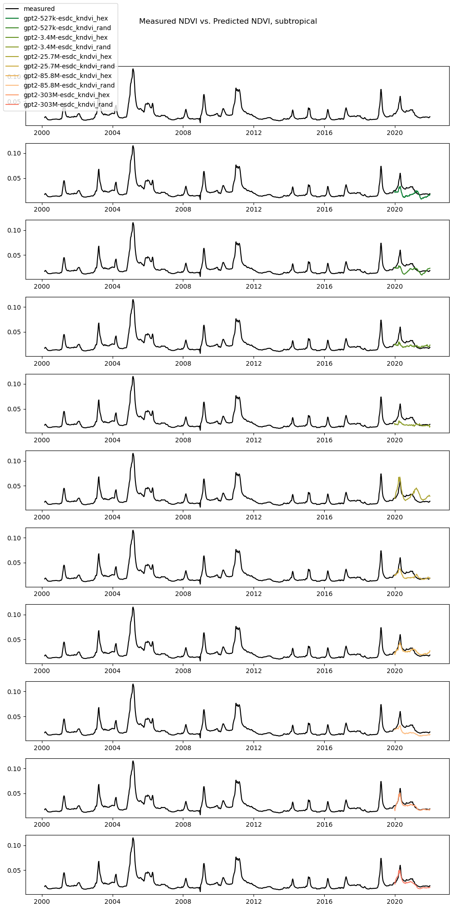

# Transformer based forecast of productivity in DeepESDL (Kraemer et al. in prep)

Authors: Guido Kraemer

## Introduction/Problem/Objectives
Given the intricate relationship between vegetation health and climate
variables, developing robust deep learning architectures for environmental
predictions is crucial. In this project, we chose the GPT architecture as our
foundation because of its proven ability to capture complex patterns and
long-term dependencies in sequential data. While originally designed for natural
language processing, the transformer-based architecture of GPT excels at
modelling intricate time-series relationships, making it a strong candidate for
analysing environmental variables like kNDVI (a key indicator of vegetation
health). By adapting GPT to process geodata and predict kNDVI, we demonstrate
its versatility in addressing real-world environmental challenges.

A key aspect of this project was exploring scaling laws in transformer
architectures, a concept well-studied in NLP but underexplored in geodata
applications. In NLP, researchers have extensively analysed how model
performance scales with parameters, data size, and computational resources.
However, these principles are equally relevant for environmental modelling,
where resource efficiency is critical due to the often-limited availability of
labelled geospatial data and computational budgets. To investigate this, we
trained multiple smaller-scale versions of our adapted GPT model, systematically
varying the number of parameters and assessing their impact on prediction
accuracy.

## Data

The Earth System Data Cube (ESDC) version 3.0.2 serves as the primary dataset
for this analysis, offering a robust and comprehensive framework for
spatiotemporal exploration of Earth system variables. The ESDC is structured as
a 4-dimensional data cube, comprising longitude, latitude, time, and multiple
variables, including precipitation, temperature, evaporation, radiation, and
kNDVI. This structure allows for the simultaneous analysis of diverse Earth
observation (EO) streams on a common spatiotemporal grid, eliminating the need
for extensive preprocessing to harmonize data from different sources. This
approach provides a holistic view of the Earth system by considering the
interdependencies among different environmental factors.

Sampling in blocks is crucial for spatial data due to the inherent spatial
autocorrelation present in such datasets. Spatial autocorrelation refers to the
tendency of nearby locations to exhibit similar values more frequently than
distant locations. Random sampling without regard to spatial structure can lead
to underestimating the prediction error of a model. By dividing the data into
blocks—discrete regions that maintain local spatial relationships—we ensure a
more balanced and representative sample.

Hexagonal sampling (hexsampling) is particularly advantageous for this purpose.
Hex grids are well-suited for global coverage as they tile the Earth's surface
without gaps or overlaps, ensuring efficient partitioning of data into
manageable blocks. Each hexagon serves as a block that preserves local spatial
patterns and relationships, which is essential for maintaining the integrity of
spatial autocorrelation in the dataset. Hex grids offer uniform coverage and
reduce sampling bias, especially important over large areas where traditional
latitude-longitude grids can cause oversampling at the poles.

In summary, the combination of block sampling and hexagonal partitioning in the
Earth System Data Cube provides an optimal framework for robust and reliable
analysis of Earth system dynamics. This approach ensures that the dataset is
both representative and computationally manageable, preserving the spatial
integrity necessary for accurate environmental modeling.

## Methods

To tailor GPT for this task, we made few modifications. First, we transformed
the input format to accommodate multivariate environmental data, replacing the
token embedding layer with a linear projection layer that maps features into a
high-dimensional space suitable for transformer blocks. Similarly, we adjusted
the output layer to predict continuous environmental variables instead of
discrete text tokens. These changes allowed us to leverage GPT's advanced
capabilities for time-series forecasting while maintaining its core
architectural strengths.

## Discussion

Given the complex relation between vegetation and climate, a robust deep
learning architecture is required. Here we chose GPT as an architecture because.
GPT's transformer-based model excels in capturing complex patterns and long-term
dependencies within sequential data such as natural language, making it
well-suited for analysing the intricate time-series data of environmental
variables. By adapting GPT from predicting language to predicting time-series,
and training it to predict kNDVI, we unlock its advanced capabilities to
interpret and forecast vegetation health, thereby providing a powerful tool to
support environmental stewardship. GPT was originally created to predict text,
and the architecture had to be adapted to work on generic time series. Most
importantly, the input format was fundamentally transformed. While the original
GPT processes text tokens, our model was designed to accept multivariate
environmental data. To handle these inputs, we replaced the token embedding
layer with a linear layer that projects multivariate features into a
high-dimensional space suitable for the GPT-2 transformer blocks. We also
replaced the output layer from predicting text tokens with a linear layer to
predict environmental features. We trained models of different sizes. Because
the original GPT-2 model was quite substantial in size and training a model of
the same size would have been infeasible to train. Therefore, we trained several
smaller models to assess the scaling of the accuracy of the model prediction
with the number of parameters of the model and the amount of compute used for
training. By making these adaptations, we successfully leveraged the robust
architecture of GPT-2 to achieve highly accurate environmental predictions. This
endeavour not only showcases the versatility of transformer models but also
highlights their potential in addressing complex, real-world forecasting
challenges.

<figure markdown="span">
    
    <figcaption>
        Training results of the smallest model 
    </figcaption>
</figure>

<figure markdown="span">
    
    <figcaption>
        Validation loss vs. compute for models of different complexity. We can see that
        large models perform significantly better. There is overfitting for models 85.8M
        and larger. Block sampling is necessary to not underestimate the validation
        error.
    </figcaption>
</figure>

<figure markdown="span">
    
    <figcaption>
        Prediction of the last two years of an artic kNDVI pixel time series with models
        of increasing complexity
    </figcaption>
</figure>

<figure markdown="span">
    
    <figcaption>
        Prediction of the last two years of a subtropical kNDVI pixel time series with
        models of increasing complexity
    </figcaption>
</figure>

## Conclusion

The successful adaptation of the GPT-2 model for environmental predictions
demonstrates the remarkable versatility of transformer architectures beyond
their original design for text. By making key modifications to the input and
output layers, we enabled GPT-2 to process multivariate environmental data and
predict kNDVI, a crucial indicator of vegetation health. Despite the challenge
of training large-scale models with limited resources, we achieved highly
accurate results by carefully scaling down the model size and evaluating
trade-offs between complexity and performance. Our experiments reveal that
smaller models can perform comparably well, underscoring the importance of
efficiency in resource management for environmental forecasting tasks.

The results of this research offer a novel approach to leveraging
state-of-the-art AI for environmental stewardship, highlighting the potential of
transformers to tackle complex, real-world forecasting challenges. This approach
is now being made publicly available as a notebook, ensuring that the broader
scientific community can benefit from our methods and apply them to further
enhance environmental resource management and climate monitoring efforts.
