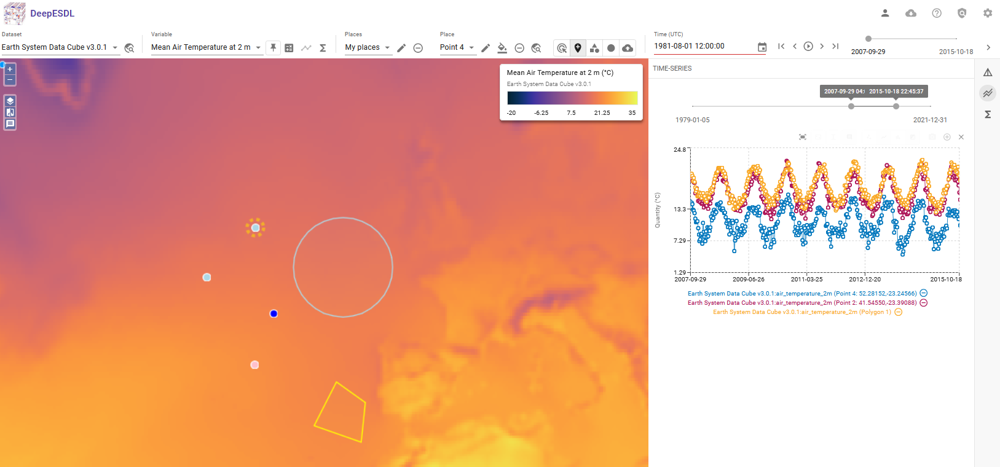

# xcube Viewer in DeepESDL

{: .centered-logo style="max-width: 300px;" }

The **xcube Viewer** is a browser-based visualization tool, built for exploring spatiotemporal Earth Observation 
data cubes. Optimized for handling large, multidimensional datasets it allows users to interactively view, analyze, 
and compare datasets directly in the browser. With a rich feature set tailored to the needs of Earth system science, 
the viewer plays a key role in both data-driven exploration and effective communication of results.

For an example explore the [DeepESDL xcube Viewer](https://viewer.earthsystemdatalab.net).

#### Features of the xcube Viewer

* **Interactive Navigation**
  Explore data through time and space.

* **Statistics and Time Series**
  View pixel-level statistics and generate time series for selected points or areas.

* **Variable Comparison**
  Compare two variables side-by-side to identify correlations or divergences across time and space.

* **User-Defined Variables**
  Create new variables directly within the viewer using expressions or operations on existing variables.

* **Custom Display Settings**
  Adjust color scales, value ranges, and visualization styles to highlight relevant data features.

* **Seamless Data Access**
  Integrated with xcube data stores (e.g., CCI, CMEMS, Sentinel Hub) for real-time viewing of remote datasets.

For more information on the Viewer, visit the DeepESDL [User Guide](../guide/xcube-viewer.md) or 
the [xcube viewer documentation](https://xcube-dev.github.io/xcube-viewer).

---

The **xcube Viewer** is a browser-based visualization tool, built for exploring spatiotemporal Earth Observation 
data cubes. It allows users to interactively view, analyze, and compare datasets. With a rich feature set
tailored to the needs of Earth system science, it’s a key component for data-driven exploration and communication 
within DeepESDL.

#### Key Benefits and Features for DeepESDL Users

* **Designed for EO Data Cubes**
  Optimized for handling large, multidimensional datasets from DeepESDL’s virtual and analysis-ready data cubes.

* **Interactive Navigation**
  Explore data through time and space.

* **Statistics and Time Series**
  View pixel-level statistics and generate time series for selected points or areas.

* **Variable Comparison**
  Compare two variables side-by-side to identify correlations or divergences across time and space.

* **User-Defined Variables**
  Create new variables directly within the viewer using expressions or operations on existing variables.

* **Custom Display Settings**
  Adjust color scales, value ranges, and visualization styles to highlight relevant data features.

* **Seamless Data Access**
  Integrated with xcube data stores (e.g., CCI, CMEMS, Sentinel Hub) for real-time viewing of remote datasets.

* **Ideal for Sharing and Communication**
  Use visual outputs for presentations, reports, or collaborative discussions.

For more information on the Viewer visit the deepESDL user Guide or the xcube Viewer documentation